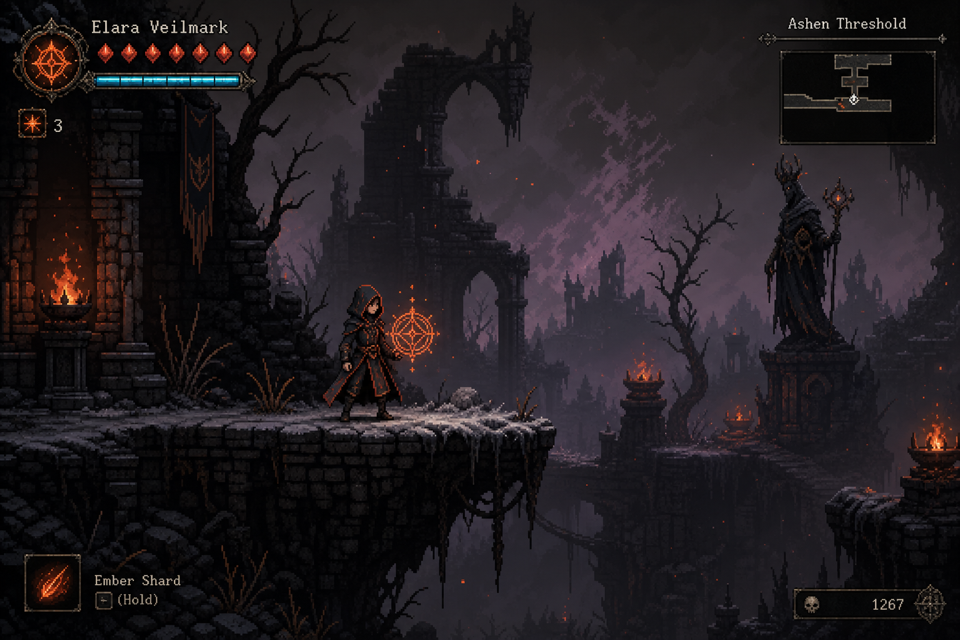

# Arcania

A dark fantasy 2D Metroidvania where every spell opens new paths in combat and exploration.

> *"The weave is torn. You are the last thread."*

Play as **Elara Veilmark**, a disgraced apprentice who awakens in the Ashen Threshold with fractured memory and a flickering Ember Sigil. Traverse an interconnected world, unlock spells that reshape combat and clear environmental obstacles, and uncover the secrets of a decaying empire.



---

## How to Play

### Requirements

- **[Godot 4.3+](https://godotengine.org/download)** (the project is tested on Godot 4.7)

### Launch

1. Clone or download this repository.
2. Open `godot/project.godot` in the Godot editor.
3. Press **F5** (Play). The title screen offers **New Game**, **Continue**, or **Load**.

### Controls

| Action | Key |
|--------|-----|
| Move left / right | **A** / **D** (or arrow keys) |
| Jump | **Space** |
| Melee attack (3-hit combo) | **J** |
| Ember Sigil (short-range fire) | **1** or **K** |
| Ember Bolt (ranged projectile) | **2** |
| Veil Step (phase dash + i-frames) | **3** or **Shift** *(East Road shrine — not at start)* |
| Rootbind (vine growth / gates) | **4** *(after pickup in Whisperwood)* |
| Rest / save at Focus Crucible | **E** |
| Pause menu (save/load) | **Esc** |
| Map overlay | **M** |
| Inventory (relics) | **I** |
| Spell wheel (8-slot loadout) | **Tab** |
| Place map marker (while map open) | **E** |

Hold an aim direction (arrow keys) before casting to fire spells upward, downward, or diagonally.

---

## Current Playable Content

This is an **in-development build** (Phases 0–4 complete). You can explore the Ashen Threshold and Whisperwood Hollow, fight bosses, collect relics, and use six spells.

**Story route**

```
Ashen Threshold hub → East Road (Veil Step shrine) → Whisperwood Hollow
                              ↓
                    Thornweft Matron → Arc Step
                    Root Warden → Rune Anchor
```

**Spells**

| Spell | How to get | Use |
|-------|------------|-----|
| **Ember Sigil** | Start | Short-range fire; lights braziers and opens ability gates |
| **Ember Bolt** | Start | Ranged fire projectile |
| **Veil Step** | Shrine on East Road | Phase dash with i-frames |
| **Rootbind** | Heartwood Chamber pickup | Grows vine platforms; clears vine gates |
| **Arc Step** | Defeat Thornweft Matron | Short blink with i-frames |
| **Rune Anchor** | Defeat Root Warden | Grapple to golden anchor rings |

**Systems**

- **Save / load** — Pause menu (**Esc**, 3 slots) or quick-save at a **Focus Crucible** (**E**).
- **Relics** — Press **I** to equip modifiers (e.g. Cinder Heart, Thornseed Charm, Iron Grip).
- **Quests** — Act I tracker on the HUD; full log in the pause menu.
- **Map** — Press **M** for fog-of-war; **E** while open to place markers (3 max).
- **Spell wheel** — Press **Tab** to assign spells to quick-cast slots.

**Mana & Overcast** — Mana regenerates slowly in combat. If you lack mana, **Overcast** lets you cast using HP instead (only above 15% health).

### HUD

- **Top-left** — HP pips and mana bar.
- **Overcast flash** — Appears when casting with HP instead of mana.
- **Boss bar** — During Thornweft Matron and Root Warden fights.
- **Quest tracker** — Bottom-left objective text.
- **Essence counter** — Tracks enemy defeats.

### What's Not in This Build Yet

- Remaining spells (8 of 14 planned)
- Full Whisperwood region and most other world areas
- Fast travel, full enemy roster, NPC dialogue, and final art/audio pass

See [DEVELOPER.md](DEVELOPER.md) for the full development status and roadmap.

---

## For Developers

Design docs, architecture, debug tools, and solo-dev setup: **[DEVELOPER.md](DEVELOPER.md)**
