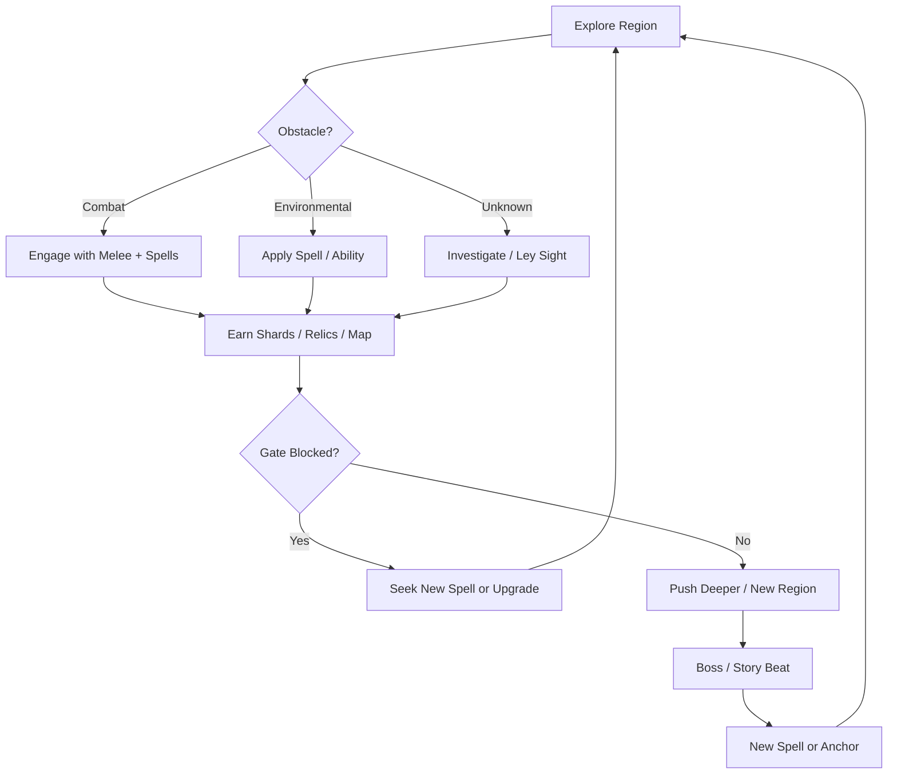
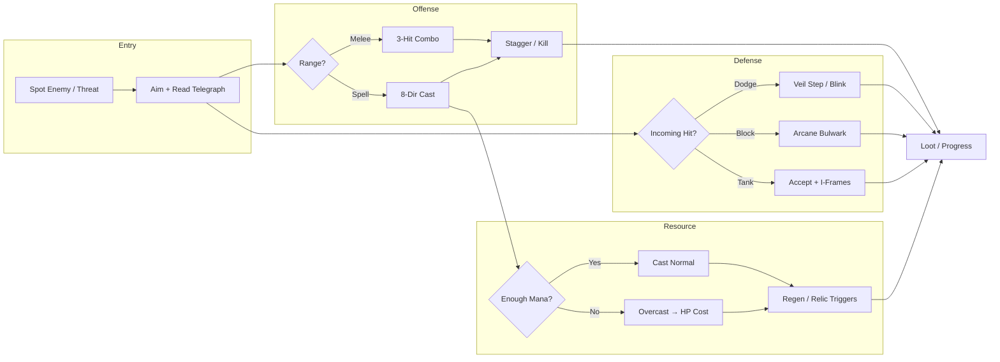

# Arcania — Game Design Document

**Version:** 1.0  
**Engine:** Godot 4.3+  
**Genre:** 2D Metroidvania / Action-Adventure  
**Perspective:** Side-view, hand-drawn  
**Target Resolution:** 1920×1080 (viewport 960×540, pixel-perfect scaling)  
**Status:** Pre-production (design lock for Phase 0)

> *"The weave is torn. You are the last thread."*

---

## 1. Executive Summary

**Arcania** is a dark fantasy 2D Metroidvania built in Godot 4, centered on magical progression where every spell serves both combat and exploration. The player controls **Elara Veilmark**, a disgraced apprentice of the Veiled Conclave who awakens in the **Ashen Threshold** with fractured memory and a flickering **Ember Sigil**—the only spell she still remembers.

The world of Arcania is a semi-open, interconnected ruinscape of twelve regions, each layered with environmental storytelling, optional challenges, and secrets. Progression is driven by **fourteen dual-purpose spells**, **Focus Shards** that expand mana capacity, **relics** that reshape build identity, and **map discovery** that rewards curiosity. The central narrative mystery—the **Arcane Collapse** and the fate of the **World Sigil**—unfolds through exploration, boss encounters, and faction remnants rather than cutscene-heavy exposition.

Visually, Arcania targets a **Hollow Knight–inspired hand-drawn aesthetic**: strong silhouettes, limited but expressive palettes, and readable combat telegraphs at 64px tile scale with characters roughly 48–64px tall. Gameplay emphasizes responsive movement, a tight three-hit melee combo, eight-directional spell casting, and a mana economy that encourages deliberate play while allowing **overcast**—casting at zero mana at the cost of health—for clutch moments.

This document is the master design reference. Detailed specifications live in companion docs indexed in [Section 12](#12-document-index--cross-links).

---

## 2. Design Pillars

### 2.1 Dual-Purpose Magic

Every spell in Arcania must justify its slot in both **combat** and **exploration**. A spell that only damages enemies or only opens a door is a design failure. Ember Sigil burns foes *and* ignites braziers; Crystal Bridge spans chasms *and* can be dropped on enemies; Ley Sight reveals hidden paths *and* exposes enemy weak points in battle.

**Design implications:**
- Spell acquisition gates map regions; spell mastery gates optional content.
- Relics and robe passives amplify spell duality rather than raw stat inflation.
- Tutorialization is environmental: the player learns Veil Step by needing to cross a gap, not by reading a tooltip wall.

### 2.2 Curiosity Rewarded

Arcania treats the map as a puzzle box. Off-path rooms, breakable illusions, Ley Sight secrets, and **Temporal Echo** replays of past events all feed players who look closely. Optional mini-bosses and elite encounters guard relics, Focus Shards, and lore fragments.

**Design implications:**
- Every region includes at least three secret rooms and one optional challenge route.
- The in-game map fills only when Elara physically explores; no auto-reveal.
- Collectibles (lore tablets, faction tokens) are optional but unlock narrative depth and a secondary ending branch.

### 2.3 Non-Linear Routes

After the opening hour, players can pursue multiple viable progression paths through the twelve regions. Soft gates (environment hazards, enemy density, mana requirements) combine with hard gates (spell-specific obstacles) to create route choice without sequence-breaking the critical path.

**Design implications:**
- At least two early-game routes to the first major hub (Veiled Sanctum).
- Backtracking is meaningful: new spells reopen earlier regions with new content.
- Fast travel (Sigil Recall anchors) unlocks mid-game to reduce friction without removing spatial literacy.

### 2.4 Dark Fantasy Tone

Arcania's world is one of **decay, forgotten empires, and dangerous knowledge**. Magic is not whimsical—it is institutional, regulated, and catastrophic when misused. The Arcane Collapse is not a generic cataclysm; it is the consequence of the Conclave attempting to rewrite the World Sigil.

**Design implications:**
- NPC dialogue is sparse, weighted, and often contradictory across factions.
- Visual design favors erosion, ash, and bioluminescent corruption over bright high fantasy.
- Player power growth feels like recovering forbidden knowledge, not becoming a chosen hero.

### 2.5 Tight Craft

Every frame of animation, every hitbox, and every audio cue must serve **readability and responsiveness**. Difficulty comes from pattern mastery, not unfair hits or visual clutter.

**Design implications:**
- Enemy telegraphs are standardized (wind-up color, audio ping, floor marker).
- Input buffer of 8 frames for jump and dodge; spell cancel windows documented per animation.
- Performance target: stable 60 FPS at 960×540 viewport on mid-range hardware.

---

## 3. Player Fantasy & Core Loop

### 3.1 Player Fantasy

You are **Elara Veilmark**: cast out, blamed for a catastrophe you barely remember, carrying a sigil that should not exist. Your fantasy is **reclamation**—of memory, of mastery, and of a truth the Conclave buried. You are not saving the world from evil; you are deciding whether the weave can be mended, replaced, or left to unravel.

Each spell recovered feels like stolen knowledge returning to your hands. Each region conquered recontextualizes the Collapse. The final confrontation is not "defeat the dark lord" but **resolve the World Sigil's fate**—with endings tied to exploration depth, faction choices, and relic loadout.

### 3.2 Core Loop

**Session loop (5–30 minutes):**
1. Depart from last Sigil Recall anchor or bench equivalent (**Focus Crucible**).
2. Explore, fight, discover map tiles and secrets.
3. Encounter a gate (spell wall, collapsed bridge, sealed vault).
4. Route to upgrade path—optional side content or main critical path.
5. Acquire new capability; backtrack or push forward.
6. Save/progress at anchor; repeat.

**Macro loop (full game ~12–18 hours main path, 25+ completionist):**
- Act I (Regions 1–4): Learn dual-purpose magic; uncover Collapse hints.
- Act II (Regions 5–9): Faction entanglements; mid-game spell synergy; first World Sigil fragments.
- Act III (Regions 10–12): Conclave ruins; Unravel and World Thread; ending branch resolution.

---

## 4. Controls

Default bindings support keyboard and gamepad with remapping in Settings. All actions are digital unless noted.

| Action | Keyboard | Gamepad | Notes |
|--------|----------|---------|-------|
| Move | A / D or ← / → | Left stick / D-pad | 8-dir on ladders/vines |
| Jump | Space | A / Cross | Coyote time: 6 frames; buffer: 8 frames |
| Melee Attack | J or Left Click | X / Square | 3-hit combo; third hit has endlag |
| Cast Spell | K or Right Click | Y / Triangle | Uses equipped spell; 8-dir aim |
| Aim Spell | Mouse / IJKL | Right stick | 8-directional; defaults to facing |
| Spell Wheel | Tab (hold) | LB (hold) | Slow-time optional in settings |
| Quick Slot 1–4 | 1–4 | D-pad | Assign favorites from wheel |
| Veil Step / Dash | Shift | B / Circle | If Veil Step acquired; i-frames |
| Interact | E | A / Cross (context) | NPCs, anchors, levers |
| Map | M | Select / View | Full-screen map overlay |
| Inventory | I | Start (toggle) | Robes, relics, focus |
| Pause | Esc | Start (hold) | Pause menu |

**Spell aiming:** When using keyboard, I/J/K/L or mouse cursor sets cast direction in 45° increments. Gamepad right stick uses a circular deadzone with 8-way snapping for readability.

See [08-technical-architecture.md](08-technical-architecture.md) for input action map and Godot `InputMap` definitions.

---

## 5. Combat System

### 5.1 Melee

Elara's baseline offense is a **three-hit combo** with distinct timing windows:

| Hit | Damage | Speed | Notes |
|-----|--------|-------|-------|
| 1 | 100% base | Fast | Can chain immediately |
| 2 | 110% base | Medium | Small forward step |
| 3 | 140% base | Slow | Knockback; 12 frames endlag |

Combo resets after 0.6s idle or on hit taken. Melee hitboxes are forward-biased; down-air and up-air variants exist when airborne (single hit, no full combo). Melee does not consume mana and is essential for finishing staggered foes cheaply.

### 5.2 Spells

Fourteen spells (full specs in [06-magic-system.md](06-magic-system.md)):

| Spell | Combat Role | Exploration Role |
|-------|-------------|------------------|
| **Ember Sigil** (starter) | Short-range fire burst | Ignite braziers, melt frost barriers |
| **Veil Step** | Phase-through attack; brief i-frames | Short blink through thin walls / grates |
| **Rune Anchor** | Pulls enemies to anchor point | Grapple to distant rings; hold platforms |
| **Crystal Bridge** | Drops crystal spike on foes below | Create temporary walkable bridge |
| **Spirit Form** | Intangible; pass through enemy attacks | Pass through spirit gates / wraith barriers |
| **Ley Sight** | Reveals enemy weak points (bonus damage) | Highlight hidden paths and illusions |
| **Temporal Echo** | Replay last 3s of damage in an area | Activate echo-sensitive switches |
| **Shadow Blink** | Teleport behind targeted enemy | Cross large gaps to shadow anchors |
| **Arcane Bulwark** | Directional shield; reflects projectiles | Block wind tunnels; hold against force doors |
| **Frost Bind** | Roots enemies; shatter for bonus damage | Freeze water; condense steam geysers |
| **Storm Lash** | Chain lightning between foes | Power conduits; electrify rails |
| **Sigil Recall** | Teleport back to placed recall sigil | Player-placed fast travel anchor |
| **Unravel** | Dispel enemy buffs / shields | Unweave magical barriers and seals |
| **World Thread** | Stitch enemies together (shared damage) | Repair broken ley lines; bridge world gaps |

Spells are cast in **eight directions** (including diagonals). Cast time, mana cost, and cooldown vary per spell; see magic system doc for numeric tables.

### 5.3 Mana & Focus Shards

**Mana** is Elara's casting resource, visualized as a segmented bar tied to **Focus Shards**:

- Base capacity: 3 shards (30 mana units; 10 per segment).
- Shards found in world: +1 segment each (max 8 shards / 80 mana).
- Regeneration: passive tick after 1.2s since last cast; rate increases near Focus Crucibles and ley wells.
- **Focus** equipment slot modifies regen rate, max capacity bonus, or overcast tolerance.

### 5.4 Overcast

When mana is insufficient, Elara may **overcast**: the spell fires at **HP cost equal to 150% of missing mana** (minimum 5 HP per cast). Overcast triggers:

- Screen desaturate pulse and heartbeat SFX.
- 0.3s vulnerability window after cast (no i-frames).
- Visual "thread fray" VFX on Elara's silhouette.

Overcast enables clutch escapes and skilled play but punishes spam. Relics can mitigate overcast damage or convert it into tactical advantage (see Tier 3 relics).

### 5.5 I-Frames & Knockback

| Source | I-Frame Duration | Notes |
|--------|------------------|-------|
| Veil Step / dash | 14 frames | Full invulnerability |
| Shadow Blink exit | 10 frames | Reduced if spammed (cooldown) |
| Hit taken (default) | 20 frames | Flash white; input lock 8 frames |
| Arcane Bulwark (hold) | Front arc only | Back exposed |
| Boss grab attacks | 0 | Explicit grab immunity bypass |

**Knockback:** Damage tier determines knockback distance. Elara receives reduced knockback when blocking with Bulwark. Enemies stagger at 30% HP threshold for mini-enemies, per-enemy poise for elites (see [04-enemy-bible.md](04-enemy-bible.md)).

### 5.6 Combat Flow

---

## 6. Equipment

Elara equips **Robes** (defensive / utility passives), one **Focus** (mana modifier), and **6–8 Relic slots** (unlockable; start with 6, expand via late-game quest).

### 6.1 Robes

One active robe at a time. Robes change silhouette tint and minor VFX.

| Robe | Passive | Tradeoff |
|------|---------|----------|
| **Ashen Apprentice** (default) | +5% spell damage | −5% max HP |
| **Veiled Sentinel** | +1 poise | −10% mana regen |
| **Threadbare Scholar** | Ley Sight always faintly active | −1 relic slot |
| **Collapse Warden** | Overcast HP cost −20% | Melee damage −15% |
| **Conclave Remnant** (late) | All spells −1 mana cost | No robe swap at benches |

### 6.2 Focus

| Focus Item | Effect |
|------------|--------|
| **Cracked Lens** (starter) | Standard regen |
| **Ember Core** | +10 max mana; overcast +5 HP cost |
| **Still Pool** | +40% regen; −15% spell damage |
| **Fractured Sigil** | Overcast casts at 120% spell power |
| **World Shard** (late) | 8th shard capacity; regen −20% |

### 6.3 Relics (24 Total)

Relics are passive modifiers found in optional rooms, elite drops, and boss rewards. **8 Tier 1**, **8 Tier 2**, **8 Tier 3**.

#### Tier 1 — Foundational (Regions 1–4)

| Relic | Effect |
|-------|--------|
| **Flickering Ash** | Overcast damage reduced by 15% |
| **Apprentice's Thread** | +10 max mana |
| **Rune-Stitched Hem** | +1 i-frame after damage taken (once per room) |
| **Ember Residue** | Ember Sigil leaves a burning trail (minor DoT) |
| **Threshold Dust** | Veil Step distance +10% |
| **Worn Veil Fragment** | Veil Step afterimage distracts enemies 0.5s |
| **Crystalline Splinter** | Crystal Bridge duration +2 seconds |
| **Hollow Coin** | +10% shard currency from enemies |

#### Tier 2 — Intermediate (Regions 5–9)

| Relic | Effect |
|-------|--------|
| **Conclave Seal** | Rune Anchor pull radius +20% |
| **Ley Navigator** | Ley Sight marks secrets on map while active |
| **Echo Lattice** | Temporal Echo records +1 second |
| **Shadow Mantle** | Shadow Blink exit grants 0.4s untargetable |
| **Bulwark Core** | Arcane Bulwark reflects 10% projectile damage |
| **Frostweave Ring** | Frost Bind spreads to 1 adjacent enemy |
| **Storm Conductor** | Storm Lash chains to +1 target |
| **Recall Beacon** | Sigil Recall cooldown −15% |

#### Tier 3 — Legendary (Regions 10–12)

| Relic | Effect |
|-------|--------|
| **Unraveler's Lens** | Unravel permanently reveals elite weak points |
| **World Thread Spindle** | World Thread range +25% |
| **Veiled Crown** | All spells cost 10% less mana |
| **Collapse Shard** | Overcast grants +15% spell damage for 3s |
| **Sigil of Renewal** | Mana regen +20% when below 25% mana |
| **Architect's Relic** | Crystal Bridge + Rune Anchor may coexist |
| **Soul Anchor** | Once per save: survive lethal hit at 30% HP (consumes relic) |
| **World Sigil Fragment** | Enables World Thread on ley ruptures; ending branch flag |

Full relic placement and acquisition paths: [06-magic-system.md](06-magic-system.md) and [02-world-design.md](02-world-design.md).

---

## 7. Progression

### 7.1 Spell Progression

- **Ember Sigil** granted at game start.
- Remaining thirteen spells gated by bosses, major secrets, or faction quests.
- No spell respec; loadout is **equip any acquired spell** to wheel slots (max 4 quick slots + wheel of all).
- Spell upgrades (damage, duration, mana cost −1) via **Conclave Echo** challenges—optional skill rooms in Regions 6, 9, and 11.

### 7.2 Focus Shards

- 5 shards in critical path; 3 in optional content (8 total findable; Focus item can raise effective cap).
- Each shard increases max mana and slightly lengthens combo window (+2 frames per shard, cap +16).

### 7.3 Map Discovery

- Map reveals room-by-room when entered; connections shown when traversed.
- **Ley Sight** and **Ley Navigator** relic reveal hidden rooms on map.
- Player-placed markers (3 max) on map UI.
- Region name displayed on first entry; completion % tracks secrets, shards, and bosses per region ([02-world-design.md](02-world-design.md)).

### 7.4 HP & Defensive Progression

- **Vitality Threads**: 4 fragments per HP pip; 5 pips base, max 8 pips (12 fragments optional).
- Sources: mini-bosses, hidden gardens, one major boss reward.
- No armor stat beyond robes and relics—HP and skill expression are the defensive model.

### 7.5 Progression Pacing (Target)

| Milestone | Game Time | Capability |
|-----------|-----------|------------|
| Ashen Threshold clear | 0:30 | Ember + movement mastery |
| First spell choice | 1:30 | Veil Step *or* Rune Anchor (route dependent) |
| Mid-game hub | 4:00 | 6–7 spells; 4–5 shards |
| Act II climax | 8:00 | 10 spells; fast travel unlocked |
| Pre-final | 12:00 | 13 spells; Tier 3 relic online |
| Final region | 14:00+ | World Thread; ending choice |

---

## 8. Difficulty & Balancing Philosophy

### 8.1 Design Intent

Arcania targets **Hollow Knight–adjacent difficulty**: punishing but fair, with learnable patterns and generous checkpoint spacing at Focus Crucibles. Death returns Elara to the last Crucible with map progress retained; shard currency drops once per enemy kill (no death penalty loop).

### 8.2 Difficulty Levers

| Lever | Easy | Normal | Arcane (Hard) |
|-------|------|--------|---------------|
| Enemy damage | −20% | Baseline | +15% |
| Mana regen | +15% | Baseline | −10% |
| Overcast HP cost | −25% | Baseline | +25% |
| Elite spawn density | Reduced | Baseline | +1 per room (cap) |

Single difficulty toggle at new game; no mid-run change.

### 8.3 Balancing Principles

1. **Every spell must have a mana-positive use case** in its acquisition region (puzzle solution cheaper than brute force).
2. **Melee DPS ≈ sustained spell DPS** at equal skill; spells win on utility and range.
3. **Overcast is never required** on critical path; optional challenges may assume overcast mastery.
4. **Boss HP tuned for 2–4 spell rotations + melee windows** per phase; see [05-boss-bible.md](05-boss-bible.md).
5. **Playtest metric:** first-attempt boss deaths ≤ 3 on Normal for main path bosses; optional bosses unbounded.

### 8.4 Accessibility Interaction with Difficulty

Assist options (see Section 11) are independent of difficulty preset—players may combine Arcane difficulty with generous assists, or Easy with minimal assists.

---

## 9. UI/UX Overview

### 9.1 HUD (In-Game)

- **Top-left:** HP pips (thread-style), mana segments (shard-aligned).
- **Top-right:** Mini-map (toggleable); region name on entry fade.
- **Bottom-center:** Equipped spell icon + cooldown radial; quick slot indicators.
- **Bottom-right:** Relic proc toasts (subtle, 1s fade).
- **Damage numbers:** Off by default; optional in settings.

Minimal HUD during exploration; combat adds enemy HP on elites/bosses only.

### 9.2 Map Screen

- Full-screen overlay; pan and zoom with stick/mouse.
- Unexplored rooms: fog; explored: line art matching [03-art-bible.md](03-art-bible.md) map style.
- Icons: Crucibles, Sigil Recall anchors, bosses (after encounter), secrets (with Ley Navigator).
- Filter toggles: collectibles, anchors, markers.

### 9.3 Spell Wheel

- Hold Tab / LB; radial 8 slots (all acquired spells paginated if >8).
- Assign to D-pad / 1–4 on release with confirm.
- Optional **slow-time (30%)** while wheel open—default off for competitive feel.

### 9.4 Inventory

- Tabs: **Robes**, **Focus**, **Relics** (grid with drag-equip).
- Relic tooltips: name, tier color, effect text, lore snippet.
- Compare mode for Focus swaps at benches only.

### 9.5 UX Principles

- **No more than two button presses** to reach map or swap spell from gameplay.
- **Bench / Crucible** flow: rest (HP + mana), equip, fast travel (post-unlock), quit.
- **Save indicator:** subtle sigil pulse on autosave at Crucibles and post-boss.

Wireframes and asset list: [09-asset-production-list.md](09-asset-production-list.md) (UI section).

---

## 10. Audio Direction Summary

Audio reinforces Arcania's **decay-meets-resonance** identity: sparse melody, heavy reverb in hollow spaces, and sharp transient SFX for combat clarity.

### 10.1 Music Style

| Context | Direction |
|---------|-----------|
| **Exploration** | Low strings, solo voice or glass harmonica, 60–80 BPM; region-specific leitmotifs ([02-world-design.md](02-world-design.md)) |
| **Combat** | Layered percussion entrance; 90–120 BPM; no full restart on exit—stem crossfade |
| **Boss** | Unique motif per boss; Phase 2 adds dissonant counter-melody |
| **Safe hub (Crucibles)** | Single held tone; warmth without cheer |

Reference tracks and AI generation prompts: [09-asset-production-list.md](09-asset-production-list.md) § Audio.

### 10.2 SFX Categories

| Category | Count (target) | Notes |
|----------|----------------|-------|
| **Player movement** | 12 | Footsteps per surface (ash, stone, crystal, organ wood) |
| **Melee** | 8 | Whoosh + impact variants |
| **Spells (14)** | 3 each | Cast, travel/loop, impact/resolve |
| **Overcast / hurt** | 6 | Heartbeat, thread snap, pain gasp |
| **Enemy (40 normals)** | 2–4 each | Telegraph + attack |
| **UI** | 10 | Map open, relic equip, shard pickup |
| **Ambient beds** | 12 | One per region loop |

**Mix priority:** gameplay-critical telegraph SFX > player hurt > spell impact > music. Sidechain duck −3dB on heavy impacts.

Implementation notes: Godot `AudioStreamPlayer` buses defined in [08-technical-architecture.md](08-technical-architecture.md).

---

## 11. Accessibility Considerations

Arcania aims for inclusive play without diluting core challenge. All options live in **Settings → Accessibility**.

| Feature | Description |
|---------|-------------|
| **Input remapping** | Full rebind; alternate hold/toggle for dash and Bulwark |
| **Spell slow-time** | Optional 30% slow on spell wheel |
| **Telegraph enhancement** | Brighter enemy wind-up; optional floor hazard outline |
| **Screen shake** | 0–100% scale; separate boss shake toggle |
| **Flash reduction** | Replace white hit-flash with outline pulse |
| **Colorblind modes** | Protan, Deutan, Tritan palettes for interactables and hazards |
| **Subtitle / caption size** | Dialogue + SFX captions (e.g., "[ley well hums]") |
| **HUD scale** | 80–150% |
| **Auto-overcast warning** | Confirm dialog first time per session |
| **One-handed preset** | Moves spells to face-button cluster; jump on shoulder |

**Not planned for v1:** automated aim assist (8-dir skill is core); full co-pilot play. Revisit post-launch based on feedback.

---

## 12. Document Index & Cross-Links

| Doc | Title | Relationship to GDD |
|-----|-------|---------------------|
| [02-world-design.md](02-world-design.md) | World Design | 12 regions, gating, secrets, fast travel—implements §3, §7 |
| [03-art-bible.md](03-art-bible.md) | Art Bible | Visual execution of §2.4, §2.5 pillars |
| [04-enemy-bible.md](04-enemy-bible.md) | Enemy Bible | Combat targets for §5; poise and telegraphs |
| [05-boss-bible.md](05-boss-bible.md) | Boss Bible | Phase design, spell checks, narrative beats |
| [06-magic-system.md](06-magic-system.md) | Magic System | Full spell stats, relic tables, upgrade paths |
| [07-narrative.md](07-narrative.md) | Narrative | Arcane Collapse, factions, endings—§3.1 fantasy |
| [08-technical-architecture.md](08-technical-architecture.md) | Technical Architecture | Godot implementation of all systems |
| [09-asset-production-list.md](09-asset-production-list.md) | Asset Production List | Animation frames, audio prompts, UI assets |
| [10-development-roadmap.md](10-development-roadmap.md) | Development Roadmap | Phased build order from GDD lock |

**GDD change control:** Version bumps when pillars, spell count, or progression structure change. Dependent docs update in same commit batch.

---

## Appendix A: Technical Targets (Summary)

| Parameter | Value |
|-----------|-------|
| Engine | Godot 4.3+ |
| Viewport | 960×540 |
| Tile size | 64px |
| Character height | 48–64px |
| Target FPS | 60 |
| Input buffer | 8 frames |
| Coyote time | 6 frames |

---

## Appendix B: Spell Acquisition Order (Suggested Critical Path)

1. Ember Sigil (start)  
2. Veil Step *or* Rune Anchor (Region 2 fork)  
3. Crystal Bridge (Region 3)  
4. Ley Sight (Region 4 — mini-boss)  
5. Spirit Form (Region 5)  
6. Frost Bind (Region 6)  
7. Arcane Bulwark (Region 7)  
8. Shadow Blink (Region 8)  
9. Storm Lash (Region 9)  
10. Temporal Echo (Region 10)  
11. Sigil Recall (Region 11)  
12. Unravel (Region 12 pre-boss)  
13. World Thread (final major boss reward)  

Exact placement subject to [02-world-design.md](02-world-design.md) iteration.

---

*End of Game Design Document — Arcania v1.0*
