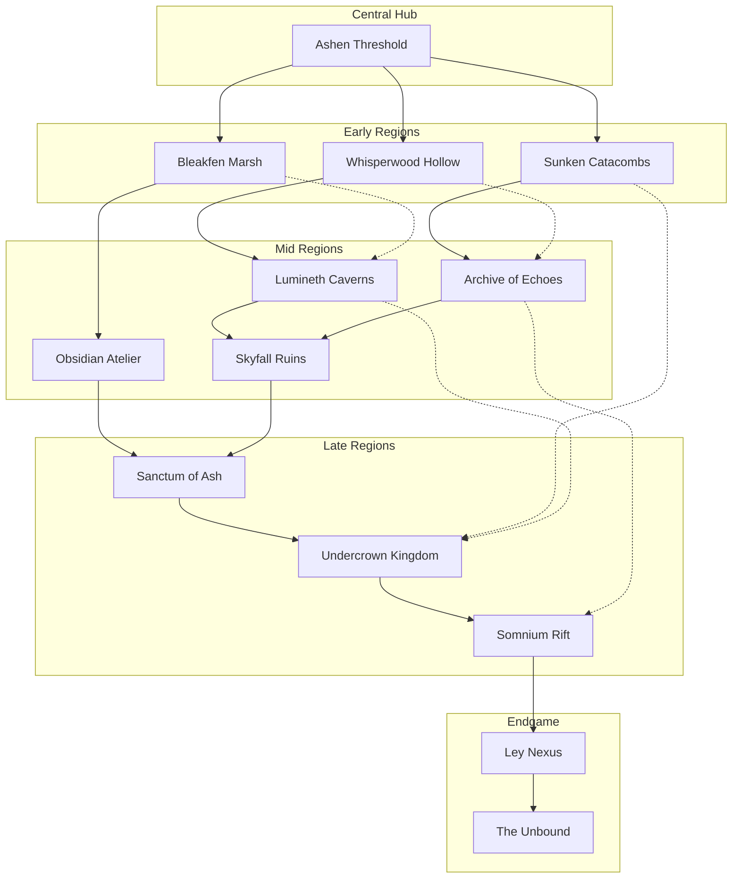
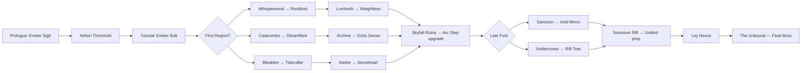

# 02 — World Design Document

**Project:** Arcania  
**Genre:** Dark Fantasy 2D Metroidvania  
**Protagonist:** Elara Veilmark  
**Document version:** 1.0  
**Status:** Production-ready level design spec

> *"The weave is torn. You are the last thread."*

This document defines all twelve explorable regions, their interconnections, progression gates, fast travel, secret zones, and backtracking routes. Cross-reference [04-enemy-bible.md](04-enemy-bible.md), [05-boss-bible.md](05-boss-bible.md), and [06-magic-system.md](06-magic-system.md) for combat and ability details.

---

## Table of Contents

1. [World Map Overview](#world-map-overview)
2. [Progression Graph](#progression-graph)
3. [Ability-Gating Structure](#ability-gating-structure)
4. [Fast Travel](#fast-travel)
5. [Shortcut Design Philosophy](#shortcut-design-philosophy)
6. [Backtracking Routes](#backtracking-routes)
7. [Secret Zones](#secret-zones)
8. [Region Specifications](#region-specifications)
   - [01 — Ashen Threshold (Hub)](#01--ashen-threshold-hub)
   - [02 — Whisperwood Hollow (Early)](#02--whisperwood-hollow-early)
   - [03 — Sunken Catacombs (Early)](#03--sunken-catacombs-early)
   - [04 — Bleakfen Marsh (Early)](#04--bleakfen-marsh-early)
   - [05 — Lumineth Caverns (Mid)](#05--lumineth-caverns-mid)
   - [06 — Archive of Echoes (Mid)](#06--archive-of-echoes-mid)
   - [07 — Skyfall Ruins (Mid)](#07--skyfall-ruins-mid)
   - [08 — Obsidian Atelier (Mid)](#08--obsidian-atelier-mid)
   - [09 — Sanctum of Ash (Late)](#09--sanctum-of-ash-late)
   - [10 — Undercrown Kingdom (Late)](#10--undercrown-kingdom-late)
   - [11 — Somnium Rift (Late)](#11--somnium-rift-late)
   - [12 — Ley Nexus + The Unbound (Endgame)](#12--ley-nexus--the-unbound-endgame)

---

## World Map Overview

Arcania is a single contiguous overworld shaped like a broken ring around a collapsed ley core. The **Ashen Threshold** sits at the geographic and narrative center. Early regions branch outward in three directions (forest, underground, marsh). Mid-game regions climb vertically (caverns, archives, sky ruins, forge). Late regions descend into ash sanctums, subterranean kingdoms, and dream rifts before the player breaches the **Ley Nexus** at the world's wound.

**Legend:** Solid arrows = primary intended route. Dotted arrows = optional cross-links unlocked by mid/late abilities.

---

## Progression Graph

Player-facing progression is non-linear after the tutorial block. Three viable "first exits" from the hub open different spell pickups and boss orderings. All paths reconverge at **Skyfall Ruins** before the late-game fork.

**Recommended minimum spell count before Ley Nexus:** 11 of 14 (all except Unbind and one optional utility).

---

## Ability-Gating Structure

Fourteen spells gate traversal, combat, and secrets. Each spell has a **primary gate type** and **secondary uses** in other regions.

| # | Spell | Primary Gate | Unlocked In | Hard Gates | Soft Gates |
|---|-------|-------------|-------------|------------|------------|
| 01 | **Ember Bolt** | Ranged combat / ignite braziers | Ashen Threshold (tutorial) | Ember-locked sconces | Weak enemy shields |
| 02 | **Arc Step** | Short blink through thin walls | Whisperwood Hollow | Arc-conductive gaps | Combat reposition |
| 03 | **Kindling Ward** | Block fire/corruption damage | Sunken Catacombs | Heat vents, ash storms | DoT-heavy zones |
| 04 | **Rootbind** | Grow climbable vines | Whisperwood Hollow | Vertical bark walls | Trap enemies |
| 05 | **Mistveil** | Pass through mist barriers | Bleakfen Marsh | Fen fog gates | Reduce aggro radius |
| 06 | **Tidecaller** | Raise/lower water levels | Bleakfen Marsh | Flooded passages | Push floating debris |
| 07 | **Stoneheart** | Break cracked stone / statues | Obsidian Atelier | Reinforced walls | Stagger armored foes |
| 08 | **Gleamflare** | Reveal hidden paths / illusions | Sunken Catacombs | Phantom bridges | Blind light-sensitive enemies |
| 09 | **Weightless** | Float across chasms / updrafts | Lumineth Caverns | Gravity wells | Extended air control |
| 10 | **Echo Sense** | Detect memory echoes / secret doors | Archive of Echoes | Echo-locked archives | Track invisible enemies |
| 11 | **Rift Tear** | Open planar tears in thin reality | Undercrown Kingdom | Rift membranes | Pull distant objects |
| 12 | **Ley Anchor** | Stabilize ley currents / activate pylons | Skyfall Ruins | Unstable bridges | Boost spell range |
| 13 | **Void Mirror** | Reflect beams / absorb curse pulses | Sanctum of Ash | Mirror puzzles | Return projectiles |
| 14 | **Unbind** | Sever ley bindings / final key | Somnium Rift | Ley Nexus seals | Dispel boss shields |

**Design rule:** No single spell hard-gates more than two region exits. Soft gates (optional loot, shortcuts) may stack.

---

## Fast Travel

### Waystone Circles

Waystones are circular stone platforms inscribed with ley fractures. Each region contains **1–3 Waystone Circles** (hub has 1 central circle). Activation requires:

1. Physical discovery (stand on circle)
2. Clearing adjacent **Corruption Nodes** (1–4 per circle)
3. Paying a one-time **Memory Shard** (hub tutorial circle is free)

Once active, Waystones appear on the map. Travel is **instant** with a 1.5s dissolve transition. Waystones do **not** connect across regions until the **Ley Anchor** spell is acquired; before that, each region's Waystones form an isolated subnet.

| Region | Waystone Count | Notes |
|--------|---------------|-------|
| Ashen Threshold | 1 | Central; always free |
| Whisperwood Hollow | 2 | Second behind Rootbind vine wall |
| Sunken Catacombs | 2 | One in flooded annex (Tidecaller) |
| Bleakfen Marsh | 3 | Spread due to zone size |
| Lumineth Caverns | 2 | One in crystal gallery |
| Archive of Echoes | 2 | One in restricted stack |
| Skyfall Ruins | 3 | Vertical distribution |
| Obsidian Atelier | 2 | Forge heat hazard nearby |
| Sanctum of Ash | 2 | One post-mini-boss |
| Undercrown Kingdom | 3 | Throne district locked until Rift Tear |
| Somnium Rift | 2 | Unstable; flicker during travel |
| Ley Nexus | 1 | Final hub before The Unbound |

**Post–Ley Anchor:** All activated Waystones link into a single network. Player selects destination from map UI.

### Sigil Recall

**Sigil Recall** is Elara's innate fast-travel override tied to the Ember Sigil:

- **Unlock:** Defeat the Whisperwood Hollow mini-boss (Thornweft Matron)
- **Function:** Hold `Recall` for 2s to return to the **last rested Waystone** or **Sanctuary brazier**
- **Cooldown:** 90 seconds (reduced to 60s after Ley Anchor)
- **Restriction:** Disabled in boss arenas, during cutscenes, and inside Somnium Rift unstable zones
- **Upgrade (Archive of Echoes):** Recall leaves a 3s echo decoy that draws enemy aggro

Sigil Recall and Waystones share the same destination list once Ley Anchor unifies the network.

---

## Shortcut Design Philosophy

Arcania shortcuts follow four principles:

1. **Earned, not found.** Every major shortcut requires a spell or key obtained *deeper* in the same region or an adjacent one. No shortcut opens before the player has a reason to backtrack.

2. **Three-beat structure.** (a) Player sees a locked shortcut near region entrance. (b) Player loops through the region and unlocks it from the far side. (c) Return trip is 40–60% shorter but not trivial — one combat encounter or hazard remains.

3. **Visual landmarking.** Unlocked shortcuts change the environment: raised bridges, lit braziers, cleared rubble, or opened grates. Locked shortcuts use consistent iconography (cracked stone = Stoneheart, mist curtain = Mistveil, vine wall = Rootbind).

4. **Hub compression.** The Ashen Threshold accumulates shortcuts as regions are cleared. By endgame, the hub connects to at least four regions via one-way drop shafts or blink pads unlocked from the far side.

**Shortcut types:**

| Type | Example | Typical Spell |
|------|---------|---------------|
| One-way drop | Collapsed floor to lower hub | None (one-way) |
| Two-way gate | Mist curtain parting | Mistveil |
| Mechanical | Gear lift to upper catwalk | Tidecaller / Stoneheart |
| Planar | Rift door between twin rooms | Rift Tear |
| Ley lift | Floating platform network | Ley Anchor |

---

## Backtracking Routes

After acquiring key spells, previously visited regions gain new paths. This table lists **high-value backtrack loops** for level designers and QA.

| After Obtaining | Backtrack To | New Route / Reward |
|-----------------|-------------|-------------------|
| Rootbind | Ashen Threshold | Climb east cliff → shortcut to Whisperwood upper canopy |
| Gleamflare | Sunken Catacombs | Reveal phantom bridge → Memory Shard cache |
| Tidecaller | Bleakfen Marsh | Drain central fen → access **The Hollow Heart** secret zone |
| Tidecaller | Sunken Catacombs | Lower ossuary water → elite encounter E-31 |
| Arc Step | Whisperwood Hollow | Blink through canopy wall → relic slot |
| Weightless | Lumineth Caverns | Float to crystal spire → map fragment |
| Echo Sense | Archive of Echoes | Hidden stack → **Memory Well** secret zone |
| Echo Sense | Ashen Threshold | Detect Veilmark family echo → lore + shard |
| Stoneheart | Obsidian Atelier | Break forge seal → weapon upgrade material |
| Ley Anchor | Skyfall Ruins | Stabilize all bridges → unified Waystone net |
| Ley Anchor | All regions | Waystone network goes global |
| Void Mirror | Sanctum of Ash | Mirror puzzle room → **Fallen Observatory** access key |
| Rift Tear | Undercrown Kingdom | Tear into sealed vault → **King's Hollow** |
| Rift Tear | Skyfall Ruins | Planar shortcut to Somnium Rift antechamber |
| Unbind | Ley Nexus | Open final seal → **The Unwritten Page** |
| Unbind | Somnium Rift | Collapse dream loops → true ending gate |

---

## Secret Zones

Five optional zones sit outside the critical path. Each requires 2–3 ability checks and rewards a **Relic Tier-2** item or **alternate lore branch**.

---

### The Hollow Heart

| Field | Detail |
|-------|--------|
| **Location** | Bleakfen Marsh — drained central fen basin (Tidecaller) |
| **Theme** | Fossilized tree core pulsing with dormant ley sap |
| **Visual** | Enormous petrified roots forming a chamber; bioluminescent sap veins (#1A4D2E, #7CFC00) |
| **Access** | Drain fen → Stoneheart cracked root → Mistveil inner fog |
| **Contents** | 4 rooms, 1 elite (E-28 Fen Colossus), relic **Heartwood Chalice** (+15% mana regen in nature zones) |
| **Lore** | The Hollow Heart was the first ley tree; the Weave was anchored here before the Sundering |

---

### Memory Well

| Field | Detail |
|-------|--------|
| **Location** | Archive of Echoes — hidden stack behind Echo Sense wall |
| **Theme** | Submerged archive of liquid memory |
| **Visual** | Infinite reflection pool, floating pages, silver-blue light (#0D1B2A, #778DA9) |
| **Access** | Echo Sense → Gleamflare hidden shelf → Tidecaller raise inner pool |
| **Contents** | 5 rooms, memory puzzle, relic **Wellkeeper's Lens** (Echo Sense reveals loot through walls) |
| **Lore** | Archivists poured their memories into the Well to survive the empire's fall; many still drift, half-aware |

---

### Fallen Observatory

| Field | Detail |
|-------|--------|
| **Location** | Skyfall Ruins — collapsed upper ring (Void Mirror key from Sanctum) |
| **Theme** | Shattered celestial observatory hanging above the void |
| **Visual** | Broken orrery, star charts on stone, void backdrop (#1B1B3A, #FFD700) |
| **Access** | Void Mirror beam puzzle in Sanctum → Rift Tear sky gap → Weightless float sequence |
| **Contents** | 6 rooms, star alignment puzzle, relic **Astrolabe Fragment** (Ley Anchor range +20%) |
| **Lore** | Astronomancers predicted the Sundering decades early; they were silenced, not heeded |

---

### King's Hollow

| Field | Detail |
|-------|--------|
| **Location** | Undercrown Kingdom — sealed vault beneath throne |
| **Theme** | Tomb of the last Undercrown monarch |
| **Visual** | Gold-inlaid basalt, root-choked throne, fungal crown (#2D2D2D, #B8860B) |
| **Access** | Rift Tear vault membrane → Echo Sense royal inscription → Stoneheart seal break |
| **Contents** | 5 rooms, optional elite E-35 Crown Devourer, relic **Hollow Signet** (+10% damage vs. elites) |
| **Lore** | King Morvain chose to bury his kingdom rather than surrender its ley keys to the Unbound |

---

### The Unwritten Page

| Field | Detail |
|-------|--------|
| **Location** | Ley Nexus — behind the final seal (Unbind required) |
| **Theme** | The page torn from the Weave's source codex |
| **Visual** | White void, single floating page, text that rewrites itself (#FFFFFF, #4A0E4E) |
| **Access** | Unbind final seal → Gleamflare read invisible ink → Echo Sense resonate |
| **Contents** | 3 rooms, narrative choice, relic **Unwritten Margin** (unlock true ending branch) |
| **Lore** | The Unwritten Page is the spell that was never cast — the one that could have mended the Weave without sacrifice |

---

## Region Specifications

---

### 01 — Ashen Threshold (Hub)

| Field | Detail |
|-------|--------|
| **Theme** | Ruined waystation at the edge of the Sundering scar |
| **Visual Identity** | Collapsed archways, ember-lit fog, cracked ley pavement, Veilmark insignia faded on stone |
| **Color Palette** | `#2C2C34` (charcoal stone), `#8B4513` (burnt umber), `#FF6B35` (ember orange), `#4A4E69` (twilight slate), `#1A1A2E` (deep shadow) |

#### Lore

The Ashen Threshold was once a pilgrim crossing where apprentices swore oaths to the Weave. When the Sundering tore the ley core, the crossing collapsed inward, leaving a perpetual ember fog that never fully burns or fades. Elara awakens here because her Ember Sigil resonates with the scar — she is, unknowingly, standing on the exact fracture point where her family's legacy ended.

Survivors and scavengers rarely pass through anymore. Braziers still flicker along the old processional route, maintained by no visible hand. The Threshold remembers every mage who crossed it; faint echoes of oath-speech drift through the fog at dusk. Those who linger too long report hearing their own voice reciting vows they never made.

The hub's central Waystone is cracked but functional — a metaphor the archivists would have appreciated. From here, three broken roads lead to the world's remaining organs: the forest that whispers, the catacombs that drink, and the marsh that drowns memory.

#### Enemies

| ID | Name | Role |
|----|------|------|
| E-01 | Ash Wisp | Ambient swarm; tutorial dodge |
| E-02 | Bone Crawler | Ground patrol; teaches timing |
| E-04 | Ember Moth | Flying harasser; weak to Ember Bolt |
| E-08 | Threshold Shade | Elite patrol (1 per loop); tests combo |

#### Hazards

- Ember fog patches (slow + minor chip damage; cleared by Kindling Ward later)
- Collapsing floor sections (telegraphed cracks)
- Unlit brazier corridors (visibility reduction, not damage)

#### Bosses

| Type | Name |
|------|------|
| Mini-boss | — (none; hub is safe) |
| Main boss | — |

#### Secrets

1. **Veilmark Insignia Wall** — Gleamflare (post-Catacombs) reveals family crest; lore + shard
2. **Collapsed Archive Niche** — Rootbind (post-Whisperwood) opens vine-choked alcove; consumables cache
3. **Ember Sigil Resonance Chamber** — Echo Sense (post-Archive) plays prologue memory; skill point

#### Unlock Requirements

- **Entry:** Prologue complete (automatic)
- **Exits:** Tutorial Ember Bolt acquired; three region gates open simultaneously after first rest at central Waystone

#### Connections

| Direction | Region | Gate |
|-----------|--------|------|
| East | Whisperwood Hollow | Broken forest road (open) |
| North | Sunken Catacombs | Collapsed stair (open) |
| West | Bleakfen Marsh | Flooded gate (open; wading section) |
| Down | Ley Nexus | Sealed until Unbind (endgame) |

#### Room Count Estimate

**28 rooms** (including 4 sanctuary/rest areas, 1 shop NPC alcove, 3 shortcut stubs that fill in later)

#### Music Mood

*Melancholic ambient — sparse piano, distant wind, ember crackle. Tempo: 60 BPM. No combat drums; hub is safe. Layer faint choir when Echo Sense is used here post-Archive.*

---

### 02 — Whisperwood Hollow (Early)

| Field | Detail |
|-------|--------|
| **Theme** | Sentient forest grieving its ley-drained heartwood |
| **Visual Identity** | Towering hollow trees, bioluminescent spores, woven bark bridges, moth swarms |
| **Color Palette** | `#1B4332` (deep pine), `#52B788` (moss green), `#95D5B2` (pale leaf), `#D8F3DC` (spore glow), `#40916C` (canopy mid) |

#### Lore

Whisperwood Hollow is not a forest in the common sense — it is a single organism stretched across miles, its roots once tapped directly into the ley core. When the Sundering drained the core, the forest began to dream instead of grow, and its dreams leaked into the waking wood as whispers. Travelers hear their regrets spoken back to them in a voice like rustling leaves.

The Thornweft Coven tended this place before the empire fell, binding aggressive growth with song-threads. Their songs are gone, but the threads remain, twitching in response to magic. Elara's Rootbind spell is not learned here so much as *remembered* — the forest recognizes the Veilmark bloodline as old gardeners.

Deep in the canopy, the heartwood chamber still pulses faintly. Something nested there after the Sundering: something that wraps prey in silk and stores them like seeds. The forest wants it gone but cannot act against its own flesh.

#### Enemies

| ID | Name | Role |
|----|------|------|
| E-03 | Bramble Stalker | Camouflage ambush from bark |
| E-07 | Mothling Swarm | Air denial; weak to fire |
| E-12 | Bark Wraith | Phase through trees; teaches tracking |
| E-15 | Thornweft Larva | Ranged silk spit; slows player |
| E-18 | Canopy Hunter | Elite jumper; mini-boss prelude |

#### Hazards

- Thorn floors (DoT on contact)
- Falling branch traps (telegraphed sway)
- Spore clouds (obscure vision; Mistveil clears later)
- Vertical pit drops (one-way until Rootbind shortcut)

#### Bosses

| Type | Name |
|------|------|
| Mini-boss | **Thornweft Matron** |
| Main boss | — |

#### Secrets

1. **Gardener's Cache** — Hidden behind destructible bark wall; relic fragment
2. **Whisper Loop** — Stand in three whisper stones (sequence puzzle); map marker
3. **Canopy Nest** — Arc Step blink into hollow trunk; elite E-18 optional fight

#### Unlock Requirements

- **Entry:** Ashen Threshold east gate
- **Spells obtained:** Rootbind (heartwood chamber), Arc Step (post-Matron drop)
- **Gate out:** Rootbind required for Lumineth Caverns upper lift

#### Connections

| Direction | Region | Gate |
|-----------|--------|------|
| West | Ashen Threshold | Forest road return |
| Up | Lumineth Caverns | Rootbind vine elevator |
| Shortcut | Archive of Echoes | Canopy rift (Arc Step + Echo Sense, optional) |

#### Room Count Estimate

**42 rooms**

#### Music Mood

*Organic acoustic — cello harmonics, breathy flute, rustling foley. Combat layers add staccato strings. Matron fight: discordant choir + percussion.*

---

### 03 — Sunken Catacombs (Early)

| Field | Detail |
|-------|--------|
| **Theme** | Drowned burial city of the first archivists |
| **Visual Identity** | Waist-deep water corridors, bone mosaics, sunken reliquaries, ghost lanterns |
| **Color Palette** | `#0B090A` (void black), `#495867` (wet slate), `#B1FAFF` (lantern cyan), `#C9ADA7` (bone dust), `#5C677D` (flood stone) |

#### Lore

Before the Archive of Echoes existed above ground, the dead were stored below the water table — a precaution against fire, which the early archivists feared more than drowning. The Catacombs held thousands of memory-vessels: ceramic urns containing the final thoughts of scholars, soldiers, and mages. When the ley core fractured, the water table shifted overnight, and the Catacombs partially drained, exposing chambers that were never meant to see air.

The ghost lanterns that drift through the halls are not spirits — they are recorded memories seeking their urns. Some have forgotten what they are and attack anything warm. The Catacombs remember Elara's name from somewhere, whispering it in corridors she has never walked. This is because her ancestor's urn is stored here, sealed behind a Gleamflare illusion.

The mini-boss, **Reliquary Sentinel**, is a construct built to guard the urn vault. It has stood in knee-deep water for three centuries, its recognition protocols slowly corrupting. It will not yield unless defeated or bypassed with Gleamflare's revelation of the service corridor behind its alcove.

#### Enemies

| ID | Name | Role |
|----|------|------|
| E-02 | Bone Crawler | Water-speed variant |
| E-06 | Grave Lantern | Floating orb; explodes on proximity |
| E-09 | Drowned Acolyte | Rising grab from water |
| E-11 | Mosaic Serpent | Corridor sweeper; telegraphed lunge |
| E-14 | Urn Wraith | Ranged memory shard throw |
| E-20 | Reliquary Guard | Mini-boss adds; shield formation |

#### Hazards

- Flooded rooms (slow movement; Tidecaller drainage shortcut later)
- Collapsing bone mosaic floors (fall into lower loop)
- Lantern burst zones (fire damage; Kindling Ward blocks)
- Gas pockets in dry chambers (poison; vent with Ember Bolt ignite)

#### Bosses

| Type | Name |
|------|------|
| Mini-boss | **Reliquary Sentinel** |
| Main boss | — |

#### Secrets

1. **Veilmark Urn Vault** — Gleamflare reveals hidden aisle; ancestor lore + Kindling Ward upgrade
2. **Drowned Scriptorium** — Tidecaller drain side chamber; spell upgrade material
3. **Bone Mosaic Code** — Floor tile sequence; opens consumable hoard

#### Unlock Requirements

- **Entry:** Ashen Threshold north stair
- **Spells obtained:** Kindling Ward (Sentinel drop), Gleamflare (urn vault)
- **Gate out:** Gleamflare for Archive lower entrance illusion

#### Connections

| Direction | Region | Gate |
|-----------|--------|------|
| South | Ashen Threshold | Collapsed stair |
| Up | Archive of Echoes | Gleamflare phantom stair |
| Down | Undercrown Kingdom | Sealed royal crypt (Rift Tear, late backtrack) |

#### Room Count Estimate

**38 rooms**

#### Music Mood

*Submerged Gothic — low pipe organ drones, dripping water percussion, distant choral hum. Sentinel fight: clockwork motifs, reversed choir.*

---

### 04 — Bleakfen Marsh (Early)

| Field | Detail |
|-------|--------|
| **Theme** | Memory-sinking wetland where regrets pool and ferment |
| **Visual Identity** | Stagnant black water, dead cypress, fog banks, will-o-wisps, rotting docks |
| **Color Palette** | `#1A1A1D` (peat black), `#4E5D5C` (moss grey), `#6B9080` (fen green), `#AEC3B0` (dead mist), `#E8E8E8` (wisp white) |

#### Lore

Bleakfen Marsh formed when ley runoff mixed with the tears of a failed resurrection spell — a court mage's last attempt to revive a drowned prince. The spell did not fail cleanly. It dispersed into the watershed, and now the marsh absorbs memories instead of water. Drink from the fen and you forget an hour. Fall in and you forget a year.

The Fenbound cult once worshipped the marsh as a mercy: a place to surrender grief. Their stilt-villages still stand, empty, lanterns burning with no oil. Elara finds Tidecaller inscribed on a cult altar — not as a weapon, but as a prayer to lower the waters and reveal what the marsh hides. The prayer still works. The marsh does not want to be emptied.

At the marsh's center lies the petrified Hollow Heart tree, accessible only when the fen drains. The tree is the oldest thing in Arcania and the reason the forest, catacombs, and marsh all connect underground — their roots, bones, and water share the same buried organ.

#### Enemies

| ID | Name | Role |
|----|------|------|
| E-05 | Fen Leech | Water surface skimmer; latches |
| E-10 | Will-o-Mire | Lures into hazard; explodes |
| E-13 | Bog Maw | Pit trap enemy; ground chomp |
| E-16 | Stilt Crawler | Elevated patrol on dock paths |
| E-19 | Memory Eel | Steals mana on hit |
| E-22 | Fenbound Zealot | Ranged curse spit; elite |

#### Hazards

- Deep fen pools (instant grab; Tidecaller lowers some)
- Memory fog (screen desaturate; Mistveil passage)
- Rotting dock collapses (timing platforming)
- Curse totems (slow stacking debuff; destroy with Ember Bolt)

#### Bosses

| Type | Name |
|------|------|
| Mini-boss | **Miremother** |
| Main boss | — |

#### Secrets

1. **Stilt-Village Hoard** — Collapsed house basement; cult lore tablets
2. **Wisp Trail** — Follow will-o-wisps without attacking (Mistveil); relic slot
3. **The Hollow Heart** — Secret zone (see Secret Zones section)

#### Unlock Requirements

- **Entry:** Ashen Threshold west gate (wading intro)
- **Spells obtained:** Mistveil (Miremother drop), Tidecaller (cult altar)
- **Gate out:** Stoneheart cracked dam to Obsidian Atelier (or via hub loop)

#### Connections

| Direction | Region | Gate |
|-----------|--------|------|
| East | Ashen Threshold | Fen road |
| North | Obsidian Atelier | Cracked dam (Stoneheart) / long route via hub |
| Down | Lumineth Caverns | Submerged root tunnel (Tidecaller + Rootbind) |

#### Room Count Estimate

**45 rooms** (largest early region due to horizontal sprawl)

#### Music Mood

*Swamp blues ambient — detuned banjo, foghorn-like synth, sluggish tempo 50 BPM. Miremother: heartbeat bass, layered whispers.*

---

### 05 — Lumineth Caverns (Mid)

| Field | Detail |
|-------|--------|
| **Theme** | Crystalized ley overflow — beauty that cuts |
| **Visual Identity** | Prismatic crystal formations, light refraction, vertical shafts, gem growths |
| **Color Palette** | `#10002B` (deep amethyst), `#7B2CBF` (crystal violet), `#E0AAFF` (pale prism), `#FFD60A` (reflected gold), `#3C096C` (cavern shadow) |

#### Lore

When the ley core was healthy, excess energy vented through crystal vents beneath the Whisperwood, forming the Lumineth Caverns. The crystals are not mineral — they are solidified spell-residue, each facet containing a fragment of someone's cast magic. Touch a crystal and you feel a stranger's intent: love, rage, fear, all frozen mid-thought.

The Caverns have begun to crack since the Sundering. Light that once refracted gently now cuts like glass. Miners from the Obsidian Atelier descended here for raw material until the Weightless vents opened, pulling workers into the ceiling and leaving them embedded in crystal. Their silhouettes are still visible, reaching.

The **Prism Warden** mini-boss is a crystal golem assembled from mined fragments, still executing its last command: "Do not let anyone reach the spire." The spire holds the Weightless spell, which the Atelier mages were trying to steal when the vents opened. Elara must take it to reach Skyfall Ruins from below — the caverns are the vertical spine connecting earth to sky.

#### Enemies

| ID | Name | Role |
|----|------|------|
| E-17 | Crystal Crawler | Wall/ceiling mobility |
| E-21 | Prism Bat | Reflected projectile attacker |
| E-23 | Shard Stalker | Glass shard trail AoE |
| E-25 | Lightcut Beam | Environmental enemy; rotating laser |
| E-27 | Gembound Miner | Undead miner; pickaxe combo |
| E-29 | Prism Warden | Mini-boss; reflect shield phases |

#### Hazards

- Rotating light beams (cut damage; Void Mirror reflects later)
- Gravity inversion zones (Weightless required)
- Crystal shard rain (telegraphed ceiling crack)
- Slippery crystal slopes (momentum control)

#### Bosses

| Type | Name |
|------|------|
| Mini-boss | **Prism Warden** |
| Main boss | — |

#### Secrets

1. **Embedded Miner Gallery** — Echo Sense reads final thoughts; skill point
2. **Prism Refraction Room** — Align three crystals (Gleamflare hint); map fragment
3. **Spire Underhang** — Weightless float to hidden ledge; Tier-1 relic

#### Unlock Requirements

- **Entry:** Whisperwood Rootbind elevator OR Bleakfen submerged root tunnel
- **Spells obtained:** Weightless (crystal spire)
- **Gate out:** Weightless float up draft shaft to Skyfall Ruins underside

#### Connections

| Direction | Region | Gate |
|-----------|--------|------|
| Down | Whisperwood Hollow | Rootbind vine elevator |
| Up | Skyfall Ruins | Weightless updraft shaft |
| West | Bleakfen Marsh | Submerged tunnel (return) |
| East | Undercrown Kingdom | Deep crystal fault (Rift Tear, late) |

#### Room Count Estimate

**48 rooms** (high verticality; many shafts count as rooms)

#### Music Mood

*Crystalline electronic — glass percussion, arpeggiated synth, reverb-heavy pads. 75 BPM. Warden fight: sharp staccato, dissonant intervals.*

---

### 06 — Archive of Echoes (Mid)

| Field | Detail |
|-------|--------|
| **Theme** | Living library where books remember readers who never returned |
| **Visual Identity** | Infinite shelves, floating pages, ink rivers, echo silhouettes, candle pools |
| **Color Palette** | `#03045E` (ink navy), `#0077B6` (candle blue), `#90E0EF` (page white-blue), `#CAF0F8` (echo pale), `#023E8A` (shelf dark) |

#### Lore

The Archive of Echoes is the empire's last attempt to preserve everything before the Sundering. Head Archivist Thessaly ordered every text, spell, and memory-vessel transferred here from the Catacombs and satellite libraries. The transfer spell was imperfect: it copied *impressions* of books as well as the books themselves, and now the Archive contains duplicates that disagree on facts.

Echoes — translucent replays of past events — wander the stacks, reenacting arguments, love affairs, and betrayals on loop. Some loops have run so long the participants' faces have worn smooth. Echo Sense was designed here as a cataloguing tool; Elara repurposes it as a key.

The **Index Hydra** mini-boss guards the central catalog, a creature made of card catalog drawers that bite. Defeating it grants access to the Memory Well secret zone entrance and the Echo Sense upgrade. The Archive connects to Skyfall Ruins via a toppled shelf bridge — a literal bridge of books frozen mid-fall by a time-loop echo.

#### Enemies

| ID | Name | Role |
|----|------|------|
| E-14 | Urn Wraith | Archive variant; ink splash |
| E-24 | Page Swarm | Flying paper cuts |
| E-26 | Echo Scholar | Copies player spell (one cast) |
| E-30 | Ink Elemental | Pool spawner; slows |
| E-32 | Catalog Serpent | Index Hydra body segment |
| E-33 | Binding Golem | Shelf collapse trigger |

#### Hazards

- Ink rivers (slow + mana drain)
- Falling shelf triggers (Binding Golem proximity)
- Echo loops (disorienting; Echo Sense identifies safe paths)
- Candle wax pools (stick; jump or Arc Step)

#### Bosses

| Type | Name |
|------|------|
| Mini-boss | **Index Hydra** |
| Main boss | — |

#### Secrets

1. **Thessaly's Office** — Gleamflare hidden door; faction lore
2. **Memory Well** — Secret zone (see Secret Zones)
3. **Contradiction Room** — Two books, one truth (dialogue puzzle); alternate spell flavor text

#### Unlock Requirements

- **Entry:** Sunken Catacombs Gleamflare stair OR Whisperwood canopy rift (optional)
- **Spells obtained:** Echo Sense (Index Hydra drop), Sigil Recall upgrade
- **Gate out:** Echo Sense + frozen shelf bridge to Skyfall Ruins

#### Connections

| Direction | Region | Gate |
|-----------|--------|------|
| Down | Sunken Catacombs | Phantom return stair |
| East | Skyfall Ruins | Frozen shelf bridge |
| Shortcut | Somnium Rift | Dream catalog (Echo Sense + Rift Tear, late) |

#### Room Count Estimate

**52 rooms** (horizontal shelf mazes + vertical reading towers)

#### Music Mood

*Library ambient — page-turn foley, soft harpsichord, whispered Latin-like vocals. Hydra fight: chaotic polyrhythm, stampeding percussion.*

---

### 07 — Skyfall Ruins (Mid)

| Field | Detail |
|-------|--------|
| **Theme** | Celestial city that crashed when the ley core collapsed |
| **Visual Identity** | Floating debris, inverted gravity zones, star-scarred stone, broken bridges over void |
| **Color Palette** | `#0D0221` (void purple), `#264653` (teal stone), `#2A9D8F` (sky jade), `#E9C46A` (star gold), `#F4A261` (dawn orange) |

#### Lore

Skyfall Ruins was a city built on ley levitation — the empire's wealthiest mages lived in the sky, literally looking down on the ground-dwellers. When the core failed, the levitation fields inverted in a cascade. The city did not fall all at once; it *unfolded*, district by district, over three days. Survivors describe hearing the screams of buildings.

Now the Ruins hang in a permanent partial collapse: some platforms stable, others drifting, some frozen mid-fall by residual ley locks. The **Ley Anchor** spell was the emergency protocol — mages were supposed to stabilize their districts. Most never cast it in time. Elara finds the protocol inscribed on a skybridge control panel, still functional, still waiting.

Skyfall is the convergence point. All three early-to-mid routes lead here, and from here the late game splits toward Sanctum of Ash (up, into the burn) and Undercrown Kingdom (down, into the root). The major boss **Starfall Regent** rules the highest intact tower, a mage who fused with his levitation engine rather than die in the crash.

#### Enemies

| ID | Name | Role |
|----|------|------|
| E-25 | Lightcut Beam | Sky variant; longer range |
| E-28 | Void Leaper | Inter-platform jumper |
| E-31 | Gravity Wraith | Inverts local gravity |
| E-34 | Debris Golem | Rolling boulder enemy |
| E-36 | Starfall Knight | Elite; shield + lance |
| E-37 | Regent's Echo | Boss adds; levitation orbs |

#### Hazards

- Void gaps (fall = respawn at last platform; Weightless mitigates)
- Inversion zones (controls flip; Ley Anchor stabilizes)
- Wind shear corridors (pushback; Rootbind anchor points)
- Crumbling skybridges (timed crossing; Ley Anchor permanent fix)

#### Bosses

| Type | Name |
|------|------|
| Mini-boss | **Bridge Warden Kael** |
| Main boss | **Starfall Regent** |

#### Secrets

1. **Fallen Observatory** — Secret zone (see Secret Zones; requires Sanctum key)
2. **Inverted Garden** — Weightless float into upside-down room; relic
3. **Regent's Private Ledger** — Post-boss; true history of Sundering trigger

#### Unlock Requirements

- **Entry:** Lumineth updraft OR Archive shelf bridge OR (late) Rift Tear from Undercrown
- **Spells obtained:** Ley Anchor (skybridge panel), Arc Step range upgrade (Regent drop)
- **Gate out:** Regent defeat opens Sanctum ascent + Undercrown descent

#### Connections

| Direction | Region | Gate |
|-----------|--------|------|
| Down | Lumineth Caverns | Updraft return |
| West | Archive of Echoes | Shelf bridge return |
| Up | Sanctum of Ash | Burn scar elevator (post-Regent) |
| Down | Undercrown Kingdom | Root chute (post-Regent) |
| Planar | Somnium Rift | Rift Tear antechamber (late) |

#### Room Count Estimate

**58 rooms** (multi-tier vertical; largest mid region)

#### Music Mood

*Celestial tragedy — soaring strings broken by silence gaps, wind howl, distant thunder. Regent fight: full orchestra, inverted motif of hub theme.*

---

### 08 — Obsidian Atelier (Mid)

| Field | Detail |
|-------|--------|
| **Theme** | Forbidden forge where spells were weaponized |
| **Visual Identity** | Obsidian furnaces, molten channels, anvil golems, scorched blueprints, ash snow |
| **Color Palette** | `#0A0A0A` (obsidian black), `#DC2F02` (forge orange), `#FFBA08` (molten yellow), `#370617` (deep crimson), `#6A040F` (cooling ember) |

#### Lore

The Obsidian Atelier was the empire's weapons division — a forge-temple where mages bound spells into physical form: blades, armor, siege engines. The Atelier's master, **Forge-Saint Ilmen**, believed magic should be *shaped*, not freely cast. He opposed the ley core expansion that ultimately caused the Sundering. He was overruled, and he began forging something in secret: Stoneheart, a spell to break what others built.

Ilmen did not survive the Sundering, but his final forge-golem, **Anvil Ascendant**, still hammers in the dark, completing a weapon no one ordered. The Atelier's furnaces run on residual ley heat — they will never cool unless Stoneheart is used on the central anvil. Doing so opens the forge's true product: a map to the Sanctum of Ash's hidden entrance, bypassing half the Regent's tower.

The Atelier connects Bleakfen to the late game through the dam Ilmen built — a structure meant to hold back the marsh's memory-water from contaminating the forge's ley-fuel.

#### Enemies

| ID | Name | Role |
|----|------|------|
| E-27 | Gembound Miner | Forge variant; heat aura |
| E-33 | Binding Golem | Anvil chain variant |
| E-35 | Slag Crawler | Molten trail leave-behind |
| E-38 | Blueprint Phantom | Ranged; summons turret |
| E-39 | Furnace Mouth | Stationary; breath attack |
| E-40 | Anvil Thrall | Mini-boss adds; hammer combo |

#### Hazards

- Molten channels (high DoT; Kindling Ward reduces)
- Forge blast vents (timed; telegraphed red glow)
- Ash snow (visibility + minor chip; indoor only)
- Magnetic pull zones near anvils (movement restrict; Stoneheart breaks anchors)

#### Bosses

| Type | Name |
|------|------|
| Mini-boss | **Anvil Ascendant** |
| Main boss | — |

#### Secrets

1. **Ilmen's Journal** — Hidden forge office; Stoneheart lore + upgrade
2. **Blueprint Vault** — Stoneheart break wall; crafting materials
3. **Dam Control Room** — Tidecaller alternate; drains Atelier moat for shortcut to Bleakfen

#### Unlock Requirements

- **Entry:** Bleakfen cracked dam (Stoneheart) OR hub long-loop through marsh
- **Spells obtained:** Stoneheart (central anvil)
- **Gate out:** Stoneheart + Anvil defeat → Sanctum hidden entrance OR return to Bleakfen/Lumineth

#### Connections

| Direction | Region | Gate |
|-----------|--------|------|
| South | Bleakfen Marsh | Dam route |
| Down | Lumineth Caverns | Forge lift (Weightless) |
| Secret | Sanctum of Ash | Ilmen's hidden tunnel (post-Anvil) |

#### Room Count Estimate

**44 rooms** (compact but dense with hazards)

#### Music Mood

*Industrial dark — hammer on anvil percussion, distorted brass, furnace roar. Ascendant fight: rhythmic metal, escalating tempo 90→130 BPM.*

---

### 09 — Sanctum of Ash (Late)

| Field | Detail |
|-------|--------|
| **Theme** | Cathedral of the last burn — where mages immolated themselves to slow the Sundering |
| **Visual Identity** | Ash-fall indoors, stained glass melted to slag, pyre altars, ember statues |
| **Color Palette** | `#212529` (ash charcoal), `#E5383B` (blood ember), `#F48C06` (pyre orange), `#FFDDD2` (ash white), `#6C757D` (cinder grey) |

#### Lore

When the ley core began to fracture, a faction of mages called the Ashbound chose self-immolation — converting their bodies and souls into a containment field to slow the spread. The Sanctum of Ash is their tomb and their engine. Ash falls eternally inside the cathedral, never accumulating, never clearing — a loop of sacrifice.

Elara's family, the Veilmarks, were Ashbound dissenters. They believed the immolation was murder dressed as heroism. Elara's disgrace — the reason she was stripped of apprenticeship — was her public refusal to take the Ashbound oath. The Sanctum remembers her refusal and responds with hostility: ember statues turn to face her as she passes.

**Void Mirror** is the Ashbound's last gift: a spell designed to reflect the core's fracture energy back upon itself. It did not work. But it works on the Sanctum's remaining curse-pulses, and it opens the Fallen Observatory key chamber. The major boss **Pyre Cardinal Voss** is the sole surviving Ashbound who did not burn — he chose to shepherd the ashes instead, and the ashes have consumed his identity.

#### Enemies

| ID | Name | Role |
|----|------|------|
| E-08 | Threshold Shade | Sanctum variant; ember trail |
| E-20 | Reliquary Guard | Ash armor variant |
| E-36 | Starfall Knight | Burned variant; flame lance |
| E-38 | Blueprint Phantom | Ashbound ritual variant |
| E-40 | Anvil Thrall | Ember hammer variant |
| E-41 | Ashbound Zealot | New late enemy; self-destruct rush |

#### Hazards

- Eternal ash fall (Kindling Ward mandatory for extended stay)
- Pyre altars (ignite on proximity; Ember Bolt trigger from safe distance)
- Curse pulse waves (Void Mirror reflect puzzles)
- Melted glass floors (opaque; Gleamflare shows safe tiles)

#### Bosses

| Type | Name |
|------|------|
| Mini-boss | **Ember Confessor** |
| Main boss | **Pyre Cardinal Voss** |

#### Secrets

1. **Veilmark Dissent Tablet** — Family lore; ending branch flag
2. **Fallen Observatory Key** — Void Mirror puzzle; secret zone access
3. **Ashbound Pyre Room** — Optional immolation witness echo; moral choice recorded

#### Unlock Requirements

- **Entry:** Skyfall Regent defeated → burn scar elevator OR Obsidian Atelier hidden tunnel
- **Spells obtained:** Void Mirror (Voss drop)
- **Gate out:** Voss defeat → Undercrown deep route OR return Skyfall

#### Connections

| Direction | Region | Gate |
|-----------|--------|------|
| Down | Skyfall Ruins | Burn scar elevator |
| Secret | Obsidian Atelier | Ilmen's tunnel return |
| East | Undercrown Kingdom | Ash root descent (post-Voss) |
| Up | Fallen Observatory | Void Mirror key (secret zone) |

#### Room Count Estimate

**50 rooms**

#### Music Mood

*Sacred fire — organ dirge, ash hiss, Gregorian-style chant degraded by static. Voss fight: choir vs. silence, dynamic swells.*

---

### 10 — Undercrown Kingdom (Late)

| Field | Detail |
|-------|--------|
| **Theme** | Subterranean fungal monarchy that survived the Sundering by burrowing |
| **Visual Identity** | Bioluminescent mushrooms, throne roots, spore palaces, insect cavalry, buried crown |
| **Color Palette** | `#2B2D42` (deep earth), `#8D99AE` (fungal grey), `#EDF2F4` (spore white), `#EF233C` (crown red), `#D90429` (royal crimson) |

#### Lore

While the sky-city fell and the Ashbound burned, the Undercrown Kingdom dug down. King Morvain sealed his court beneath the ley root network, trading sunlight for survival. The kingdom thrived in fungal darkness for decades until the root network — the same network that connects Whisperwood, Bleakfen, and Lumineth — began to die. Morvain's solution was extreme: he entombed himself in the King's Hollow vault, taking the royal ley keys with him.

The current ruler, **Queen Mycelis**, is not Morvain's descendant — she is a fungal symbiote that grew from his corpse and inherited his crown through spore-inheritance. She is not evil, merely alien: she wants to spread Undercrown spores to replace the dying surface world. Elara must acquire **Rift Tear** from the sealed vault to reach Somnium Rift, and she must decide whether to negotiate with Mycelis or dethrone her.

The Undercrown connects every region underground. Mastering it unlocks the fastest backtracking routes in the game.

#### Enemies

| ID | Name | Role |
|----|------|------|
| E-17 | Crystal Crawler | Fungal crystal hybrid |
| E-22 | Fenbound Zealot | Spore cult variant |
| E-28 | Fen Colossus | Undercrown elite guard |
| E-35 | Crown Devourer | Royal vault elite |
| E-42 | Spore Cavalry | Mounted; charge attack |
| E-43 | Root Knight | Heavy; Rootbind vulnerable |

#### Hazards

- Spore clouds (stacking poison; Mistveil filters)
- Collapsing root bridges (timed; Ley Anchor stabilizes)
- Fungal growth walls (block paths; Ember Bolt burns temporary)
- Royal seal zones (Rift Tear required)

#### Bosses

| Type | Name |
|------|------|
| Mini-boss | **Root Champion** |
| Main boss | **Queen Mycelis** |

#### Secrets

1. **King's Hollow** — Secret zone (see Secret Zones)
2. **Morvain's Letter** — Pre-vault; negotiation dialogue option with Mycelis
3. **Spore Highway** — Rift Tear shortcut to Somnium Rift antechamber

#### Unlock Requirements

- **Entry:** Skyfall root chute OR Sanctum ash descent OR Sunken Catacombs royal crypt (Rift Tear)
- **Spells obtained:** Rift Tear (King's Hollow vault)
- **Gate out:** Mycelis defeat or negotiate → Somnium Rift

#### Connections

| Direction | Region | Gate |
|-----------|--------|------|
| Up | Skyfall Ruins | Root chute return |
| West | Sanctum of Ash | Ash root passage |
| Up | Sunken Catacombs | Royal crypt (Rift Tear) |
| Up | Lumineth Caverns | Crystal fault |
| Planar | Somnium Rift | Spore Highway |

#### Room Count Estimate

**55 rooms** (underground highway hub)

#### Music Mood

*Subterranean royal — fungal bass, courtly waltz distorted, spore crackle. Mycelis fight: organic percussion, two-phase motif (human → alien).*

---

### 11 — Somnium Rift (Late)

| Field | Detail |
|-------|--------|
| **Theme** | Wound in dreaming — where the world's unconscious bleeds |
| **Visual Identity** | Impossible geometry, memory fragments as platforms, color-inverted zones, floating text |
| **Color Palette** | `#240046` (dream purple), `#5A189A` (rift violet), `#C77DFF` (dream pink), `#E0AAFF` (pale unreal), `#FF6D00` (nightmare accent) |

#### Lore

The Somnium Rift opened when the Sundering cracked not just the ley core but the barrier between waking and dream. Mages who slept during the event never woke — their bodies remain in the world, their minds trapped in the Rift. The Rift is not a place; it is a *condition* that has localized into traversable space, like an infection that became a geography.

Elara has been dreaming of the Rift since her awakening in the Threshold. Her fractured memory is not amnesia — it is Rift-sickness. The **Unbind** spell is the counter-condition: a meta-spell that severs the binding between dream and reality. It is taught not by an NPC but by Elara's own dream-self, who has been waiting at the Rift's center, aging differently.

The Rift contains remixes of every region — a Whisperwood made of glass, a Catacombs where water flows upward, a Skyfall that never stopped falling. These are not cosmetic; they are memory-combat zones where Elara fights echoes of bosses she has already defeated, now corrupted by dream logic.

#### Enemies

| ID | Name | Role |
|----|------|------|
| E-26 | Echo Scholar | Dream variant; double cast |
| E-31 | Gravity Wraith | Inverted dream physics |
| E-37 | Regent's Echo | Corrupted boss echo |
| E-44 | Nightmare Fragment | Procedural; region-themed |
| E-45 | Dream Leach | Mana drain aura |
| E-46 | Rift Stalker | Teleport ambush; mini-boss tier |

#### Hazards

- Geometry shift (rooms rearrange on timer; Echo Sense shows next layout)
- Memory collapse (platforms fade; Weightless save window)
- Inverted color zones (controls/meaning swap; Gleamflare stabilizes)
- Dream loop traps (return to room start; Unbind severs)

#### Bosses

| Type | Name |
|------|------|
| Mini-boss | **Mirror Elara** |
| Main boss | **The Somnium Warden** |

#### Secrets

1. **Dream-Self Dialogue** — True memory restoration; ending prerequisite
2. **Corrupted Boss Rush** — Optional three-fight gauntlet; Tier-2 relic
3. **Unbind Inscription** — Post-Warden; spell acquisition chamber

#### Unlock Requirements

- **Entry:** Undercrown Spore Highway OR Archive dream catalog (late)
- **Spells obtained:** Unbind (dream-self chamber, post-Warden)
- **Gate out:** Unbind → Ley Nexus breach

#### Connections

| Direction | Region | Gate |
|-----------|--------|------|
| Planar | Undercrown Kingdom | Spore Highway return |
| Planar | Archive of Echoes | Dream catalog return |
| Forward | Ley Nexus | Unbind seal break |

#### Room Count Estimate

**46 rooms** (many are remix variants; unique geometry ~30)

#### Music Mood

*Dream jazz wrong — time-signature shifts, reversed samples of hub theme, lullaby corrupted. Mirror Elara: solo piano duel. Warden: full distortion.*

---

### 12 — Ley Nexus + The Unbound (Endgame)

| Field | Detail |
|-------|--------|
| **Theme** | The torn heart of the Weave — raw ley exposed, reality thin |
| **Visual Identity** | Floating ley strands, geometric void, crystallized time, the Unbound's silhouette at the core |
| **Color Palette** | `#000000` (void), `#7F00FF` (ley magenta), `#00FFFF` (nexus cyan), `#FFFFFF` (pure weave), `#FF0099` (corruption pink) |

#### Lore

The Ley Nexus is where the Sundering began and where it must end. The ley core was not a natural formation — it was a knot tied by the first mages to hold reality together. The Unbound is what was tied down: not a creature, but a *principle* — the natural tendency of magic to disperse, dissolve, and undo structure. Naming it gave it intent. Feeding it ley energy gave it hunger.

The empire fed it for centuries, siphoning the Unbound's dispersal energy into usable magic. The knot held. Then the Veilmark faction — Elara's ancestors — proposed widening the knot to power a permanent levitation field for Skyfall. The Unbound slipped one thread free. The Sundering was not an accident. Elara finds this truth in the Nexus, written in ley-light, and must decide whether to re-tie the knot (restoring the empire's cage), sever it entirely (freeing magic but unmaking structure), or cast the Unwritten Page spell (the third option hidden in the secret zone).

**The Unbound** as a boss is a fight against entropy itself: phases represent each region's corruption, and Elara must use every spell in sequence to re-weave the pattern. There is no trick — it is the game's final exam.

#### Enemies

| ID | Name | Role |
|----|------|------|
| E-44 | Nightmare Fragment | Nexus variant; ley-touched |
| E-45 | Dream Leach | Core parasite |
| E-46 | Rift Stalker | Final corridor guard |
| E-47 | Ley Fragment | New; orbiting hazard enemy |
| E-48 | Unbound Shard | Boss phase add |
| E-49 | Weave Remnant | Elite; all-element rotation |

#### Hazards

- Raw ley exposure (constant chip unless Kindling Ward + Ley Anchor active)
- Reality tears (instant kill zones; Rift Tear creates safe paths)
- Time crystallization (freeze player; Weightless breaks free)
- Spell suppression zones (one spell disabled per room; rotate)

#### Bosses

| Type | Name |
|------|------|
| Mini-boss | **Ley Guardian Triad** (three-phase gauntlet) |
| Main boss | **The Unbound** |

#### Secrets

1. **The Unwritten Page** — Secret zone (see Secret Zones; true ending)
2. **Veilmark Confession** — Ley-light truth; ending choice
3. **Weave Pattern Room** — All 14 spells required; permanent NG+ buff

#### Unlock Requirements

- **Entry:** Unbind acquired; Somnium Rift forward seal broken
- **Spells required for boss:** All 14 (Unbind used in fight phase 3)
- **Completion:** Unbound defeated → ending sequence

#### Connections

| Direction | Region | Gate |
|-----------|--------|------|
| Back | Somnium Rift | Unbind return (one-way until boss defeat) |
| Up | Ashen Threshold | Nexus collapse → hub transformation (post-game) |

#### Room Count Estimate

**34 rooms** (Nexus 22 + The Unbound arena complex 12)

#### Music Mood

*Cosmic finality — silence as instrument, ley hum baseline, all region leitmotifs woven and torn. Unbound fight: no fixed tempo; phases sync to player spell casts. Post-victory: hub theme, restored, solo violin.*

---

## Appendix A — Region Summary Table

| # | Region | Tier | Rooms | Mini-Boss | Main Boss | Spells Found | Waystones |
|---|--------|------|-------|-----------|-----------|--------------|-----------|
| 01 | Ashen Threshold | Hub | 28 | — | — | Ember Bolt | 1 |
| 02 | Whisperwood Hollow | Early | 42 | Thornweft Matron | — | Rootbind, Arc Step | 2 |
| 03 | Sunken Catacombs | Early | 38 | Reliquary Sentinel | — | Kindling Ward, Gleamflare | 2 |
| 04 | Bleakfen Marsh | Early | 45 | Miremother | — | Mistveil, Tidecaller | 3 |
| 05 | Lumineth Caverns | Mid | 48 | Prism Warden | — | Weightless | 2 |
| 06 | Archive of Echoes | Mid | 52 | Index Hydra | — | Echo Sense | 2 |
| 07 | Skyfall Ruins | Mid | 58 | Bridge Warden Kael | Starfall Regent | Ley Anchor | 3 |
| 08 | Obsidian Atelier | Mid | 44 | Anvil Ascendant | — | Stoneheart | 2 |
| 09 | Sanctum of Ash | Late | 50 | Ember Confessor | Pyre Cardinal Voss | Void Mirror | 2 |
| 10 | Undercrown Kingdom | Late | 55 | Root Champion | Queen Mycelis | Rift Tear | 3 |
| 11 | Somnium Rift | Late | 46 | Mirror Elara | Somnium Warden | Unbind | 2 |
| 12 | Ley Nexus + Unbound | Endgame | 34 | Ley Guardian Triad | The Unbound | — | 1 |
| | **Total** | | **540** | **10** | **8** | **14** | **25** |

---

## Appendix B — Waystone & Shortcut Checklist (Per Region)

Use this checklist during blockout QA.

| Region | WS1 Location | WS2 Location | WS3 Location | Primary Shortcut |
|--------|-------------|-------------|-------------|-----------------|
| Ashen Threshold | Central plaza | — | — | East cliff (Rootbind) |
| Whisperwood | Forest entrance | Canopy mid | — | Matron arena → entrance vine drop |
| Sunken Catacombs | Ossuary entry | Flooded annex | — | Drain valve → Sentinel skip |
| Bleakfen Marsh | Stilt village | Central fen | Deep bog | Dam lever → Atelier |
| Lumineth Caverns | Crystal entry | Spire base | — | Gravity well → upper gallery |
| Archive of Echoes | Main hall | Restricted stack | — | Hydra arena → hall elevator |
| Skyfall Ruins | Lower platform | Mid bridge | Regent tower | Ley Anchor bridges |
| Obsidian Atelier | Forge entry | Anvil chamber | — | Dam control → Bleakfen |
| Sanctum of Ash | Narthex | Pyre nave | — | Voss arena → elevator |
| Undercrown | Throne approach | Spore market | Vault antechamber | Highway → Somnium |
| Somnium Rift | Rift entry | Dream-self nexus | — | Loop sever → Nexus gate |
| Ley Nexus | Antechamber | — | — | Post-boss → hub drop |

---

## Appendix C — Cross-Document References

| Topic | Document |
|-------|----------|
| Enemy stats, AI, drops | [04-enemy-bible.md](04-enemy-bible.md) |
| Boss phases, attack catalogs | [05-boss-bible.md](05-boss-bible.md) |
| Spell mechanics, mana costs | [06-magic-system.md](06-magic-system.md) |
| Faction lore, endings | [07-narrative.md](07-narrative.md) |
| Region color keys (art) | [03-art-bible.md](03-art-bible.md) |
| Tilemap layer conventions | [08-technical-architecture.md](08-technical-architecture.md) |

---

*End of World Design Document.*
