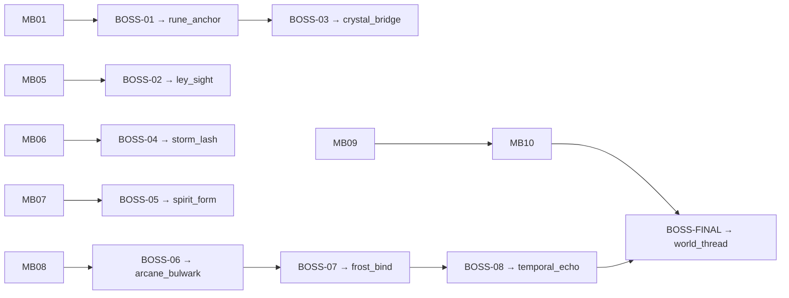

# Arcania — Boss Bible

**Version:** 1.0  
**Status:** Design lock for Phase 0  
**Cross-references:** [01-gdd.md](01-gdd.md) · [02-world-design.md](02-world-design.md) · [04-enemy-bible.md](04-enemy-bible.md) · [06-magic-system.md](06-magic-system.md) · [07-narrative.md](07-narrative.md)

> *"Every boss is a gate — of place, of memory, of mastery."*

---

## Table of Contents

1. [Boss Design Philosophy](#1-boss-design-philosophy)
2. [Shared Telegraph Language](#2-shared-telegraph-language)
3. [Boss Roster Overview](#3-boss-roster-overview)
4. [Mini-Bosses (MB-01 — MB-10)](#4-mini-bosses-mb-01--mb-10)
5. [Major Bosses (BOSS-01 — BOSS-08)](#5-major-bosses-boss-01--boss-08)
6. [Final Boss (BOSS-FINAL)](#6-final-boss-boss-final)
7. [Appendix — Tuning Constants](#7-appendix--tuning-constants)

---

## 1. Boss Design Philosophy

Arcania bosses are **progression gates first, spectacle second, exam third**. Each encounter must:

1. **Teach the spell it unlocks** — The fight introduces the spell's combat verb before the reward chest grants exploration use. BOSS-01 (Root Warden) forces grapple timing so `rune_anchor` feels earned, not arbitrary.
2. **Mirror region identity** — Whisperwood bosses root and entangle; Archive bosses misdirect and catalog; Somnium bosses lie about reality. A player who has explored the region should recognize the boss's vocabulary.
3. **Respect the dual-purpose contract** — Spell unlock bosses include at least one phase where the new spell is **required** (soft-enforced via bonus damage windows, not hard fail states except final boss).
4. **Scale complexity with tier** — Mini-bosses: 1–2 phases, 2–4 attack patterns, ~3–5 minute median. Major bosses: 2–3 phases, 5–8 patterns, ~8–12 minutes. Final: 3 phases + ending integration, full spell exam, ~15–20 minutes.
5. **Offer mastery paths** — Every boss has at least one **parry/stagger/counter** route and one **pattern-dodge** route. No boss is DPS-only.
6. **Connect to narrative** — Boss defeat advances Elara's memory, faction sympathy hooks, or World Sigil truth. Lore is not flavor text bolted on; it explains *why* the fight exists.

**Anti-patterns (reject in review):**

- Unavoidable damage without telegraph
- Phase transitions that reset player position into hazards
- Spell unlocks with no combat application in the acquisition fight
- Duplicate arena geometry across regions

---

## 2. Shared Telegraph Language

All bosses and mini-bosses use the **Arcania Telegraph Standard (ATS)** at 60 FPS unless noted.

### 2.1 Color & VFX Tiers

| Tier | Color | Meaning | Audio |
|------|-------|---------|-------|
| **T1 — Quick** | Amber `#FFB347` rim flash | Fast attack; dodge or block | Short click (880 Hz) |
| **T2 — Heavy** | Crimson `#E63946` fill pulse | High damage; commit to dodge | Low thud (220 Hz) + floor crack |
| **T3 — Grab/Pull** | Violet `#7B2CBF` tether line | Positioning threat; break line | Rising whine |
| **T4 — Safe** | Cyan `#48CAE4` glow | Counter/stagger window opening | Harmonic chime |
| **T5 — Environmental** | White `#F1FAEE` tile outline | Floor hazard activating | Rumble + particle dust |

### 2.2 Frame Budget Reference

| Attack Speed | Wind-up (frames) | Active (frames) | Recovery (frames) |
|--------------|------------------|-----------------|-------------------|
| Fast jab | 12–18 | 4–6 | 14–20 |
| Standard swing | 22–30 | 6–10 | 24–32 |
| Heavy slam | 40–55 | 8–12 | 45–60 |
| Ultimate / phase breaker | 60–90 | 12–20 | 30 (i-frame grant to player) |

**Player reference:** Veil Step = 14 i-frames; default hitstun = 20 i-frames; input buffer = 8 frames.

### 2.3 Stagger Rules

- **Stagger meter:** Hidden; fills on counter hits, parries, and spell-specific breaks (e.g., `rune_anchor` pull during wind-up).
- **Stagger threshold:** Mini-boss 100%, Major 150%, Final 200% (per phase).
- **Stagger duration:** 90 frames — boss enters T4 cyan outline; melee third-hit deals +50% damage.
- **Re-stagger cooldown:** 8 seconds (480 frames) unless phase transition resets.

### 2.4 Damage Notation

Damage values assume **Elara base HP = 100**, no robe modifiers, Normal difficulty.

| Label | Value | Notes |
|-------|-------|-------|
| Chip | 5–8 | Environmental / aura |
| Light | 12–18 | Quick attacks |
| Medium | 22–30 | Standard patterns |
| Heavy | 35–45 | Failed dodge on telegraphed heavies |
| Crush | 50+ | Arena hazards; always T2+ telegraph |

---

## 3. Boss Roster Overview

### 3.1 Mini-Bosses (10)

| ID | Name | Region | Role |
|----|------|--------|------|
| MB-01 | Thornweft Matron | Whisperwood Hollow | Rootbind gate; teaches entangle breaking |
| MB-02 | Reliquary Sentinel | Sunken Catacombs | Gleamflare preview; urn vault guard |
| MB-03 | Miremother | Bleakfen Marsh | Tidecaller / memory swamp boss |
| MB-04 | Prism Warden | Lumineth Caverns | Reflection mechanics; pre-Leviathan |
| MB-05 | Index Hydra | Archive of Echoes | Catalog puzzle combat; pre-Phantom |
| MB-06 | Bridge Warden Kael | Skyfall Ruins | Vertical arena; pre-Magister |
| MB-07 | Anvil Ascendant | Obsidian Atelier | Forge heat phases; pre-Subject IX |
| MB-08 | Ember Confessor | Sanctum of Ash | Ash confession mechanic; pre-Cardinal |
| MB-09 | Ley Guardian — Static Warden | Ley Nexus | Endgame gauntlet I; spell suppression |
| MB-10 | Ley Guardian — Weave Sentinel | Ley Nexus | Endgame gauntlet II; multi-element rotation |

> **Regional gatekeepers:** Undercrown's **Root Champion** and Somnium's **Mirror Elara** are integrated as **Phase 0** introductions inside BOSS-07 and BOSS-08 respectively (see major boss sections). This keeps the MB count at 10 while endgame receives two dedicated mini-bosses.

### 3.2 Major Bosses (8) — Spell Unlocks

| ID | Name | Region | Spell Unlock |
|----|------|--------|--------------|
| BOSS-01 | The Root Warden | Whisperwood Hollow | `rune_anchor` |
| BOSS-02 | Archivist Phantom | Archive of Echoes | `ley_sight` |
| BOSS-03 | Crystal Leviathan | Lumineth Caverns | `crystal_bridge` |
| BOSS-04 | The Fallen Magister | Skyfall Ruins | `storm_lash` |
| BOSS-05 | Subject IX | Obsidian Atelier | `spirit_form` |
| BOSS-06 | Cardinal of Ash | Sanctum of Ash | `arcane_bulwark` |
| BOSS-07 | The Undercrown | Undercrown Kingdom | `frost_bind` |
| BOSS-08 | Somnium Weaver | Somnium Rift | `temporal_echo` |

### 3.3 Final Boss

| ID | Name | Region | Spell Unlock |
|----|------|--------|--------------|
| BOSS-FINAL | The Unbound Conclave | Ley Nexus | `world_thread` |

---

## 4. Mini-Bosses (MB-01 — MB-10)

---

### MB-01 — Thornweft Matron

**Region:** Whisperwood Hollow · **Arena:** Heartwood Grove — circular glade, 18×14 tiles

#### Lore

The Thornweft Matron is not a creature born but **grown** — a living loom of thorn-vines, bark, and the bones of oath-breakers who fled into Whisperwood when the Collapse began. The Thornbound circle bound twelve druids to the root-network; when nine died in the ash-rain, the remaining three merged their failing bodies into the grove itself. The Matron is their collective hunger for continuity: it tests every mage who enters the deep wood, asking silently whether they serve growth or extraction.

Elara's Ember Sigil dries roots on contact — the Matron recognizes the Veilmark scent and fights with personal fury. Defeating it does not destroy the Thornbound; it **convinces** the grove that Elara may pass to the Ironroot Depths where the Conclave once mined anchor-runes. Thornbound sympathy +1 if the player completes the fight without burning vines (optional challenge).

#### Arena Layout

```
        [CANOPY — soft boundary]
    ~ ~ ~ ~ ~ ~ ~ ~ ~ ~ ~ ~ ~
  ~   T   T   T   T   T   T   ~
 ~    .   .   .   .   .   .    ~
~     .   @   @   @   @   .     ~
 ~    .   @ [M] @   .   .    ~    M = Matron core (mobile)
~     .   @   @   @   @   .     ~   T = Thorn pillar (destructible)
 ~    .   .   .   .   .   .    ~   @ = Root tile (slows 30%)
  ~   T   T   T   T   T   T   ~
    ~ ~ ~ ~ ~ ~ ~ ~ ~ ~ ~ ~ ~
        [ENTRY — south gate]
```

#### Phases

| Phase | HP Threshold | Behavior |
|-------|--------------|----------|
| I — Loom | 100–51% | Ground entangle, vine whip, pillar spawn |
| II — Heartwood | 50–0% | Matron uproots; arena shrinks; aerial thorn rain |

#### Attack Patterns

| Attack | Phase | Telegraph | Dmg | Counter Window |
|--------|-------|-----------|-----|----------------|
| **Vine Lash** | I | T1 amber; 15f wind-up; lateral sweep | Light ×2 | Dodge through; hit core during 20f recovery |
| **Root Snare** | I | T3 violet floor ring; 25f | Medium (grab) | Jump or Veil Step; **break with melee on exposed root bulb** (T4, 30f) |
| **Thorn Pillars** | I | T5 white tiles; 40f | Medium (pillar hit) | Destroy T pillars to limit arena shrink in P2 |
| **Canopy Rain** | II | T2 crimson; 35f; sky darkens | Medium ×3 | Stand under destroyed pillar gaps |
| **Heartwood Pulse** | II | T2; 50f; Matron glows green | Heavy (AoE) | Hide behind thorn pillar OR Veil Step i-frames |

#### Visual Effects

- Vine attacks leave **sap-green** particle trails; snare zones pulse violet.
- Phase II: roots pull back like retracting ribs; spore motes rise with `#588157` palette.
- Stagger: bark cracks along Matron core; cyan T4 outline on central bulb.

#### Defeat Rewards

- **Essence:** 120
- **Items:** Thornbound Token (faction +1), Focus Shard fragment (½ — complete second fragment in secret grove)
- **Unlock:** Path to Ironroot Depths / Root Warden arena

#### Animation List

| Clip | Frames | Notes |
|------|--------|-------|
| `intro_emerge` | 90 | Rises from root mound |
| `idle_loom` | 48 loop | Weaving motion |
| `atk_vine_lash_l/r` | 38 | Symmetric |
| `atk_root_snare` | 55 | Ground FX sync frame 25 |
| `spawn_pillar` | 45 | Hand-tuned per pillar |
| `phase2_uproot` | 120 | Invuln; arena script |
| `atk_canopy_rain` | 70 | Loopable rain cycle |
| `stagger` | 90 | Bulb exposure |
| `death_unravel` | 150 | Vines petrify; grove sigh SFX |

#### Music / SFX

- **Music:** Low cello drone + bow-on-branch scrapes; 60 BPM; Phase II adds heartbeat percussion.
- **SFX:** Sap hiss on lash; root creak on snare; pillar crack on destroy; death = single Thornbound choir note.

#### Difficulty Tuning

- **Normal:** Snare grab damage −15%; pillar count max 4.
- **Hard:** Phase II starts at 60% HP; rain interval −20%.
- **Design intent:** First mini-boss; teach ATS T1/T3 distinction and destructible arena elements.

---

### MB-02 — Reliquary Sentinel

**Region:** Sunken Catacombs · **Arena:** Flooded Urn Vault — 20×12 tiles, knee-deep water

#### Lore

The Reliquary Sentinel is a **Conclave construct** — ceramic-plated automaton built to guard memory-vessels when the Catacombs still served the living Archive. Three centuries of partial submersion corrupted its recognition glyphs: it classifies all warm bodies as "urn thieves." Its chest cavity holds a **blank urn** labeled *Veilmark* — added post-Collapse by a Keeper who never returned to remove it.

The Sentinel's fight teaches that some guardians can be **bypassed** (Gleamflare reveals a service corridor) but defeating it permanently lowers water level in the ossuary wing, opening a Memory Shard cache. Lore tablets nearby imply Elara's ancestor's urn is behind the Sentinel's alcove.

#### Arena Layout

```
[ALCOVE — urn shelves, north wall]
================================
~ ~ ~ ~ ~ ~ ~ ~ ~ ~ ~ ~ ~ ~ ~ ~
  .   .   [U] [U] [U]   .   .
~   .   .   .   .   .   .   .   ~
  .   .       [S]       .   .      S = Sentinel (fixed until P2)
~   ~   ~   ~   ~   ~   ~   ~   ~
================================
        [ENTRY — south]
~ = Shallow water (Tidecaller interact later)
```

#### Phases

| Phase | HP | Behavior |
|-------|-----|----------|
| I — Guard | 100–40% | Shield rotation, urn lob, water pulse |
| II — Flood Protocol | 39–0% | Shield shatter; arena water rises; laser sweep |

#### Attack Patterns

| Attack | Phase | Telegraph | Dmg | Counter |
|--------|-------|-----------|-----|---------|
| **Ceramic Slam** | I | T2; 30f | Medium | Side dodge; hit rear panel |
| **Urn Lob** | I | T1; 18f | Light (splash AoE) | Catch with melee mid-air (advanced) or dodge |
| **Shield Rotate** | I | T4 cyan front arc | — | Move to back arc; 45f vulnerability window each rotation |
| **Flood Pulse** | II | T5 water line; 35f | Medium | Jump to alcove shelves (climbable) |
| **Memory Beam** | II | T2; 45f charge | Heavy | Hide behind urn pillars; **Gleamflare reveals weak lens** (+30% dmg) |

#### Visual Effects

- Ceramic shards glitter `#B7B7A4`; memory beam = pale blue `#A8DADC` with glyph overlay.
- Water rise: refracted caustics on Sentinel legs.
- Death: urns glow sequentially like extinguishing candles.

#### Defeat Rewards

- **Essence:** 140
- **Items:** Reliquary Key, Catacombs map tile (hidden wing)
- **Unlock:** Ossuary water lowered; Gleamflare tutorial mural activates

#### Animation List

`intro_activate`, `idle_guard`, `atk_slam`, `atk_urn_lob`, `shield_rotate`, `phase2_shatter`, `atk_beam_charge/fire`, `stagger`, `death_flood`

#### Music / SFX

- **Music:** Drip percussion, glass marimba, 72 BPM; Phase II adds reversed choir sample.
- **SFX:** Ceramic crack; urn splash; beam harmonic ring.

#### Difficulty Tuning

- Shield rotation speed scales with player DPS (cap at Hard tier).
- Beam telegraph +10f on Normal for first-time clarity.

---

### MB-03 — Miremother

**Region:** Bleakfen Marsh · **Arena:** The Drowning Circle — 16×16 tiles, central sinkhole

#### Lore

Bleakfen absorbs memory instead of water — the Miremother is what happens when a **failed resurrection spell** gains motherhood. She was once Court Hydromancer Ilmen's final attempt to revive Prince Aldric; the prince's body dissolved but the * longing* remained, collecting every drowned mage's last thought into a single hungry intelligence.

The Miremother does not speak; she **shows** memories — brief illusions of Elara's induction ceremony during Phase II. Wraithmonger Vex pays premium for her core jelly. Defeating her drains the central fen (Tidecaller gate elsewhere), revealing **The Hollow Heart** secret zone entrance.

#### Arena Layout

```
    M   M   M   M   M   M
  M   .   .   .   .   .   M
 M   .   ~   ~   ~   ~   .  M
M   .   ~   [O]   ~   .   M    O = Sinkhole (Miremother)
 M   .   ~   ~   ~   ~   .  M   ~ = Deep fen (slow + chip)
  M   .   .   .   .   .   M
    M   M   M   M   M   M
```

#### Phases

| Phase | HP | Behavior |
|-------|-----|----------|
| I — Brood | 100–50% | Tentacle sweep, memory bait, fen pull |
| II — Absorption | 49–0% | Sinkhole widens; illusion copies; burst |

#### Attack Patterns

| Attack | Telegraph | Dmg | Counter |
|--------|-----------|-----|---------|
| **Tentacle Sweep** | T1; 20f | Light ×2 | Jump; hit tentacle base (T4) |
| **Memory Lure** | T3; illusion of safe tile; 30f | Medium (fall-in) | Ley Sight preview (if owned) or probe with Ember |
| **Fen Pull** | T5 ring closing; 40f | Chip + pull | Veil Step out; **Tidecaller** (post-acquisition) reverses pull |
| **Absorption Burst** | T2; 55f; sinkhole glows | Heavy | Max range; stagger bulb at arena edge |

#### Visual Effects

- Fen foam `#386641`; memory illusions desaturate 50%.
- Phase II: ghost faces in water surface (non-damaging unless lured).

#### Defeat Rewards

- **Essence:** 130
- **Items:** Miremother Gel (crafting), Memory Shard 1 hint tablet
- **Unlock:** Central fen drain trigger (Tidecaller puzzle)

#### Animation List

`intro_surface`, `idle_brood`, `atk_sweep_l/r`, `atk_lure`, `atk_pull`, `phase2_widen`, `atk_burst`, `stagger`, `death_drain`

#### Music / SFX

- **Music:** Wet bass pulses, 54 BPM; Phase II adds induction ceremony motif (distorted).
- **SFX:** Mud bubble; whisper overlay on lure; drain suck on death.

#### Difficulty Tuning

- Lure tiles never spawn on entry path first cycle (tutorial fairness).
- Hard: illusion copies mimic player spell VFX once per Phase II.

---

### MB-04 — Prism Warden

**Region:** Lumineth Caverns · **Arena:** Crystal Spire Antechamber — 14×18 tiles, reflective floor

#### Lore

The Prism Warden is a **crystal golem** assembled from mined Lumineth fragments, still executing its last command: *"Do not let anyone reach the spire."* The Atelier mages who built it are dead; the Warden persists because ley-light keeps recrystallizing its wounds. Its faceplate bears no sigil — only a smooth mirror surface that reflects the viewer's worst doubt.

Defeating the Warden opens the vertical shaft to the **Glacial Rift** chamber where the Crystal Leviathan sleeps. The fight teaches reflection routing — a compressed preview of `crystal_bridge` geometry puzzles.

#### Arena Layout

```
        [SPIRE SHAFT — gated north]
    = = = = = = = = = = = =
      \   |   /   \   |   /
       \  |  /     \  |  /
    .   . [P] .   . [P] .      P = Prism pillar (reflects beams)
       /  |  \     /  |  \
      /   |   \   /   |   \
    = = = = = = = = = = = =
         [W]  Warden center
```

#### Phases

| Phase | HP | Behavior |
|-------|-----|----------|
| I — Reflect | 100–45% | Beam bounce, shard volley, mirror shield |
| II — Overcharge | 44–0% | Floor cracks; beams split 3-way |

#### Attack Patterns

| Attack | Telegraph | Dmg | Counter |
|--------|-----------|-----|---------|
| **Prism Beam** | T2 line on floor; 28f | Medium | Redirect with pillar; bounce into Warden (T4, 40f) |
| **Shard Volley** | T1; 15f ×5 | Light each | Veil Step through gap |
| **Mirror Shield** | T4 front; 60f | Reflect player spells | Flank; melee back panel |
| **Split Beam** | II; T2; 35f | Heavy | Position pillar chain; puzzle-like safe zone |

#### Visual Effects

- Beams: `#90E0EF` core, `#CAF0F8` bloom; split beams rainbow diffraction.
- Mirror Shield: player silhouette visible in faceplate (shader).

#### Defeat Rewards

- **Essence:** 160
- **Items:** Prism Core (relic craft), spire elevator key
- **Unlock:** Crystal Leviathan arena access

#### Animation List

`intro_crystalize`, `idle_hum`, `atk_beam`, `atk_volley`, `shield_mirror`, `phase2_crack`, `atk_split`, `stagger`, `death_shatter`

#### Music / SFX

- **Music:** Glass percussion, 75 BPM; Warden motif = staccato arpeggios.
- **SFX:** Crystal ping on beam; shatter cascade on death.

#### Difficulty Tuning

- Beam path preview lines remain 0.5s after attack (learning aid).
- Hard: Split Beam paths randomize after first bounce.

---

### MB-05 — Index Hydra

**Region:** Archive of Echoes · **Arena:** Central Catalog — 22×14 tiles, card-catalog walls

#### Lore

The Index Hydra is a **catalog made carnivorous** — drawers, index cards, and brass rails fused by the imperfect transfer spell that copied the Archive's contents. Each "head" is a drawer cluster snapping with paper teeth; the body is a rolling ladder assembly that once served Head Archivist Thessaly. It guards the Memory Well entrance and the Library of Maps where `ley_sight` waits beyond the Archivist Phantom.

Hydra heads **disagree** on Elara's classification — one head marks her "Veilmark," another "Candidate," a third "Authorized." The fight's Phase II requires targeting the head whose label matches the floor glyph puzzle (Echo Sense hint).

#### Arena Layout

```
[CATALOG WALL — north]
|D|D|D|D|D|D|D|D|D|D|D|
  .   .   .   .   .   .
    H1      H2      H3        Hi = Hydra head (mobile)
  .   .   .   .   .   .
|D|D|D|D|D|D|D|D|D|D|D|
        [ENTRY — south]
```

#### Phases

| Phase | HP | Behavior |
|-------|-----|----------|
| I — Catalog | 100–50% | Three heads independent; card flurry |
| II — Reindex | 49–0% | Heads merge; floor glyph puzzle; AoE stamp |

#### Attack Patterns

| Attack | Telegraph | Dmg | Counter |
|--------|-----------|-----|---------|
| **Card Flurry** | T1; 12f ×8 | Light | Block with Bulwark (late return) or dodge weave |
| **Drawer Bite** | T2; 25f per head | Medium | Stagger individual head at 25% HP each |
| **Misfile Swap** | T3; arena tiles shuffle ghost outline; 45f | — | Echo Sense shows true layout |
| **Reindex Stamp** | II; T2; 50f AoE | Heavy | Stand on matching glyph tile |

#### Visual Effects

- Cards orbit `#F4A261` ink trails; misfile swap = chromatic aberration 0.3s.
- Correct glyph tile glows cyan T4.

#### Defeat Rewards

- **Essence:** 170
- **Items:** Archivist Stamp (quest item), Echo Sense upgrade scroll
- **Unlock:** Archivist Phantom arena; Memory Well

#### Animation List

`intro_drawers`, `idle_heads`, `atk_flurry`, `atk_bite_h1/h2/h3`, `atk_misfile`, `phase2_merge`, `atk_stamp`, `stagger`, `death_spill`

#### Music / SFX

- **Music:** Paper rustle rhythm, 80 BPM; stamp = bass hit on downbeat.
- **SFX:** Drawer slam; card slice; merge = book spine crack.

#### Difficulty Tuning

- Phase II glyph always matches most-damaged head label (logic hint).
- Hard: Misfile swap during active flurry.

---

### MB-06 — Bridge Warden Kael

**Region:** Skyfall Ruins · **Arena:** Collapsed Span — 24×8 tiles, vertical drop sides

#### Lore

Kael was a **Skyfall bridge keeper** who refused evacuation when the levitation engine failed. The Fallen Magister's engine-fusion radiation **anchored** Kael's corpse to the last intact span, reanimating him as a ley-conduit warden. He remembers duty, not name — calling out toll counts for passengers who will never come.

Kael's defeat lowers the **conductive rails** powering the Magister's storm barrier — a direct preview of `storm_lash` conduit puzzles. Optional: listen to full toll dialogue before aggro for Archive sympathy +1.

#### Arena Layout

```
[SKY VOID — east drop]     [SKY VOID — west drop]
~~  ~~  ~~  ~~  ~~  ~~  ~~  ~~  ~~  ~~  ~~  ~~
    .   .   .   .   .   .   .   .   .   .
    = = = = = = = = = = = = = = = = = =   = = bridge
    .   .   .  [K]  .   .   .   .   .       K = Kael
~~  ~~  ~~  ~~  ~~  ~~  ~~  ~~  ~~  ~~  ~~
        [ENTRY — south platform]
```

#### Phases

| Phase | HP | Behavior |
|-------|-----|----------|
| I — Toll | 100–50% | Lance thrust, toll bell stun, wind gust |
| II — Span Collapse | 49–0% | Bridge sections fall; lightning rod summon |

#### Attack Patterns

| Attack | Telegraph | Dmg | Counter |
|--------|-----------|-----|---------|
| **Lance Thrust** | T1; 18f | Light–Medium | Drop to lower ledge |
| **Toll Bell** | T2; 40f ring | Medium (sonic) | Veil Step through wave |
| **Wind Gust** | T5 edge push; 30f | — (environment) | Anchor to bolt rings (pre-Rune Anchor: crouch in notch) |
| **Lightning Rod** | II; T3; 35f | Medium chain | Destroy rod (T4); foreshadows Storm Lash |

#### Visual Effects

- Bell shockwave `#FFD166` ring; rods crackle violet.
- Bridge collapse: tile crumble T5 20f preview.

#### Defeat Rewards

- **Essence:** 180
- **Items:** Kael's Toll Ledger (lore), conduit key
- **Unlock:** Fallen Magister arena; rail power puzzle

#### Animation List

`intro_toll`, `idle_lean`, `atk_lance`, `atk_bell`, `env_gust`, `phase2_collapse`, `summon_rod`, `stagger`, `death_fall`

#### Music / SFX

- **Music:** Wind-string harmonics, 66 BPM; bell motif = toll theme.
- **SFX:** Bridge creak; bell toll; fall whistle on death.

#### Difficulty Tuning

- First rod always spawns center (readable).
- Hard: Gust during bell recovery.

---

### MB-07 — Anvil Ascendant

**Region:** Obsidian Atelier · **Arena:** Forge Pit — 16×14 tiles, heat vents

#### Lore

The Anvil Ascendant is a **forged hierarch** — a blacksmith-mage who volunteered for obsidian infusion so the Atelier could produce Conclave war-plate forever. The infusion succeeded; his humanity did not survive the third day. He hammer-strikes with the rhythm of production quotas, each blow imprinting sigils that **reject spirit matter** — foreshadowing Subject IX's ectoplasm cage.

Ilmen's dam controls connect to the forge vents; overheating the Ascendant (environmental) skips Phase I armor. Obsidian Atelier region music mutates here — industrial sacred.

#### Arena Layout

```
    [FORGE CHIMNEY — north vent]
    V   V   V   V   V   V
  .   .   .   .   .   .   .
  .   [A]   .   .   .   .      A = Ascendant
  = = = = = = = = = = = =      = = anvil cover (block)
  .   .   .   .   .   .   .
    V   V   V   V   V   V
    [ENTRY — south]
V = Heat vent (timed)
```

#### Phases

| Phase | HP | Behavior |
|-------|-----|----------|
| I — Armored | 100–55% | Hammer combo, sigil reject, vent flush |
| II — Molten Core | 54–0% | Armor melt; faster combos; spirit-ghost afterimages |

#### Attack Patterns

| Attack | Telegraph | Dmg | Counter |
|--------|-----------|-----|---------|
| **Hammer Triplet** | T1/T2 alternating; 22f | Light, Light, Medium | Parry third (T4) |
| **Sigil Reject** | T3; 30f; pushes spells back | Self-damage if reflected | Bulwark later; now dodge |
| **Vent Flush** | T5 vent glow; 35f | Heavy fire chip | Stand on anvil cover |
| **Ghost Afterimage** | II; T1 feint; 15f | Medium | Hit real body (afterimage grey) |

#### Visual Effects

- Obsidian `#1A1A2E` shell; Phase II molten `#E94560` veins.
- Afterimages: 40% opacity; real body has heartbeat ember.

#### Defeat Rewards

- **Essence:** 190
- **Items:** Ascendant Plate fragment, Stoneheart upgrade
- **Unlock:** Subject IX containment wing

#### Animation List

`intro_hammer`, `idle_forge`, `atk_triplet`, `atk_reject`, `env_vent`, `phase2_melt`, `atk_afterimage`, `stagger`, `death_cool`

#### Music / SFX

- **Music:** Industrial hammer on beat, 84 BPM; Phase II double-time.
- **SFX:** Anvil ring; vent whoosh; cool hiss on death.

#### Difficulty Tuning

- Vent pattern fixed first cycle.
- Hard: Afterimages cast fake spell VFX.

---

### MB-08 — Ember Confessor

**Region:** Sanctum of Ash · **Arena:** Confession Ash-Pit — 18×12 tiles

#### Lore

The Ember Confessor was a **Pyre Cardinal acolyte** who recorded sins in ash before the Sanctum burned. When Cardinal Voss ascended through fire, the Confessor **absorbed** every unconfessed sin in the chamber — thousands of ash-glyphs crawling on its robe. It asks Elara three confession questions during Phase I; answering truthfully (based on player choices) removes one attack pattern per honest answer.

The Confessor is optional before Cardinal of Ash but recommended — each honest answer weakens Voss's Phase II fire screen. Lie answers buff Confessor damage (+10% per lie).

#### Arena Layout

```
    [ASH ALTAR — north]
    ~ ~ ~ ~ ~ ~ ~ ~ ~ ~
  .   .   .   .   .   .   .
  .   .  [C]  .   .   .   .     C = Confessor
  ~ ~ ~ ~ ~ ~ ~ ~ ~ ~
    [ENTRY — south]
~ = Ash drift (slow)
```

#### Phases

| Phase | HP | Behavior |
|-------|-----|----------|
| I — Confession | 100–50% | Ash scroll, sin lash, question prompts |
| II — Absolution | 49–0% | Fire screen, ash storm, guilt manifest |

#### Attack Patterns

| Attack | Telegraph | Dmg | Counter |
|--------|-----------|-----|---------|
| **Ash Scroll** | T1; 20f | Light | Burn scroll mid-flight (Ember) |
| **Sin Lash** | T2; 32f | Medium | Bulwark preview: block with shield angle |
| **Confession Prompt** | UI pause; 120f | — | Dialogue choice; truth removes pattern |
| **Fire Screen** | II; T5 wall advance; 45f | Heavy | Gap in screen (honest answer creates gap) |
| **Guilt Manifest** | II; T3; 40f | Medium | Destroy manifest orb (T4) |

#### Visual Effects

- Ash glyphs crawl `#6C757D`; fire screen `#F77F00` gradient.
- Truth answer: cyan cleanse wave.

#### Defeat Rewards

- **Essence:** 200
- **Items:** Confessor's Ash (Cardinal debuff item), Void Mirror hint
- **Unlock:** Cardinal of Ash arena (weakened if truthful)

#### Animation List

`intro_ash`, `idle_scribe`, `atk_scroll`, `atk_lash`, `prompt_confess`, `phase2_screen`, `atk_guilt`, `stagger`, `death_scatter`

#### Music / SFX

- **Music:** Choral whisper, 58 BPM; questions = solo voice unaccompanied.
- **SFX:** Quill scratch; fire roar; scatter whisper on death.

#### Difficulty Tuning

- Questions reference actual player flags (Corin trust, etc.).
- Hard: Fire screen speed +25% if any lie.

---

### MB-09 — Ley Guardian — Static Warden

**Region:** Ley Nexus · **Arena:** Static Corridor — 12×20 tiles, narrow

#### Lore

The Static Warden is the first of two Ley Guardian constructs — a **Purifier echo** frozen in ley amber when the Unbinding ritual began. It enforces spell **suppression**: one random spell slot disabled for the fight (rotates every 60s). Represents the Conclave's desire to excise the Unbound — foreshadowing ending B.

Defeating both guardians (MB-09 + MB-10) opens the Weaveheart antechamber where `world_thread` is remembered before BOSS-FINAL.

#### Arena Layout

```
[VOID WALLS — east/west non-traversable]
| | | | | | | | | | | | |
| | .   .   .   .   . | |
| | .   [S]   .   . | |    S = Static Warden
| | .   .   .   .   . | |
| | | | | | | | | | | | |
      [ENTRY] [EXIT-N]
```

#### Phases

| Phase | HP | Behavior |
|-------|-----|----------|
| I — Suppress | 100–0% | Single phase; suppression aura, null blade, static burst |

#### Attack Patterns

| Attack | Telegraph | Dmg | Counter |
|--------|-----------|-----|---------|
| **Null Blade** | T2; 28f | Medium | Melee stagger window T4 |
| **Suppress Pulse** | T3; 40f ring | Light + disable spell 10s | Veil Step |
| **Static Burst** | T2; 50f | Heavy | Long-range only safe zone |

#### Visual Effects

- Static `#7F00FF` noise shader; suppressed spell slot greys in UI.
- Death: amber shatter releasing whisper names.

#### Defeat Rewards

- **Essence:** 220
- **Items:** Static Core, Ley Nexus map segment
- **Unlock:** MB-10 arena path

#### Animation List

`intro_unamber`, `idle_static`, `atk_blade`, `atk_suppress`, `atk_burst`, `stagger`, `death_crack`

#### Music / SFX

- **Music:** Purifier motif corrupted, 70 BPM; silence gaps intentional.
- **SFX:** Static crackle; null harmonic.

#### Difficulty Tuning

- Never suppress Ember Sigil (baseline fairness).
- Hard: Suppression rotates every 40s.

---

### MB-10 — Ley Guardian — Weave Sentinel

**Region:** Ley Nexus · **Arena:** Weave Rotunda — 18×18 tiles, circular

#### Lore

The Weave Sentinel rotates **all elemental damage types** every 20 seconds — Root, Ember, Crystal, Storm, Spirit, Frost — mirroring the eight major bosses Elara has conquered. It is the Nexus testing whether the player can **switch tactics** under pressure. Its core displays a tapestry of boss sigils unraveling as HP drops.

Final mini-boss before BOSS-FINAL; victory grants **World Thread memory fragment** (cutscene) and full mana refill.

#### Arena Layout

```
        .   .   .   .   .
      .       [CORE]       .
    .     .   .   .   .     .
      .                   .
        .   .   .   .   .
```

#### Phases

| Phase | HP | Behavior |
|-------|-----|----------|
| I — Rotation | 100–50% | Element cycle, boss mimic attacks (scaled down) |
| II — Unravel | 49–0% | Dual-element; faster cycle |

#### Attack Patterns

| Attack | Telegraph | Dmg | Counter |
|--------|-----------|-----|---------|
| **Element Strike** | Color matches boss; 25f | Medium | Resist via robe; counter with opposite spell (+20%) |
| **Boss Mimic** | Random major boss pattern; 50% scale | Varies | Apply learned counter |
| **Unravel Pulse** | II; T2; 45f | Heavy | `Unravel` pre-fight spell strips dual-element shield |

#### Visual Effects

- Element ring orbits core; mimic attacks copy boss VFX palette.
- Tapestry unravels thread-by-thread on damage milestones.

#### Defeat Rewards

- **Essence:** 250
- **Items:** Weave Fragment, pre-boss mana restore shrine
- **Unlock:** BOSS-FINAL arena

#### Animation List

`intro_weave`, `idle_rotate`, `atk_element`, `atk_mimic_*`, `phase2_dual`, `stagger`, `death_unravel`

#### Music / SFX

- **Music:** All region leitmotifs 8-bar rotation; Phase II polyphony clash.
- **SFX:** Element-specific; unravel = string snap.

#### Difficulty Tuning

- Mimic never uses final boss patterns.
- Hard: Dual-element from 70% HP.

---

## 5. Major Bosses (BOSS-01 — BOSS-08)

---

### BOSS-01 — The Root Warden

**Region:** Whisperwood Hollow · **Spell Unlock:** `rune_anchor`  
**Arena:** Ironroot Depths — 20×16 tiles, anchor rings on walls

#### Lore

The Root Warden was a **Conclave mine-magister** named Aldren who grafted his nervous system into the Ironroot ley lattice so he could haul anchor-runes without rest. When the Collapse hit, the roots kept him alive — fused, furious, forgotten. He is neither Thornbound nor Purifier; he is **infrastructure that gained a grudge**.

Elara's master corrected Aldren's anchor vectors once — the Warden remembers her handwriting in the rune stone. The fight is personal: he pulls her toward the mine shaft where apprentice bodies still hang in root-cocoons. Defeating him yields the **Rune Anchor** spell-stone, the first tool that treats distance as negotiable.

The Thornbound watch from the canopy; sparing cocooned apprentices (optional destructible) grants Thornbound sympathy +1 without affecting loot.

#### Arena Layout

```
[SHAFT DROP — north, hazard]
  O       O       O           O = Anchor ring (grapple point)
    .   .   .   .   .   .
  .   .   [W]   .   .   .       W = Root Warden
    = = = = = = = = = = =
  .   .   .   .   .   .   .     = = root barrier (temporary)
        [ENTRY — south]
```

#### Phases

| Phase | HP | Behavior |
|-------|-----|----------|
| I — Magister | 100–66% | Anchor pull, root spear, mine cart crush |
| II — Lattice | 65–33% | Warden merges with wall; ring grapple combat |
| III — Cocoon | 32–0% | Shaft hazard; mass pull ultimate |

#### Attack Patterns

| Attack | Phase | Telegraph | Dmg | Counter |
|--------|-------|-----------|-----|---------|
| **Anchor Pull** | I | T3; 30f | Medium + reposition | **Break with incoming Rune Anchor tug-of-war** (Phase II+) |
| **Root Spear** | I | T2; 35f | Heavy | Side dodge; spear stuck 40f T4 |
| **Cart Crush** | I | T5 track glow; 50f | Crush | Grapple to ceiling ring |
| **Lattice Merge** | II | Warden enters wall; 60f | — | Use anchor rings to flanking positions |
| **Mass Pull** | III | T3; 55f; all rings activate | Heavy | Counter-pull at shaft edge; stagger core |

#### Visual Effects

- Rune chains `#FFD700`; root blood `#40916C`.
- Phase III: cocoon silhouettes in shaft (lore); pull VFX stretches screen edges.

#### Defeat Rewards

- **Essence:** 400
- **Spell:** `rune_anchor` — acquisition tutorial in arena post-fight
- **Items:** Focus Shard, Ironroot map completion
- **Unlock:** Lumineth / Archive routes via grapple shortcuts

#### Animation List

`intro_cocoon`, `idle_magister`, `atk_pull`, `atk_spear`, `env_cart`, `phase2_merge`, `phase3_shaft`, `atk_mass_pull`, `stagger`, `death_root_release`, `spell_grant`

#### Music / SFX

- **Music:** Deep drum + chain rhythm, 68 BPM; Phase III adds choir of trapped names.
- **SFX:** Chain clink (anchor motif); root snap; grant = metallic rune lock.

#### Difficulty Tuning

- Phase I teaches pull without spell; post-stagger grants trial `rune_anchor` charges.
- Hard: Cart Crush spawns from both sides alternating.

---

### BOSS-02 — Archivist Phantom

**Region:** Archive of Echoes · **Spell Unlock:** `ley_sight`  
**Arena:** Library of Maps — 24×18 tiles, shifting shelves

#### Lore

The Archivist Phantom is **Head Archivist Thessaly's impression** — not her ghost, but the Archive's belief about her, given mass by ley leakage. She remembers every catalogued sin of the Conclave and **misfiles reality** to protect the institution. Two Phantoms exist in lore; only one fights — the other watches from a mirror, correcting errors.

Elara almost became Thessaly's successor before the Collapse. The Phantom offers her the position mid-fight (*"Resume your duties, Candidate Veilmark"*). Refusing triggers Phase III; accepting is a trap ending the run (fake death — reload checkpoint with debuff unless player uses Ley Sight to see the false floor).

The `ley_sight` unlock is framed as **cartographer's curse** — seeing the weave's true paths hurts, but deception cannot hide from it.

#### Arena Layout

```
[MIRROR WALL — west, interactive]
|S|S|S|S|S|S|S|S|S|S|S|S|
  .   .   .   .   .   .   .
  .   .  [P]  .   .   .   .    P = Phantom (teleports)
  .   .   .   .   .   .   .
|S|S|S|S|S|S|S|S|S|S|S|S|
        [ENTRY — east]
S = Shelf (collapses on Phase III)
```

#### Phases

| Phase | HP | Behavior |
|-------|-----|----------|
| I — Catalog | 100–70% | Misfile teleport, page blade, false aisle |
| II — Audit | 69–40% | Weak point reveal (needs Ley Sight for bonus) |
| III — Excision | 39–0% | Arena collapse; invisible platforms real/fake |

#### Attack Patterns

| Attack | Phase | Telegraph | Dmg | Counter |
|--------|-------|-----------|-----|---------|
| **Page Blade** | I | T1; 18f ×3 | Light | Close gap during third slash |
| **Misfile Blink** | I | T3; 25f | — | Ley Sight shows true position after unlock |
| **False Aisle** | I | T5; floor looks solid; 40f | Heavy | Probe or sight-reveal |
| **Audit Seal** | II | T4 on joint; 30f | — | +15% damage to marked joint |
| **Excision Cut** | III | T2; 45f plane | Heavy | Real platforms glow faint cyan pre-sight |

#### Visual Effects

- Wireframe overlay on Ley Sight activation; misfile = RGB split 0.2s.
- Mirror Thessaly writes corrections in floating ink.

#### Defeat Rewards

- **Essence:** 420
- **Spell:** `ley_sight`
- **Items:** Cartographer's Lens (relic), Memory Shard 2
- **Unlock:** Hidden paths in all prior regions (backtrack)

#### Animation List

`intro_stamp`, `idle_float`, `atk_page`, `blink_misfile`, `trap_offer`, `phase2_audit`, `phase3_excision`, `stagger`, `death_unfile`, `spell_grant`

#### Music / SFX

- **Music:** Harpsichord + tape hiss, 76 BPM; offer motif = induction theme.
- **SFX:** Page flip; stamp thud; sight grant = glass tone.

#### Difficulty Tuning

- Fake accept trap disabled on Normal after first death.
- Hard: False aisles without faint crack texture.

---

### BOSS-03 — Crystal Leviathan

**Region:** Lumineth Caverns · **Spell Unlock:** `crystal_bridge`  
**Arena:** Glacial Rift — 22×10 tiles + 8-tile chasm

#### Lore

The Crystal Leviathan is a **leviathan fossil** animated by Lumineth ley-light — once a real creature that died when the high passes sealed. Glacial hermits worshipped it as a bridge between worlds; the Conclave mined its spine for crystal fuel, leaving it half-awake for centuries. It dreams of open sky.

Elara must cross its body to reach the rift's far ledge where the bridge spell inscription sleeps in ice. The fight **moves** along the Leviathan's back as it thrashes over the chasm — a mobile arena. Destroying crystal growths on its flanks calms thrash frequency (environmental DPS check without skip).

#### Arena Layout

```
[CHASM LEFT]  ~~LEVIATHAN BACK~~  [CHASM RIGHT]
              ~ ~ ~ ~ ~ ~ ~ ~ ~
              . [H1] [H2] [H3] .     H = Crystal growth (weak point)
              ~ ~ ~ ~ ~ ~ ~ ~ ~
[ENTRY] ———— spine path ———— [GOAL LEDGE]
```

#### Phases

| Phase | HP | Behavior |
|-------|-----|----------|
| I — Slumber | 100–60% | Tail sweep, ice breath, spine quake |
| II — Thrash | 59–25% | Arena scrolls; bridge gaps form |
| III — Ascent | 24–0% | Vertical climb on body; head laser |

#### Attack Patterns

| Attack | Phase | Telegraph | Dmg | Counter |
|--------|-------|-----------|-----|---------|
| **Tail Sweep** | I | T2; 32f | Medium | Jump spine ridge |
| **Ice Breath** | I | T5 cone; 40f | Heavy | Break H1 growth to interrupt |
| **Spine Quake** | I | T5; 35f | Medium AoE | Veil Step |
| **Bridge Gap** | II | Chasm opens; 50f | Crush | **Crystal Bridge trial cast** |
| **Prism Laser** | III | T2; 55f | Heavy | Hide behind growth; reflect optional |

#### Visual Effects

- Ice `#ADE8F4`; ley veins `#48CAE4` pulse with heartbeat.
- Bridge cast: hexagonal walkway VFX from magic doc.

#### Defeat Rewards

- **Essence:** 440
- **Spell:** `crystal_bridge`
- **Items:** Leviathan Scale (Tier-2 relic craft)
- **Unlock:** Skyfall lower entry; frozen shortcut back to Bleakfen

#### Animation List

`intro_awaken`, `idle_drift`, `atk_tail`, `atk_breath`, `env_quake`, `phase2_scroll`, `phase3_climb`, `atk_laser`, `stagger`, `death_settle`, `spell_grant`

#### Music / SFX

- **Music:** Glass orchestra swell, 64 BPM; Phase III full choir.
- **SFX:** Whale-low moan; ice crack; bridge hum.

#### Difficulty Tuning

- Phase II grants 3 trial bridge charges.
- Hard: Gap timing −15% margin.

---

### BOSS-04 — The Fallen Magister

**Region:** Skyfall Ruins · **Spell Unlock:** `storm_lash`  
**Arena:** Tempest Spire Conduit Apex — 18×18 tiles, conductive pools

#### Lore

The Fallen Magister was **Starfall Regent** before the name was forgotten — the mage who fused with his levitation engine to survive Skyfall's crash. He is a walking **conduit apex**: copper ribs, ley coils, and the arrogance of a man who believed gravity was negotiable. The Conclave promised him the Spire; the Spire promised him thunder.

Elara finds his private ledger post-fight (lore): he triggered the widening of the ley knot that began the Sundering — not from malice but from **competitive vanity** against the Veilmark faction. Storm Lash is his legacy weaponized against him — electrify pools beneath his floating chassis.

Corin optional appearance: shouts warning about overcast lightning during Phase II.

#### Arena Layout

```
        [CONDUIT — north pole]
           |   |
    ~ ~ ~ ~ | ~ ~ ~ ~        ~ = Conductive pool
  .   .   . | .   .   .
    .   [M]   .   .          M = Magister (hover 2 tiles)
  ~ ~ ~ ~ ~ ~ ~ ~ ~ ~
        [ENTRY — south]
```

#### Phases

| Phase | HP | Behavior |
|-------|-----|----------|
| I — Regent | 100–65% | Orb volley, levitation crush, rail snap |
| II — Conduit | 64–30% | Pool electrify; chain lightning |
| III — Engine Heart | 29–0% | Overload risk; floor-wide storm |

#### Attack Patterns

| Attack | Phase | Telegraph | Dmg | Counter |
|--------|-------|-----------|-----|---------|
| **Orb Volley** | I | T1; 15f ×4 | Light | Weave between orbs |
| **Levitation Crush** | I | T3; 40f; shadow grows | Heavy | Exit shadow; **Storm Lash stun** post-unlock |
| **Rail Snap** | I | T5; 35f | Medium line | Jump |
| **Pool Charge** | II | T4 pool glow; 30f | Medium DoT | Lure Magister over pool; lash chain |
| **Engine Overload** | III | T2; 60f | Crush | Hide at conduit base; Bulwark optional |

#### Visual Effects

- Lightning `#7B2FBE`; pools ripple electric blue.
- Engine heart visible through ribcage at Phase III.

#### Defeat Rewards

- **Essence:** 460
- **Spell:** `storm_lash`
- **Items:** Regent's Ledger (Sundering truth), Focus Shard
- **Unlock:** Sanctum ascent + Undercrown chute

#### Animation List

`intro_descent`, `idle_hover`, `atk_orb`, `atk_crush`, `atk_rail`, `phase2_charge`, `phase3_overload`, `stagger`, `death_engine_explode`, `spell_grant`

#### Music / SFX

- **Music:** Thunder percussion, 82 BPM unstable; Phase III no downbeat.
- **SFX:** Coil whine; thunder crack; overload siren.

#### Difficulty Tuning

- Pool chain tutorial before Phase II.
- Hard: Crush targets player anchor point prediction.

---

### BOSS-05 — Subject IX

**Region:** Obsidian Atelier · **Spell Unlock:** `spirit_form`  
**Arena:** Ectoplasm Containment — 16×16 tiles, spirit barriers

#### Lore

Subject IX was the Atelier's **ninth attempt** to forge a living spell — a person-shaped container for Conclave battle-script. The first eight failed cleanly. IX **partially succeeded**: a body that is solid only when observed, hollow when feared. It remembers every interrogation. It wants Elara's Ember Sigil because fire makes it feel **real**.

The fight alternates physical and spirit phases — Subject IX passes through barriers Elara cannot until she learns Spirit Form from the containment breach. Moral weight: IX can be **pacified** in Phase III if player avoids fire damage (secret dialogue; still grants spell).

Ilmen's notes in arena imply IX was a volunteer — name redacted.

#### Arena Layout

```
|B|B|B|B|B|B|B|B|  B = Spirit barrier
  .   .   .   .   .
  .   [IX]  .   .   .
  .   .   .   .   .
|B|B|B|B|B|B|B|B|
```

#### Phases

| Phase | HP | Behavior |
|-------|-----|----------|
| I — Solid | 100–60% | Ectoplasm whip, observation snap, cage |
| II — Hollow | 59–25% | IX intangible; wraith dash through barriers |
| III — Merge | 24–0% | Dual-state flicker; possession attempt |

#### Attack Patterns

| Attack | Phase | Telegraph | Dmg | Counter |
|--------|-------|-----------|-----|---------|
| **Ectoplasm Whip** | I | T2; 28f | Medium | Dodge; hit during solid frame |
| **Observation Snap** | I | T1; 20f; when player looks away | Light | Keep facing; humour tutorial |
| **Cage Drop** | I | T5; 45f | Heavy | Veil Step |
| **Wraith Dash** | II | T3; 25f | Medium | **Spirit Form through barrier flank** |
| **Possession** | III | T3; 40f grab | Heavy | Spirit Form escape; stagger |

#### Visual Effects

- Solid: warm outline; Hollow: `#A8DADC` wisp trails.
- Possession: player silhouette overlap 30% opacity.

#### Defeat Rewards

- **Essence:** 480
- **Spell:** `spirit_form`
- **Items:** Subject Tag IX (lore), Ectoplasm Trial unlock
- **Unlock:** Wraithfen barriers globally; Sanctum hidden ectoplasm route

#### Animation List

`intro_drip`, `idle_flicker`, `atk_whip`, `atk_snap`, `atk_cage`, `phase2_hollow`, `phase3_merge`, `atk_possess`, `stagger`, `death_dissolve`, `spell_grant`

#### Music / SFX

- **Music:** Heartbeat bass + reversed speech, 62 BPM.
- **SFX:** Ectoplasm drip; snap click; dissolve sigh.

#### Difficulty Tuning

- Observation Snap disabled if accessibility "always face" enabled.
- Hard: Hollow dash from barrier behind player.

---

### BOSS-06 — Cardinal of Ash

**Region:** Sanctum of Ash · **Spell Unlock:** `arcane_bulwark`  
**Arena:** Bastion Pyre Hall — 20×14 tiles

#### Lore

Cardinal of Ash (**Pyre Cardinal Voss**) ascended through **self-immolation** when the Sanctum burned — not suicide but promotion. Ash is his flesh; confession is his weapon. He believes the Collapse was **purifying fire** that failed only because Elara interrupted the Unbinding. He offers alliance: burn the Unbound, restore Conclave order.

The Cardinal fight is **directional** — frontal faith, flank doubt. Bulwark teaches holding ground against ash storms and reflecting pyre bolts. Ember Confessor outcomes modify Phase I intensity.

#### Arena Layout

```
    [PYRE ALTAR — north]
    ~ ~ ~ ~ ~ ~ ~ ~ ~ ~
  .   .   .   .   .   .   .
  .   .  [V]  .   .   .   .    V = Voss
  .   .   .   .   .   .   .
    ~ ~ ~ ~ ~ ~ ~ ~ ~ ~
```

#### Phases

| Phase | HP | Behavior |
|-------|-----|----------|
| I — Sermon | 100–60% | Ash bolt, pyre wave, confession chain |
| II — Martyr | 59–30% | Reflect shield; frontal invuln |
| III — Ascendant Pyre | 29–0% | Full arena burn; safe zones in bulwark geometry |

#### Attack Patterns

| Attack | Phase | Telegraph | Dmg | Counter |
|--------|-------|-----------|-----|---------|
| **Ash Bolt** | I | T1; 16f | Light | **Bulwark reflect** (post-unlock tutorial) |
| **Pyre Wave** | I | T2; 38f | Medium | Heavy Plate hold |
| **Confession Chain** | I | T3; 35f link | Medium DoT | Break line with melee on anchor |
| **Martyr Shield** | II | T4 front; 50f | Reflect | Flank; Bulwark Heavy Plate face-tank for stagger |
| **Ascendant Burn** | III | T5; 55f fill | Heavy tick | Stand in bulwark hex safe tessellation |

#### Visual Effects

- Ash `#6C757D`; holy fire `#E85D04` with hex bulwark overlay on player cast.
- Voss face cracks reveal ember underneath.

#### Defeat Rewards

- **Essence:** 500
- **Spell:** `arcane_bulwark`
- **Items:** Void Mirror, Conclave Armory vault key
- **Unlock:** Undercrown ash descent; late-game Purifier encounter tone shift

#### Animation List

`intro_ignite`, `idle_sermon`, `atk_bolt`, `atk_wave`, `atk_chain`, `phase2_martyr`, `phase3_burn`, `stagger`, `death_ashfall`, `spell_grant`

#### Music / SFX

- **Music:** Organ + fire crackle, 72 BPM; Phase III full organ chord.
- **SFX:** Sermon verbals; shield harmonic; ashfall hush.

#### Difficulty Tuning

- Trial Bulwark for final 30% Phase I.
- Hard: Confession Chain links through Bulwark if held wrong angle.

---

### BOSS-07 — The Undercrown

**Region:** Undercrown Kingdom · **Spell Unlock:** `frost_bind`  
**Integrated Phase 0:** Root Champion (regional gatekeeper)

#### Lore

The Undercrown is **King Morvain's merged corpse and kingdom** — he entombed himself in the King's Hollow to deny ley keys to the Unbound. Roots, crown, and mycelial court fused into one sovereign entity. It speaks in **we**, not I — every buried subject adds a voice.

Root Champion Phase 0 is the champion who refused to leave when Morvain sealed the vault — honor-bound to test intruders. Frost Bind is the prison spell Morvain used on rogue mages; Elara unlearns its cruelty but keeps its geometry. Undercrown sympathy affects post-fight dialogue.

#### Arena Layout

```
    [THRONE ROOT — north]
  T   T   T   T   T   T   T       T = Root throne pillar
    .   .   .   .   .   .
  .   .  [U]  .   .   .   .       U = Undercrown
    ~   ~   ~   ~   ~   ~
        [ENTRY — south]
```

#### Phases

| Phase | HP | Behavior |
|-------|-----|----------|
| 0 — Root Champion | 100% separate bar | Champion duel; parry tutorial |
| I — Sovereign | 100–55% | Root crown, spore knights, frost mist |
| II — Entomb | 54–0% | Freeze arena edges; shatter combo |

#### Attack Patterns (combined)

| Attack | Phase | Telegraph | Dmg | Counter |
|--------|-------|-----------|-----|---------|
| **Champion Cleave** | 0 | T2; 30f | Medium | Parry T4 |
| **Crown Spikes** | I | T5; 40f | Medium | Jump |
| **Spore Knights** | I | Summon; 45f | Light each | Frost Bind root (trial) |
| **Frost Mist** | II | T3; 35f | Slow + chip | **Frost Bind freeze shatter** |
| **Entomb Pulse** | II | T2; 55f | Heavy | Climb throne roots |

#### Visual Effects

- Fungal `#2D6A4F`; frost `#A2D2FF` on bind.
- Champion armor breaks into spore before Phase I merge.

#### Defeat Rewards

- **Essence:** 520
- **Spell:** `frost_bind`
- **Items:** Royal Ley Key, Rift Tear upgrade
- **Unlock:** Somnium Spore Highway

#### Animation List

`p0_champion_intro`, `p0_cleave`, `p0_death`, `intro_merge`, `atk_spikes`, `summon_knights`, `phase2_mist`, `atk_entomb`, `stagger`, `death_bury`, `spell_grant`

#### Music / SFX

- **Music:** Fungal drone + regal horn, 58 BPM; Champion Phase 0 = martial snare.
- **SFX:** Root crunch; ice crystallize; bury thud.

#### Difficulty Tuning

- Champion Phase 0 skippable on repeat play.
- Hard: Mist covers stagger window −20% visibility.

---

### BOSS-08 — Somnium Weaver

**Region:** Somnium Rift · **Spell Unlock:** `temporal_echo`  
**Integrated Phase 0:** Mirror Elara (regional gatekeeper)

#### Lore

The Somnium Weaver sits at the Rift's center — not a person but a **function**: the process that weaves dreams into memory. It wears faces Elara almost recognizes. Mirror Elara Phase 0 is her dream-self, aged seven years differently, fighting to keep Elara from remembering the Night of Unbinding.

Temporal Echo is stolen seconds from the Clockwork Ruins embedded in dream — the Weaver teaches that time in Somnium is negotiable but never free. Defeating the Weaver yields `temporal_echo` and opens the Unbind chamber; the Weaver's last words vary by ending sympathy flags.

#### Arena Layout

```
    [DREAM SKY — shifts color]
  .   .   .   .   .   .   .
  .   [M]     [W]     .       M = Mirror Elara (P0)
  .   .   .   .   .   .       W = Weaver
  ~ ~ ~ ~ ~ ~ ~ ~ ~ ~ ~ ~     ~ = Memory collapse tiles
```

#### Phases

| Phase | HP | Behavior |
|-------|-----|----------|
| 0 — Mirror Elara | Separate | Spell mirror, false recall, parry own VFX |
| I — Weave | 100–60% | Thread cut, dream replay, loop trap |
| II — Unwind | 59–30% | Reverse player inputs 2s (telegraphed) |
| III — Epoch | 29–0% | Timeline fracture; Echo mandatory |

#### Attack Patterns

| Attack | Phase | Telegraph | Dmg | Counter |
|--------|-------|-----------|-----|---------|
| **Mirror Cast** | 0 | Copies last player spell; 25f | Own spell dmg | Dodge; identify real vs mirror |
| **Thread Cut** | I | T2; 32f | Medium | Veil Step |
| **Dream Replay** | I | Replays boss attack ghost; 40f | Varies | Temporal Echo rewind interrupt |
| **Loop Trap** | I | T5; 50f | — | Unbind preview chip; Echo break |
| **Reverse Input** | II | T3; UI warning 60f | — | Pre-commit movement |
| **Epoch Fracture** | III | T2; 60f | Heavy | **Temporal Echo slow + strike** |

#### Visual Effects

- Dream palette `#C77DFF`; timeline `#FFD60A` ripple.
- Mirror Elara desaturates to match player robe.

#### Defeat Rewards

- **Essence:** 540
- **Spell:** `temporal_echo`
- **Items:** Dream Thread, Unbind chamber access
- **Unlock:** Ley Nexus breach

#### Animation List

`p0_mirror_intro`, `p0_cast`, `p0_shatter`, `intro_weave`, `atk_thread`, `atk_replay`, `trap_loop`, `phase2_reverse`, `phase3_epoch`, `stagger`, `death_unspool`, `spell_grant`

#### Music / SFX

- **Music:** Dream jazz wrong; Mirror duel solo piano; Weaver full distortion.
- **SFX:** Thread snap; clock tick; unspool reverse cymbal.

#### Difficulty Tuning

- Reverse Input accessibility toggle (slow-mo instead).
- Hard: Dream Replay uses two random major boss patterns.

---

## 6. Final Boss (BOSS-FINAL)

### BOSS-FINAL — The Unbound Conclave

**Region:** Ley Nexus · **Spell Unlock:** `world_thread`  
**Arena:** Weaveheart Spire — 28×22 tiles, floating platforms, void fall

#### Lore

The Unbound Conclave is not a single enemy — it is **what happened when the ritual failed forward**. The Conclave's senior magisters, the Unbound static, and the World Sigil's torn edge fused at the Weaveheart into a chorus of erased names wearing institutional robes. It speaks in simultaneous verdicts: *"Excise." "Merge." "Forget."* Each voice is a faction Elara met; each phase is a region's wound.

Elara was the anchor that held the door open. The Conclave blames her; the Unbound thanks her; the truth is she chose the lesser ruin. The fight is Arcania's **final exam**: all fourteen spells see use across three phases. Phase III integrates **three ending choices** — not QTEs, but spell-sequence resolutions after the Conclave falls to stagger threshold.

The narrative doc's "Unbound Avatar" and this entity are the same — **Unbound Conclave** is the in-world name scholars use; survivors say *"the Avatar"* because they cannot admit the Conclave became the monster.

#### Arena Layout

```
         [VOID — fall = respawn platform script]
    P1      P2      P3      P4       P = Phase platform cluster
      \    |    /  \    |    /
       \   |   /    \   |   /
    .   .   .   .   .   .   .   .
       /   |   \    /   |   \
      /    |    \  /    |    \
    [C]         [E]              C = Conclave core (mobile)
                                 E = Elara anchor point (Phase III)
```

#### Phases & Ending Integration

| Phase | HP | Theme | Ending Seed |
|-------|-----|-------|-------------|
| I — Verdict | 100–66% | Conclave excision patterns | Sever ending dialogue beat |
| II — Static Chorus | 65–33% | Unbound merges; region mimic barrage | Join ending dialogue beat |
| III — Thread Choice | 32–0% | World Thread weave; platform stitch | Repair ending dialogue beat |

**Ending choice moment:** When Phase III reaches 10% HP, combat **pauses** (not invuln skip) — three dialogue options appear, each tied to a spell cast requirement:

| Ending | Name | Requirement | Choice Action |
|--------|------|-------------|---------------|
| A | **Repair the Weave** | Thornbound ≥2 OR Keeper ≥2; Shards 1,3,5,6 | Cast `world_thread` to **stitch** Conclave into weave (Ember Sigil dims post-credits) |
| B | **Sever the Weave** | Undercrown ≥2 OR Conclave ≥1; Shard 6 | Cast `Unravel` + `storm_lash` combo to **cut** static free (Unbound die screaming) |
| C | **Join the Unbound** | Unbound sympathy ≥3; Unwritten Child quest | **Do not attack** 10s; accept static (Elara dissolves) |

Choice can be **deferred** until stagger kill — defeating Conclave without choosing defaults to highest-sympathy ending. Pacify route (Hard + all Shards + Archive Lens): Phase II ends early with fourth **cosmetic** epilogue variant only.

#### Attack Patterns

| Attack | Phase | Telegraph | Dmg | Counter |
|--------|-------|-----------|-----|---------|
| **Edict Beam** | I | T2; 40f | Heavy | Bulwark reflect; flank |
| **Excision Circle** | I | T5; 50f | Crush | Veil Step out; Rune Anchor pull add into circle |
| **Name Chorus** | II | T3; 35f sonic | Medium + spell suppress 5s | Temporal Echo rewind suppress |
| **Region Barrage** | II | Sequential boss mimics; 60f cycle | Varies | Use counter spell per ATS memory |
| **Static Merge** | II | T2; 45f | Heavy AoE | Spirit Form pass-through window |
| **Thread Rip** | III | T2; 55f | Crush | **World Thread barrier patch** (1/charge) |
| **Platform Unstitch** | III | T5; 40f | Fall hazard | Crystal Bridge emergency; Thread stitch |
| **Instakill Weave** | III | T2; 90f | 999 | Thread Patch OR perfect Bulwark Heavy Plate |

#### Visual Effects

- Phase I: Conclave robes `#1D3557`, gold trim; excision white `#F1FAEE`.
- Phase II: Static noise shader; region VFX palette rotates every 15s.
- Phase III: Golden thread `#FFD700` visible in air; void background `#000000` with ley magenta `#7F00FF` veins.
- Ending A: stitch bloom cyan-gold; B: sever red-white; C: static consume desaturate 100%.

#### Defeat Rewards

- **Essence:** 1000 (first clear)
- **Spell:** `world_thread` — granted Phase III start (trial), permanent post-fight
- **Items:** Weaveheart Key, NG+ mode flag
- **Unlock:** Ending sequence; Ashen Threshold post-game transformation

#### Animation List

| Clip | Notes |
|------|-------|
| `intro_conclave_form` | Magisters + static merge, 180f |
| `idle_chorus` | Multi-face morph loop |
| `phase1_edict` | Beam + circle attacks |
| `phase2_merge` | Static expansion, 120f |
| `phase2_barrage` | Per-boss mimic container |
| `phase3_thread` | Thread Rip + platform scripts |
| `ending_repair` | Stitch sequence, 240f |
| `ending_sever` | Cut sequence, 240f |
| `ending_join` | Dissolve sequence, 180f |
| `stagger` | All faces align; T4 120f |
| `death_or_resolve` | Branch per ending |

#### Music / SFX

- **Music:** Silence as instrument; ley hum baseline; region motifs woven/unwoven; **no fixed tempo** Phase II; Phase III syncs to player spell casts (adaptive layer system).
- **Phase I SFX:** Edict verbals layered; excision glass tear.
- **Phase II SFX:** Static chorus; name whispers (randomized from lore tablets).
- **Phase III SFX:** Thread pull string harmonic; ending stingers per branch.
- **Post-victory:** Hub theme restored, solo violin — regardless of ending.

#### Difficulty Tuning

| Setting | Adjustment |
|---------|------------|
| Normal | Instakill Weave telegraph +20f; Thread Patch 3 charges |
| Hard | Barrage includes 2 patterns simultaneously; suppress 8s |
| NG+ | Phase II no stagger; ending choice timer 15s before default |

**Design intent:** 15–20 minute median; every spell slot used at least once; failure teaches which spell was missing. Checkpoint before Phase III only.

---

## 7. Appendix — Tuning Constants

### 7.1 Boss HP Reference (Normal)

| Tier | HP Range |
|------|----------|
| Mini-boss | 800–1200 |
| Major boss | 2500–3500 |
| Final boss | 6000 (phase-split: 2000/2000/2000) |

### 7.2 Essence Economy

| Tier | First Clear | Repeat (NG+) |
|------|-------------|--------------|
| Mini-boss | 120–250 | 50% |
| Major boss | 400–540 | 50% |
| Final | 1000 | 200 |

### 7.3 Spell-Boss Dependency Graph



### 7.4 Cross-Document Index

| Topic | Document |
|-------|----------|
| Region connections & gates | [02-world-design.md](02-world-design.md) |
| Spell numeric tables | [06-magic-system.md](06-magic-system.md) |
| Ending requirements & sympathy | [07-narrative.md](07-narrative.md) §6 |
| Enemy add patterns | [04-enemy-bible.md](04-enemy-bible.md) |
| Combat feel & i-frames | [01-gdd.md](01-gdd.md) §5 |

---

*Document owner: Combat Design · Last updated: Phase 0 design lock*
