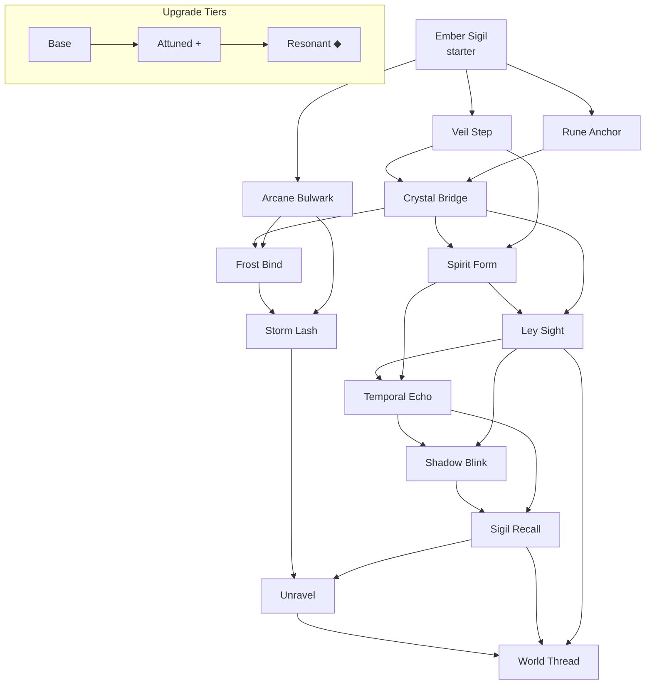

# 06 — Magic System

> *"Every thread of the weave cuts both ways — to bind and to sever, to see and to blind."*
> — Inscription on the Ashen Threshold obelisk

This document defines Arcania's complete magic framework: mana economy, the 14 dual-purpose spells, relic modifiers, equipment tiers, build archetypes, and Godot implementation guidance. Every spell must justify its slot in both combat encounters and environmental gating.

**Design pillar:** No spell is combat-only or exploration-only. Each ability has at least one meaningful use in each domain.

---

## Table of Contents

1. [Mana System](#mana-system)
2. [Overcast Mechanic](#overcast-mechanic)
3. [Spell Wheel UI](#spell-wheel-ui)
4. [Spell Upgrade Tree](#spell-upgrade-tree)
5. [Spell Catalog](#spell-catalog)
6. [Relics (24)](#relics-24)
7. [Equipment](#equipment)
8. [Build Archetypes](#build-archetypes)
9. [Balance Notes](#balance-notes)

---

## Mana System

### Core Values

| Parameter | Base | Maximum (all upgrades) |
|-----------|------|------------------------|
| **Max Mana** | 100 | 220 |
| **Combat Regen** | 2.0 / sec | 3.5 / sec |
| **Out-of-Combat Regen** | 8.0 / sec | 14.0 / sec |
| **Regen Delay** | 1.2 sec after last cast | 0.6 sec (with relics) |

Mana is displayed as a pale cyan bar beneath the health bar, with a secondary **Overcast bleed** indicator (crimson) when casting beyond capacity.

### Focus Shards (×8)

Focus Shards are permanent collectibles scattered across all 12 regions. Each shard is a crystallized fragment of the Nexus weave, embedded in environmental puzzles or guarded by optional content.

| Shard | Bonus | Typical Location |
|-------|-------|------------------|
| **Shard of Embers** | +15 max mana | Ashen Threshold — tutorial alcove |
| **Shard of Veils** | +15 max mana | Mistral Hollow — hidden behind phase wall |
| **Shard of Anchors** | +15 max mana | Ironroot Depths — grapple puzzle room |
| **Shard of Bridges** | +15 max mana | Glacial Rift — frozen waterfall secret |
| **Shard of Spirits** | +15 max mana | Wraithfen — spirit barrier trial |
| **Shard of Echoes** | +15 max mana | Clockwork Ruins — temporal mechanism vault |
| **Shard of Storms** | +15 max mana | Tempest Spire — conduit charge sequence |
| **Shard of Threads** | +15 max mana | Nexus Antechamber — pre-final gauntlet |

**Additional shard effects (stacking):**
- Shards 1–4: +15 max mana each
- Shards 5–6: +15 max mana + 0.25 combat regen each
- Shards 7–8: +15 max mana + 0.25 combat regen + reduce Overcast HP cost by 5% each

Collecting all 8 shards unlocks the **Threadbound** passive: Sigil Recall anchors cost 0 mana to establish.

### Mana Modifiers

| Source | Effect |
|--------|--------|
| Robe tier | +0 to +40 max mana (see [Equipment](#equipment)) |
| Focus item | Type-specific regen or cost reduction |
| Relics | Various (see [Relics](#relics-24)) |
| Rest points | Full mana restore on sit |

---

## Overcast Mechanic

When Elara attempts to cast with insufficient mana, she may **Overcast** — drawing power from her life force to complete the spell.

### Rules

1. **Activation:** Automatic if spell is cast with mana deficit; player can toggle **Force Overcast** in options to require manual confirmation.
2. **HP Cost:** `deficit_mana × 1.5` HP (minimum 5 HP per cast).
3. **Overcast Threshold:** Cannot Overcast below 15% max HP.
4. **Silence Stack:** Each Overcast within 8 seconds adds 1 **Silence** stack (max 3).
   - 1 stack: −10% spell damage / effect duration
   - 2 stacks: −25%, brief cast stagger
   - 3 stacks: **Silenced** for 4 sec — no casting
5. **Visual:** Veins glow ember-red; screen vignette; distinct audio cue (heartbeat + glass crack).
6. **Decay:** Silence stacks decay 1 per 6 sec out of combat; full clear at rest points.

### Design Intent

Overcast is a clutch mechanic, not a default rotation. Skilled players use it to finish a kill or cross a gap; reckless Overcasting triggers Silence at the worst moment. Focus Shards 7–8 and certain relics reduce the punishment curve for build diversity.

---

## Spell Wheel UI

### Layout

- **8 equip slots** arranged radially (hold `Tab` / `Select` to open wheel).
- **6 acquired spells** minimum before wheel feels full; 14 total spells acquired over the campaign.
- Active slot highlighted; last-used spell auto-selected on wheel close.

### Slot Rules

| Rule | Detail |
|------|--------|
| **Swap location** | Rest points (Ember Hearths) and Sigil Recall anchors |
| **Combat swap** | Blocked — wheel read-only during combat |
| **Quick cast** | `Q`, `E`, `R`, `F` bound to slots 1–4; wheel slots 5–8 wheel-only |
| **Starter loadout** | Slot 1: Ember Sigil (locked until replaced) |

### UX Notes

- Un acquired spells appear as greyed silhouettes on the wheel with region hint text after first encounter with a gated barrier.
- Upgraded spells show a small **+** pip; Advanced versions show a **◆** pip.
- Duplicate slot assignment prevented with soft shake + error tone.

---

## Spell Upgrade Tree

Spells upgrade along three tiers: **Base → Attuned (+) → Resonant (Advanced)**. Attuned upgrades are found at **Ley Wells** (one per major region). Resonant forms require a **Resonance Trial** (optional mini-challenge) or boss drop.

**Progression gates (soft):** Dotted lines indicate optional cross-path unlocks — e.g., Ley Sight can be reached via Crystal Bridge *or* Spirit Form, supporting non-linear routing per [02-world-design.md](02-world-design.md).

---

## Spell Catalog

### 1. Ember Sigil

| Field | Value |
|-------|-------|
| **ID** | `ember_sigil` |
| **Acquisition** | Starter (Ashen Threshold awakening) |

**Visual Effect:** Elara traces a small burning rune in the air; it launches forward as a wavering ember-orange sigil, leaving cinder particles and a brief afterimage scorch on surfaces.

**Lore:** The Ember Sigil is the last intact mark of Elara's apprenticeship — a beginner's cantrip the Conclave deemed too crude for court mages. In the Ashen Threshold, where the weave smolders rather than flows, its simplicity is a virtue: it burns without asking permission.

**Combat Applications:**
- Primary spammable poke (low damage, fast cast).
- Applies **Smolder** (3 sec DoT, stacks ×3) — opens backstab window on elite enemies.
- Ignites oil pools and **Kindling** enemies (+50% burn damage).
- Pops **Wisp Swarm** clouds in one hit.

**Exploration Applications:**
- Lights dark sconces and unlit braziers (persistent flame).
- Burns brittle vine walls (Ashen Threshold, Wraithfen).
- Melts thin ice crusts (early Glacial Rift shortcuts).
- Activates **Ember Receptors** on ancient machinery.

| Stat | Base | Attuned (+) |
|------|------|-------------|
| Mana | 8 | 6 |
| Cast Time | 0.25 sec | 0.20 sec |
| Cooldown | 0.4 sec | 0.3 sec |
| Range | 7 tiles | 9 tiles |

**Upgrade Path:** Attuned — Ley Well in Ashen Threshold (after Hollow Warden mini-boss). Resonant trial — **Scorch Trial** in Cinder Catacombs.

**Advanced Version — *Sigil Nova*:** Hold cast to detonate a 3-tile radial burn; Smolder spreads to all enemies hit. Exploration: clears fog-moth nests blocking paths.

**Godot Notes:** `Area2D` projectile with `AnimatedSprite2D`; use `GPUParticles2D` for cinders. Smolder as `StatusEffect` resource. Receptors implement `Interactable` with group `ember_receptor`.

---

### 2. Veil Step

| Field | Value |
|-------|-------|
| **ID** | `veil_step` |
| **Acquisition** | Mistral Hollow — after Mist Wraith elite |

**Visual Effect:** Elara dissolves into grey-violet static for 12 frames, reappearing with a vertical tear effect like parted cloth. Thin walls ripple as she passes through.

**Lore:** The Veil Step mimics how ghosts slip between stone — a forbidden footwork exercise from the Conclave's shadow curriculum. Elara learned it watching her master leave rooms without opening doors.

**Combat Applications:**
- I-frames through melee swings (8 frames invulnerable at dash peak).
- Pass through **Grate Guard** shields from behind.
- Chain into backstab: exiting phase grants +30% crit for 1 sec.
- Escapes grab attacks from Chain Revenants.

**Exploration Applications:**
- Phase through **Phase Walls** (shimmering membrane surfaces).
- Dash through narrow **Iron Grates** (1-tile gaps).
- Bypass **Spectral Bars** without Spirit Form (combat-gated shortcut).
- Cross **Falling Veil** platforms that solidify only while phased.

| Stat | Base | Attuned (+) |
|------|------|-------------|
| Mana | 15 | 12 |
| Cast Time | instant | instant |
| Cooldown | 1.8 sec | 1.4 sec |
| Range | 4 tiles dash | 5 tiles dash |

**Upgrade Path:** Attuned — Ley Well in Mistral Hollow. Resonant — **Parted Veil Trial** (phase through 5 walls under time limit).

**Advanced Version — *Veil Stride*:** Hold direction to extend dash to 7 tiles; leaves a decoy static silhouette that draws enemy aggro for 2 sec.

**Godot Notes:** Extend `CharacterBody2D` with `phase_mode` flag; `CollisionShape2D` layer swap to `PhaseLayer`. Phase walls on layer 15, detect via raycast pre-dash. Use `Tween` for dissolve shader param `dissolve_amount`.

---

### 3. Rune Anchor

| Field | Value |
|-------|-------|
| **ID** | `rune_anchor` |
| **Acquisition** | Ironroot Depths — grappling tutorial chamber |

**Visual Effect:** A golden rune streaks from Elara's hand, trailing chain-like light filaments. On impact, it embeds with a metallic *clink* and pulses until released or duration ends.

**Lore:** Rune Anchors were mine-hauling tools repurposed by battle-mages during the Siege of Ironroot. Elara's anchor still bears her master's correction marks — tighter loops, cleaner pull vectors.

**Combat Applications:**
- Pull lightweight enemies toward Elara (Stilt Crawlers, Hollow Bats).
- Yank **Shield Phalanx** enemies off-balance (guard break).
- Interrupt **Channeler** casts by pulling the caster.
- Retrieve dropped **Soul Fragments** mid-fight (risk/reward).

**Exploration Applications:**
- Grapple to **Anchor Points** (glowing rune rings).
- Pull distant **Lever Chains** and **Hanging Bells**.
- Swing across **Gaps** (short pendulum arc).
- Retrieve items from **Out-of-Reach Alcoves**.

| Stat | Base | Attuned (+) |
|------|------|-------------|
| Mana | 12 | 10 |
| Cast Time | 0.35 sec | 0.30 sec |
| Cooldown | 0.8 sec | 0.6 sec |
| Range | 8 tiles | 11 tiles |

**Upgrade Path:** Attuned — Ley Well in Ironroot Depths. Resonant — **Ironroot Pull Trial** (swing sequence without touching spikes).

**Advanced Version — *Twin Anchor*:** Fire a second anchor while the first is active; zip between them or pull two levers simultaneously.

**Godot Notes:** `RayCast2D` + `SpringArm2D` or custom grapple state machine (`GRAPPLE_FLYING`, `GRAPPLE_SWING`). Anchor points in group `anchor_point`. Use `Line2D` for chain visual with curve shader.

---

### 4. Crystal Bridge

| Field | Value |
|-------|-------|
| **ID** | `crystal_bridge` |
| **Acquisition** | Glacial Rift — after crossing the First Chasm |

**Visual Effect:** Frost-white crystals erupt from Elara's feet or a target surface, forming a translucent hexagonal walkway that hums softly. On water, crystals spread outward in a fractal bloom before solidifying.

**Lore:** The Crystal Bridge spell crystallizes ambient moisture along ley lines — a technique Glacial Rift hermits used to cross rifts before the Conclave sealed the high passes. The bridge remembers weight but not time; it fades when unwatched.

**Combat Applications:**
- Creates 3-tile elevated platform (2 sec setup) — escape floor hazards.
- Shatters on heavy enemy slam (used as bait for **Crush Colossus**).
- Crystal shards spray on break — minor bleed damage in 2-tile radius.
- Blocks low projectiles while platform persists.

**Exploration Applications:**
- Bridge **Chasms** up to 5 tiles wide (Attuned: 7 tiles).
- **Freeze Water** surfaces into walkable ice paths (60 sec duration).
- Creates stairs on **Crystal Growth** nodes (vertical shortcut).
- Stabilizes **Cracking Floor** temporarily (cross safely once).

| Stat | Base | Attuned (+) |
|------|------|-------------|
| Mana | 20 | 16 |
| Cast Time | 0.6 sec | 0.5 sec |
| Cooldown | 2.5 sec | 2.0 sec |
| Range | 5 tiles span | 7 tiles span |

**Upgrade Path:** Attuned — Ley Well in Glacial Rift. Resonant — **Rift Span Trial** (bridge 3 chasms under mana budget).

**Advanced Version — *Prism Span*:** Bridge persists until rest point; reflects one enemy projectile as a homing shard.

**Godot Notes:** Procedural `StaticBody2D` tile strip from `PackedScene` crystal_segment.tscn. Water tiles in group `freezable_water` swap to `IcePlatform` state. Timer-based despawn with crack animation.

---

### 5. Spirit Form

| Field | Value |
|-------|-------|
| **ID** | `spirit_form` |
| **Acquisition** | Wraithfen — Spirit Gate shrine |

**Visual Effect:** Elara's body desaturates to pale blue-grey; lower body dissolves into wisp trails. Eyes glow white. Wraith barriers part like smoke around her.

**Lore:** Spirit Form does not make Elara a ghost — it makes the world forget she is solid. The Wraithfen dead taught her this by accident when she nearly drowned in the fen and breathed ectoplasm instead of air.

**Combat Applications:**
- Pass through enemies (no collision) for 3 sec — cannot attack while active.
- **Possess** a slain enemy corpse for 1 attack (Attuned: 2 sec puppet strike).
- Immune to **Wraith Touch** and soul drain during form.
- Escape **Pin** attacks from Grave Roots.

**Exploration Applications:**
- Pass **Wraith Barriers** (spectral walls).
- Float across **Spirit Currents** (upward drift streams).
- Enter **Soul Cracks** (1-tile passages in walls).
- Read **Ectoplasm Writing** visible only in Spirit Form.

| Stat | Base | Attuned (+) |
|------|------|-------------|
| Mana | 18 | 14 |
| Cast Time | 0.4 sec | 0.3 sec |
| Cooldown | 4.0 sec | 3.2 sec |
| Range | self (3 sec duration) | self (4 sec duration) |

**Upgrade Path:** Attuned — Ley Well in Wraithfen. Resonant — **Ectoplasm Trial** (navigate barrier maze without touching solids).

**Advanced Version — *Pale Merger*:** Exit Spirit Form inside an enemy for a burst of inside-out damage (high single-target); exploration: pass through **Dual-Layer** barriers (wraith + physical).

**Godot Notes:** Toggle collision mask bits; `Modulate` desaturate via shader. Wraith barriers use `Area2D` with `requires_spirit_form`. Spirit currents as `Area2D` with constant upward `velocity`.

---

### 6. Ley Sight

| Field | Value |
|-------|-------|
| **ID** | `ley_sight` |
| **Acquisition** | Sunken Archives — Library of Maps chamber |

**Visual Effect:** Elara's eyes emit thin gold scan lines; the world overlays with a wireframe lattice. Hidden platforms, ley conduits, and invisible paths pulse cyan-gold. Effect fades at edges like vignette bloom.

**Lore:** Ley Sight was the cartographers' curse — seeing too much of the weave drives most mages mad. Elara's fractured memory filters the noise into maps she almost remembers drawing.

**Combat Applications:**
- Reveals **Invisible Stalkers** for 8 sec (full opacity).
- Highlights enemy **Weak Points** (+15% damage to marked joint).
- Shows **Trap Tiles** through floor fog.
- Extends Smolder/Burn tracking through walls (UI ping only).

**Exploration Applications:**
- Reveals **Invisible Platforms** and **Ghost Bridges**.
- Shows **Ley Conduit** paths for Storm Lash puzzles.
- Highlights **Secret Wall** textures (subtle crack pattern).
- Marks **Focus Shard** aura through one layer of geometry.

| Stat | Base | Attuned (+) |
|------|------|-------------|
| Mana | 10 | 8 |
| Cast Time | instant (toggle) | instant |
| Cooldown | 0 (toggle drain: 2/sec) | 0 (toggle drain: 1.5/sec) |
| Range | 12 tiles vision | 16 tiles vision |

**Upgrade Path:** Attuned — Ley Well in Sunken Archives. Resonant — **Cartographer's Trial** (memorize revealed path, traverse blind).

**Advanced Version — *Deep Sight*:** Permanently reveals one secret per region on first cast; combat: weak points stay marked 30 sec after toggle off.

**Godot Notes:** Toggle on `CanvasLayer` with custom `shader` highlighting tiles in group `ley_hidden`. Drain mana in `_process` while active. Invisible platforms swap modulate alpha 0→0.85.

---

### 7. Temporal Echo

| Field | Value |
|-------|-------|
| **ID** | `temporal_echo` |
| **Acquisition** | Clockwork Ruins — Grand Mechanism core |

**Visual Effect:** A translucent afterimage of Elara splits backward along a golden timeline; clock hands spin in the UI corner. Rewound objects leave amber ripple rings. Slowed hazards gain a grey static overlay.

**Lore:** Time magic is outlawed for good reason — every echo steals a moment from Elara's future. The Clockwork Ruins run on stolen seconds; her Echo spell steals them back, one tick at a time.

**Combat Applications:**
- **Rewind** a single enemy 2 sec (restores their position, interrupts combo).
- **Slow** hazards in 4-tile radius (50% speed, 3 sec) — dodge aid.
- Duplicate last spell cast at 50% power (echo fireball pattern).
- Cleanses **Slow** and **Stun** on self when cast defensively.

**Exploration Applications:**
- **Rewind Mechanisms** (gears, rotating platforms) to previous state.
- Slow **Pendulum Blades** and **Crushing Walls** for safe passage.
- Restore **Broken Bridge** segments (one-time per mechanism).
- Replay **Ghost Recording** events to reveal hidden codes.

| Stat | Base | Attuned (+) |
|------|------|-------------|
| Mana | 22 | 18 |
| Cast Time | 0.5 sec | 0.4 sec |
| Cooldown | 3.5 sec | 2.8 sec |
| Range | 6 tiles | 8 tiles |

**Upgrade Path:** Attuned — Ley Well in Clockwork Ruins. Resonant — **Tick Trial** (cross timed room with 3 rewinds).

**Advanced Version — *Paradox Loop*:** Store two mechanism states; swap between them. Combat: slow entire arena 30% for 2 sec (once per rest cycle).

**Godot Notes:** `MechanismState` resource snapshots `rotation`, `position`, `animation_frame`. Rewind via `Tween` reverse or state restore. Global slow via `Engine.time_scale` scoped with `SceneTreeTimer` (never below 0.5 globally).

---

### 8. Shadow Blink

| Field | Value |
|-------|-------|
| **ID** | `shadow_blink` |
| **Acquisition** | Obsidian Sanctum — Shadow Conclave reliquary |

**Visual Effect:** Elara collapses into a flat shadow on the ground, streaks along surfaces, and erupts upward at the destination sigil. Purple-black afterimages linger 0.5 sec.

**Lore:** Shadow Blink binds the caster's shadow to pre-placed sigils — the Conclave's couriers used them until an apprentice blinked into a wall and stayed there. Elara's sigils are self-inked; safer, shorter range.

**Combat Applications:**
- Teleport between **Shadow Sigils** (max 2 placed, 30 sec duration).
- Exit teleport with **Shadow Burst** (small AoE, Attuned).
- Dodge through floor attacks by blinking to ceiling sigil.
- Reset aggro when blinking out of line-of-sight.

**Exploration Applications:**
- Place sigils on **Shadow Pads** for chained vertical climbs.
- Blink through **Window Gaps** too narrow to Veil Step.
- Cross **Light Beam** puzzles (shadow path avoids burn).
- Reach **Ceiling Alcoves** for secrets.

| Stat | Base | Attuned (+) |
|------|------|-------------|
| Mana | 16 (blink) / 8 (place sigil) | 12 / 6 |
| Cast Time | instant | instant |
| Cooldown | 1.2 sec (blink) | 0.9 sec |
| Range | 10 tiles between sigils | 14 tiles |

**Upgrade Path:** Attuned — Ley Well in Obsidian Sanctum. Resonant — **Umbral Trial** (3-blink speedrun corridor).

**Advanced Version — *Shadow Weave*:** Third sigil slot; combat blink leaves damaging shadow pool at origin.

**Godot Notes:** Sigils as `Marker2D` children in `ShadowSigilManager` autoload. Line-of-sight raycast required (shadow travels on surfaces). Blink uses `global_position` snap + `AnimatedSprite2D` shadow streak.

---

### 9. Arcane Bulwark

| Field | Value |
|-------|-------|
| **ID** | `arcane_bulwark` |
| **Acquisition** | Bastion of Ash — Conclave armory vault |

**Visual Effect:** Hexagonal panels of blue-white energy tessellate around Elara, rotating slowly. Projectiles shatter on impact with glass-like fractures. Heavy plates trigger a brighter flash and audible harmonic.

**Lore:** The Bulwark is standard Conclave battlefield doctrine — geometric, cold, impersonal. Elara's version flickers at the edges, patched with ember runes where pure arcane failed her once.

**Combat Applications:**
- Blocks **Projectiles** for 2 sec (front 180° arc).
- **Heavy Plate** mode (hold cast): blocks melee, drains 5 mana/sec, slows movement 40%.
- Reflects first blocked projectile (Attuned).
- Grants **Guard Break** immunity during Heavy Plate.

**Exploration Applications:**
- Blocks **Pressure Jet** streams (create safe crossing).
- Holds against **Magnetic Push** floors (stay planted).
- Activates **Resonance Plates** when hit by matching projectiles.
- Shields against **Spore Storm** environmental damage zones.

| Stat | Base | Attuned (+) |
|------|------|-------------|
| Mana | 14 | 11 |
| Cast Time | 0.3 sec | 0.25 sec |
| Cooldown | 2.0 sec | 1.6 sec |
| Range | self (2 sec / Heavy: hold) | self (2.5 sec) |

**Upgrade Path:** Attuned — Ley Well in Bastion of Ash. Resonant — **Bulwark Trial** (block 20 projectiles without break).

**Advanced Version — *Aegis Lattice*:** Full 360° for 1 sec on perfect block timing; exploration: walk through **Arc Storm** corridors.

**Godot Notes:** `Area2D` arc collision in front of player; `projectile_blocked` signal. Heavy Plate reduces `speed_multiplier`. Use `AnimationPlayer` for panel rotation loop.

---

### 10. Frost Bind

| Field | Value |
|-------|-------|
| **ID** | `frost_bind` |
| **Acquisition** | Glacial Rift — Deep Ice Cathedral |

**Visual Effect:** Jagged ice crystals erupt from Elara's palm or ground target, spreading frost patterns like cracked glass. Frozen enemies become translucent blue statues. Shatter effect sends ice shards in radial pattern.

**Lore:** Frost Bind was a prison spell — the Conclave used it to entomb rogue mages in the Rift. Elara unlearned the cruelty but kept the geometry; ice remembers shape better than mercy.

**Combat Applications:**
- **Root** enemies 2 sec (non-boss); **Shatter** for burst damage on frozen target.
- Freeze **Boiling Blood** enemies (Berserker types) — ends rage.
- Ice wall blocks narrow corridors (3 sec, 2 tiles high).
- Combo with Storm Lash: **Superconduct** (+100% lightning on frozen).

**Exploration Applications:**
- **Freeze Geysers** into climbable pillars.
- **Shatter Cracked Walls** (marked with ice-crack texture).
- Freeze **Gear Locks** in place for Temporal Echo puzzles.
- Create **Ice Slides** on slopes (short traversal boost).

| Stat | Base | Attuned (+) |
|------|------|-------------|
| Mana | 18 | 14 |
| Cast Time | 0.45 sec | 0.35 sec |
| Cooldown | 2.2 sec | 1.8 sec |
| Range | 5 tiles | 7 tiles |

**Upgrade Path:** Attuned — Ley Well in Glacial Rift (Deep). Resonant — **Shatter Trial** (freeze 5 enemies, shatter in one combo).

**Advanced Version — *Glacial Tomb*:** Larger freeze radius; exploration: permanent freeze on one geyser type per room (persists until rest).

**Godot Notes:** `StatusEffect` freeze with `velocity = Vector2.ZERO`. Shatter on damage threshold or secondary cast. Geyser tiles implement `Freezable` interface.

---

### 11. Storm Lash

| Field | Value |
|-------|-------|
| **ID** | `storm_lash` |
| **Acquisition** | Tempest Spire — Conduit Apex |

**Visual Effect:** A whip of violet lightning arcs from Elara's focus item to target; chain lightning forks between conductive objects. Pools electrify with rippling blue surface. Conduits glow and pulse energy downstream.

**Lore:** Storm Lash channels the Tempest Spire's eternal thunder — mages who overcast it twice in succession become part of the storm permanently. Elara counts her lashes like heartbeats.

**Combat Applications:**
- Line damage with **Chain** (up to 3 targets on wet/conductive ground).
- **Electrify Pools** — standing damage zone 5 sec.
- Stuns **Armored** enemies if hit in visor weak point.
- Charges **Shield Capacitors** on elite enemies (overload explodes).

**Exploration Applications:**
- **Charge Conduits** to power lifts, doors, and bridges.
- **Electrify Pools** to stun **Eel Swarms** blocking water paths.
- Activate **Lightning Rods** for vertical ascents.
- Jump-start **Dead Mechanisms** in Clockwork Ruins (combo with Temporal Echo).

| Stat | Base | Attuned (+) |
|------|------|-------------|
| Mana | 16 | 13 |
| Cast Time | 0.35 sec | 0.30 sec |
| Cooldown | 1.5 sec | 1.2 sec |
| Range | 8 tiles | 10 tiles |

**Upgrade Path:** Attuned — Ley Well in Tempest Spire. Resonant — **Conduit Trial** (chain 5 conduits under time limit).

**Advanced Version — *Tempest Chain*:** Chain count 6; exploration: conduits stay charged 120 sec instead of 30.

**Godot Notes:** `Line2D` lightning with jagged procedural points. Conduits in group `storm_conduit` with `charge_level` property. Pool electrify via tile swap + `DamageArea2D`.

---

### 12. Sigil Recall

| Field | Value |
|-------|-------|
| **ID** | `sigil_recall` |
| **Acquisition** | Crossroads of Ash — central hub unlock |

**Visual Effect:** Elara stamps a glowing recall rune on the ground; when activated remotely, the world folds along a thread of light, dissolving and reweaving her at the anchor. Map UI shows anchor nodes as pulsing stars.

**Lore:** Sigil Recall is a fragment of the old fast-travel network the Conclave maintained between Hearths. Elara's anchors are crude but honest — each one burns a little of her memory each time she rides the thread home.

**Combat Applications:**
- **Emergency Recall** mid-fight (3 sec channel, interruptible) — teleports to last anchor, clears aggro.
- Cannot establish anchors in boss arenas.
- Attuned: recall leaves **Ember Trap** at departure point (minor burn).

**Exploration Applications:**
- **Fast Travel** between established anchors (hub menu).
- Max **4 anchors** (6 with all Focus Shards).
- Anchor placement at any **Ember Hearth** or cleared room.
- Required for **Backtrack Optimization** in 100% runs.

| Stat | Base | Attuned (+) |
|------|------|-------------|
| Mana | 25 (establish) / 0 (travel) | 20 / 0 |
| Cast Time | 1.0 sec (establish) / 0.5 sec (travel) | 0.8 / 0.3 sec |
| Cooldown | 30 sec (combat recall) | 20 sec |
| Range | map-wide (connected anchors) | map-wide |

**Upgrade Path:** Attuned — Ley Well at Crossroads of Ash. Resonant — **Thread Trial** (establish 3 anchors, traverse triangle under time).

**Advanced Version — *Bound Hearth*:** Travel also restores 25% mana; exploration: one **Portable Anchor** consumable slot per rest cycle.

**Godot Notes:** `SigilRecallManager` autoload stores anchor positions per save. Fast travel loads region async with fade transition. Anchor scene: `RecallAnchor.tscn` with persistent `NodePath` in save data.

---

### 13. Unravel

| Field | Value |
|-------|-------|
| **ID** | `unravel` |
| **Acquisition** | Conclave Spire — Ward Sanctum (post-Vigil boss) |

**Visual Effect:** Elara pulls threads of light from a ward or enchanted surface; the weave unspools with a sound like tearing silk, dissolving runes into drifting motes that fade to black.

**Lore:** Unravel is the spell that got Elara exiled — she used it on a Conclave ward during an argument, exposing state secrets woven into the barrier. The Conclave called it treason. The wards call it mercy.

**Combat Applications:**
- **Dispel** enemy buffs and shields (2 sec cast, must channel).
- Strip **Conclave Wards** from elite enemies (−50% damage reduction).
- Unravel **Summoned** minions instantly.
- Counter **Rune Trap** tiles in boss arenas.

**Exploration Applications:**
- **Dispel Conclave Wards** blocking paths and vaults.
- Unweave **False Walls** (warded secret passages).
- Disable **Suppressor Fields** that block other magic.
- Required for **Conclave Spire** upper floors and vault secrets.

| Stat | Base | Attuned (+) |
|------|------|-------------|
| Mana | 24 | 19 |
| Cast Time | 1.2 sec (channel) | 0.9 sec |
| Cooldown | 4.0 sec | 3.0 sec |
| Range | 4 tiles | 6 tiles |

**Upgrade Path:** Attuned — Ley Well in Conclave Spire. Resonant — **Ward Trial** (dispel 4 ward types in sequence puzzle).

**Advanced Version — *Unravel Weft*:** Dispel persists 10 sec on area — wards stay down; combat: stripped shields don't regenerate for 8 sec.

**Godot Notes:** Wards implement `Wardable` with `ward_strength` and `ward_type`. Channel cast uses `CastInterruptible` state. Visual: particle thread pull toward caster.

---

### 14. World Thread

| Field | Value |
|-------|-------|
| **ID** | `world_thread` |
| **Acquisition** | Nexus Antechamber — pre-final sequence |

**Visual Effect:** Elara grasps a visible golden thread in the air and pulls; reality stitches open like a seam, revealing the Nexus as a luminous void network. She walks the thread barefoot, robes trailing stardust, between disconnected landmasses.

**Lore:** World Thread is not a spell taught but remembered — the same magic that once connected all Hearths before the Conclave severed the Nexus to consolidate power. Elara is the seamstress they feared.

**Combat Applications:**
- **Nexus Rift** (boss fight only): brief invulnerability window crossing phase boundaries.
- Pull boss **Add** creatures into void (instant banish, 2 per fight max).
- Weave **Barrier Patch** during final boss — blocks one instakill attack per phase.

**Exploration Applications:**
- **Nexus Traversal** between disconnected landmasses (late-game backtracking).
- Access **Thread Islands** (optional lore, relics, boss rematches).
- Repair broken **Fast Travel Threads** (alternative to walking).
- Required for **True Ending** path and secret region **The Unwoven**.

| Stat | Base | Attuned (+) |
|------|------|-------------|
| Mana | 40 | 32 |
| Cast Time | 1.5 sec | 1.2 sec |
| Cooldown | 8.0 sec | 6.0 sec |
| Range | Nexus nodes only | Nexus nodes + 2 tile bridge |

**Upgrade Path:** Attuned — Ley Well in Nexus Antechamber. Resonant — **Seam Trial** (traverse 3 Nexus gaps under pressure).

**Advanced Version — *Weave Eternal*:** Open permanent thread between two chosen anchors (player picks once per save); combat: Nexus Rift heals 10% HP on crossing.

**Godot Notes:** Nexus nodes in `WorldThreadGraph` resource (adjacency list). Traversal scene: separate `NexusTraversal.tscn` with 2.5D parallax. Only enabled after `story_flag.nexus_unlocked`.

---

## Relics (24)

Relics are passive modifiers found in optional rooms, elite drops, and secret caches. **One relic active at a time**; swap at Ember Hearths. Each relic has a meaningful tradeoff.

| # | Name | Tier | Effect | Tradeoff | Location |
|---|------|------|--------|----------|----------|
| 1 | **Cinder Heart** | I | +20% burn damage | −10% frost effect | Ashen Threshold — optional ember room |
| 2 | **Gloom Lens** | I | Ley Sight drain −30% | −5 max HP | Mistral Hollow — secret behind phase wall |
| 3 | **Iron Grip** | I | Rune Anchor range +2 tiles | Veil Step cooldown +0.3 sec | Ironroot Depths — grapple gauntlet reward |
| 4 | **Frost Nail** | I | +1 sec freeze duration | Storm Lash chain −1 target | Glacial Rift — ice cathedral chest |
| 5 | **Whisper Bone** | II | Spirit Form +1 sec duration | −8 max mana | Wraithfen — ectoplasm cave |
| 6 | **Clock Hand Fragment** | II | Temporal Echo cooldown −0.5 sec | Overcast HP cost +10% | Clockwork Ruins — gear vault |
| 7 | **Umbral Ink** | II | Shadow Blink sigils last +15 sec | Ember Sigil damage −15% | Obsidian Sanctum — shadow library |
| 8 | **Bulwark Chip** | II | Arcane Bulwark arc 360° (front only enhanced) | Movement speed −5% | Bastion of Ash — armory secret |
| 9 | **Conductor's Ring** | II | Storm Lash stun +0.5 sec | Crystal Bridge duration −20% | Tempest Spire — rod chamber |
| 10 | **Thread Needle** | III | Sigil Recall combat cooldown −10 sec | Establish cost +5 mana | Crossroads of Ash — thread shrine |
| 11 | **Ward Shredder** | III | Unravel channel −0.3 sec | Max mana −15 | Conclave Spire — ward vault |
| 12 | **Nexus Filament** | III | World Thread cooldown −2 sec | Silence stacks +1 on Overcast | Nexus Antechamber — optional island |
| 13 | **Ash Phoenix** | II | Revive once per rest (25% HP) | −20 max mana | Ashen Threshold — hidden boss drop |
| 14 | **Mist Walker** | I | Veil Step i-frames +4 frames | Fall damage +20% | Mistral Hollow — elite drop |
| 15 | **Twin Chain** | II | Rune Anchor can pull 2 targets | Anchor cooldown +0.2 sec | Ironroot Depths — elite drop |
| 16 | **Prism Core** | III | Crystal Bridge reflects 1 projectile | Bridge mana cost +4 | Glacial Rift — puzzle reward |
| 17 | **Pale Echo** | III | Spirit Form exit deals AoE damage | Spirit Form mana cost +4 | Wraithfen — wraith lord mini-boss |
| 18 | **Deep Cartography** | II | Ley Sight reveals secrets permanently (1/region) | Toggle drain doubled | Sunken Archives — map room |
| 19 | **Paradox Gear** | III | Temporal Echo stores +1 mechanism state | Echo mana cost +4 | Clockwork Ruins — mechanism boss |
| 20 | **Shadow Reservoir** | II | +1 Shadow Blink sigil slot | Blink mana +3 | Obsidian Sanctum — elite drop |
| 21 | **Aegis Battery** | III | Perfect Bulwark block restores 8 mana | Bulwark cooldown +0.4 sec | Bastion of Ash — shield trial |
| 22 | **Glacial Shard** | II | Frost Bind shatter AoE +1 tile | Root duration −0.5 sec | Glacial Rift — deep optional |
| 23 | **Tempest Heart** | III | Storm Lash chains +2 on wet | In dry rooms damage −20% | Tempest Spire — apex elite |
| 24 | **Unwoven Cloak** | IV | All spell costs −10%; Overcast Silence −1 stack | Cannot wear Focus items | The Unwoven — secret ending region |

**Tier drop rates (optional chests):** I = common, II = uncommon, III = rare, IV = unique (one per save).

---

## Equipment

### Robes (5 Tiers)

Robes are the primary defensive and mana stat piece, upgraded at **Tailor Shrines** with **Weave Silk** (craft material from enemy drops + exploration).

| Tier | Name | Max HP | Max Mana | Special | Upgrade Cost |
|------|------|--------|----------|---------|--------------|
| 1 | **Ash-Worn Novice** | 80 | +0 | — | default |
| 2 | **Threadbare Adept** | 100 | +10 | +5% combat regen | 3 Weave Silk |
| 3 | **Ley-Stitched Mantle** | 120 | +20 | −5% spell cost | 8 Weave Silk + 1 Ley Residue |
| 4 | **Conclave Remnant** | 145 | +30 | Overcast threshold −2% HP | 15 Weave Silk + 2 Ley Residue |
| 5 | **Nexus Weaver** | 170 | +40 | +1 Overcast stack before Silence | 25 Weave Silk + Nexus Filament (boss drop) |

### Focus Items (5 Types)

Focus items occupy a separate slot from relics. They modify casting behavior rather than raw stats.

| Type | Name | Primary Bonus | Secondary | Found In |
|------|------|---------------|-----------|----------|
| **Orb** | Seer's Orb | Ley Sight range +4 tiles | +0.5 combat regen | Sunken Archives |
| **Staff Fragment** | Storm Rod Shard | Storm Lash range +2 tiles | Chain +1 | Tempest Spire |
| **Ring** | Anchor Loop | Rune Anchor pull speed +40% | Swing arc wider | Ironroot Depths |
| **Lens** | Ember Monocle | Ember Sigil applies Smolder ×4 | Burn spread on kill | Ashen Threshold |
| **Chalice** | Frost Chalice | Frost Bind root +0.5 sec | Immunity to slow tiles | Glacial Rift |

**Slot rule:** Focus item + Relic + Robe — Unwoven Cloak (relic #24) disables Focus slot as its tradeoff.

---

## Build Archetypes

Four viable endgame builds demonstrating spell/relic/equipment synergy. All assume Attuned upgrades on core spells.

### 1. Ember Pyromancer

**Fantasy:** Aggressive mid-range burner; controls space with fire and burst.

| Slot | Choice |
|------|--------|
| **Core Spells** | Ember Sigil, Frost Bind (superconduct setup), Storm Lash, Arcane Bulwark |
| **Utility** | Ley Sight, Veil Step, Sigil Recall, Unravel |
| **Relic** | Cinder Heart → Ash Phoenix (survival) |
| **Focus** | Ember Monocle |
| **Robe** | Ley-Stitched Mantle (cost reduction for spam) |

**Rotation:** Smolder stack → Frost Bind → Storm Lash superconduct → Sigil Nova finisher. Bulwark between bursts.

---

### 2. Frost Warden

**Fantasy:** Crowd control tank; freezes hazards and shatters groups.

| Slot | Choice |
|------|--------|
| **Core Spells** | Frost Bind, Crystal Bridge, Arcane Bulwark, Ember Sigil |
| **Utility** | Ley Sight, Rune Anchor, Temporal Echo, Sigil Recall |
| **Relic** | Frost Nail → Glacial Shard |
| **Focus** | Frost Chalice |
| **Robe** | Conclave Remnant (HP for frontline) |

**Rotation:** Bridge gap → Frost Bind root → shatter AoE. Bulwark Heavy Plate for elite packs. Crystal Bridge for environmental freeze shortcuts.

---

### 3. Storm Caller

**Fantasy:** Conduit puzzle specialist; chain lightning dominance in wet zones.

| Slot | Choice |
|------|--------|
| **Core Spells** | Storm Lash, Frost Bind, Ley Sight, Veil Step |
| **Utility** | Crystal Bridge, Rune Anchor, Temporal Echo, Sigil Recall |
| **Relic** | Conductor's Ring → Tempest Heart |
| **Focus** | Storm Rod Shard |
| **Robe** | Threadbare Adept (regen for sustained casting) |

**Rotation:** Electrify pool → lure enemies → chain Lash. Freeze + Lash superconduct for bosses. Ley Sight for conduit routing.

---

### 4. Void Walker

**Fantasy:** Mobility and secrets; phase, spirit, and shadow traversal master.

| Slot | Choice |
|------|--------|
| **Core Spells** | Veil Step, Spirit Form, Shadow Blink, Ley Sight |
| **Utility** | Rune Anchor, Temporal Echo, Unravel, World Thread |
| **Relic** | Umbral Ink → Shadow Reservoir |
| **Focus** | Seer's Orb |
| **Robe** | Nexus Weaver (late-game mana pool for mobility chain) |

**Rotation:** Minimal combat — Spirit Form reposition, Shadow Blink burst, Veil Step i-frames. Ley Sight + Deep Sight for 100% exploration. World Thread for endgame threads.

---

## Balance Notes

### Mana Economy

- **Target:** Player should feel mana-positive on trash packs with 2–3 casts, mana-neutral on elites, mana-starved during multi-phase bosses unless using rest phases.
- **Average fight length:** 45–90 sec; expect 80–120 mana spent per elite without Overcast.
- **Focus Shard pacing:** Shards 1–4 before mid-game (Glacial Rift); 5–6 before Conclave Spire; 7–8 in endgame optional content.

### Spell Power Budget

Each spell is budgeted on three axes:

| Axis | Guideline |
|------|-----------|
| **Combat DPS equivalent** | Ember Sigil = 1.0 baseline; finishers = 2.5–3.5; utility = 0.5–1.0 |
| **Exploration gate weight** | Tier 1 (Ember, Veil) = 1 gate; Tier 3 (Spirit, Unravel) = 2–3 gates; World Thread = region-scale |
| **Cooldown floor** | No spell below 0.3 sec CD except Ember Sigil |

### Overcast Tuning

- Intended Overcast rate: **<10% of casts** in skilled play, **20–30%** in first clear.
- Silence at 3 stacks should feel punishing but recoverable within one combat encounter.
- Bosses that enforce Overcast (mana suppress fields) should provide safe DPS windows after suppress ends.

### Relic Power

- Tier I relics: ±10–15% single-stat swing — never build-defining alone.
- Tier III relics: build-enabling — should suggest a playstyle, not mandate it.
- Tier IV (Unwoven Cloak): chase item for NG+ or true ending speedruns.

### PvE Encounter Synergy

- **Superconduct** (Frost + Storm): 2.5× lightning damage — cap at 1 proc per 3 sec to prevent burst degeneracy.
- **Smolder spread:** Max 3 stacks globally on single target; spread on kill capped at 2 nearby targets.
- **Spirit Form + combat:** No attacking prevents infinite invuln strats; Pale Merger exit damage has 4 sec cooldown.

### Accessibility

- Spell wheel supports **slow-motion wheel** (50% time scale) in accessibility menu.
- Overcast confirmation toggle prevents accidental HP drain.
- Ley Sight high-contrast mode increases hidden platform opacity to 100%.

### Implementation Priority (Solo Dev)

1. Mana + Overcast + Ember Sigil + Veil Step (vertical slice)
2. Rune Anchor + Crystal Bridge + Spirit Form (Metroidvania gating loop)
3. Ley Sight + remaining combat spells
4. Sigil Recall + World Thread (systems-heavy — late)
5. Relics + robe tiers (parallel once spell framework stable)

---

## Cross-References

- Spell gating per region: [02-world-design.md](02-world-design.md)
- Enemy weak points referenced by Ley Sight: [04-enemy-bible.md](04-enemy-bible.md)
- Boss phase interactions (World Thread, Unravel): [05-boss-bible.md](05-boss-bible.md)
- `SpellManager`, `ManaComponent` autoloads: [08-technical-architecture.md](08-technical-architecture.md)
- Elara's exile backstory (Unravel): [07-narrative.md](07-narrative.md)

---

*Document version: 1.0 — aligned with Arcania GDD pillars and Godot 4.3+ target.*
