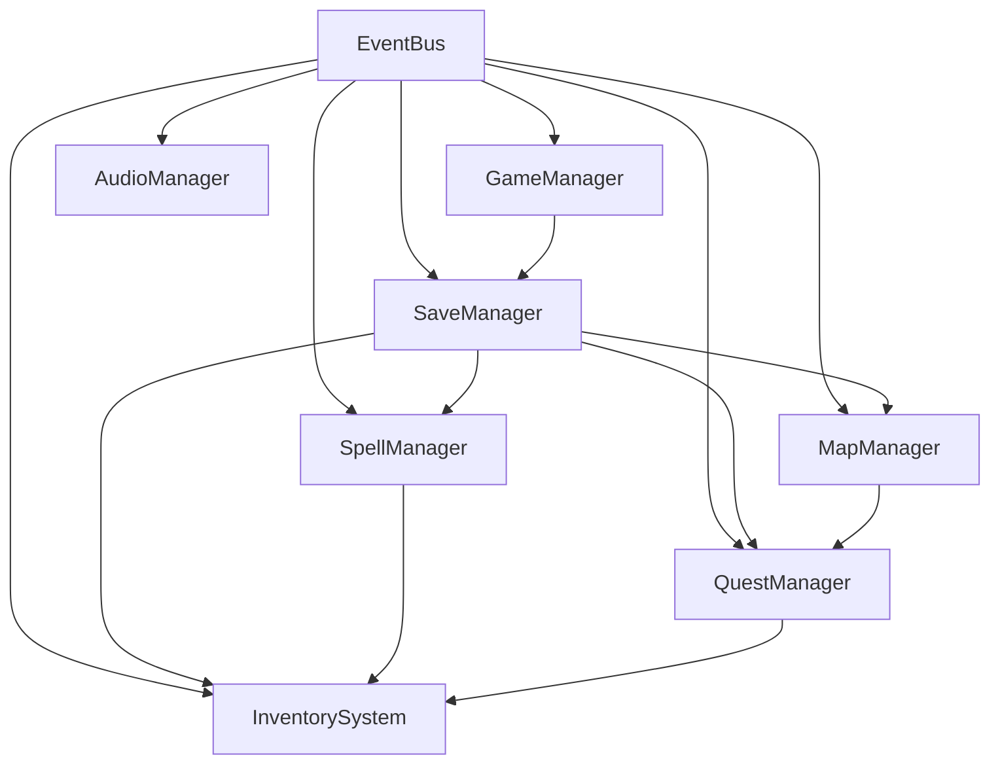
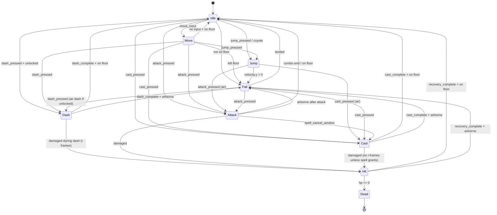
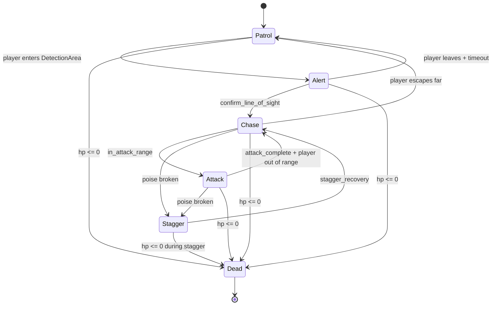
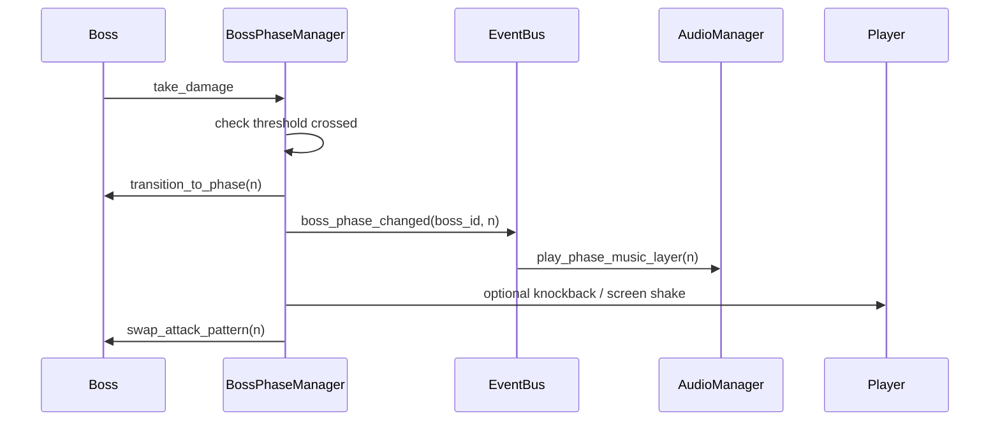
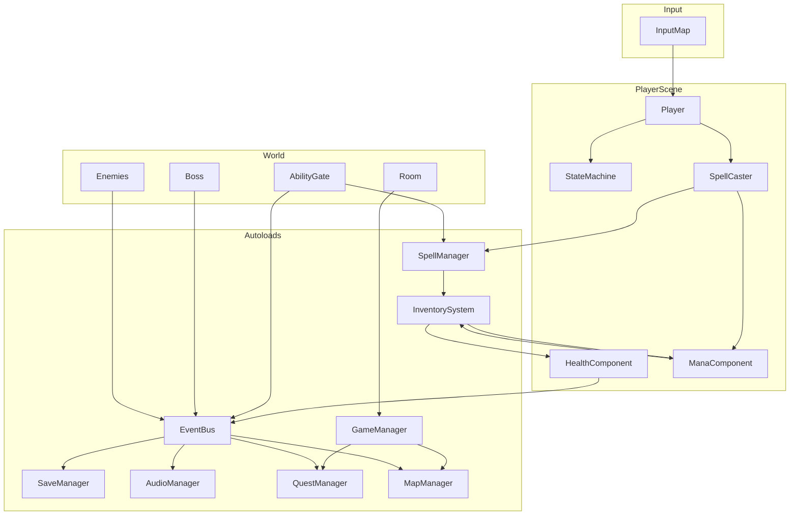
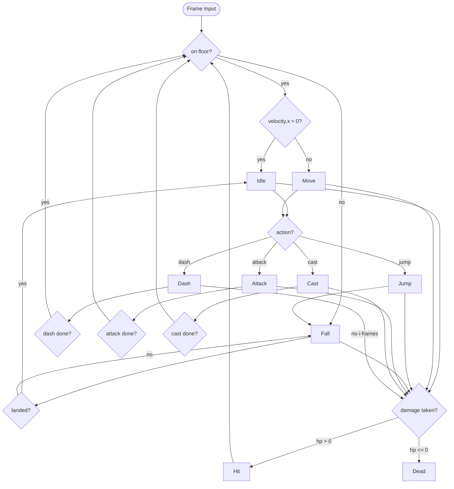

# 08 — Technical Architecture

> *"The weave is code. The sigils are scenes. The world is a graph of rooms."*

This document is the Godot 4 implementation blueprint for **Arcania**. It defines engine configuration, folder conventions, autoload singletons, scene patterns, component architecture, state machines, persistence, and performance guidelines. All systems align with the [Game Design Document](01-gdd.md), [Magic System](06-magic-system.md), and [World Design](02-world-design.md).

**Target engine:** Godot 4.3+  
**Target viewport:** 960×540 (pixel-perfect upscale to 1920×1080)  
**Scripting:** GDScript 2.0 (typed where practical)

### Implementation Status (June 2026)

Phases 0–4 are implemented in `godot/`. This table maps design sections to build state; see [10-development-roadmap.md](10-development-roadmap.md) for phase detail.

| Section | Status | Notes |
|---------|--------|-------|
| §1 Engine Setup | ✅ | Godot 4.7 project; viewport, layers, gameplay constants |
| §2 Folder Structure | ✅ | Matches layout below |
| §3 Autoload Singletons | ✅ | All 8 autoloads registered |
| §4 Scene Hierarchy | ✅ | `main.tscn` → title → `game_world.tscn` → `RoomLoader` |
| §5 Components | ✅ | Health, Hitbox, Hurtbox, Mana |
| §6 Player Controller | ✅ | 9-state machine; melee + spell cast |
| §7 Enemy AI | ⚠️ | E-03 Bramble Stalker only |
| §8 Boss Architecture | ✅ | `BaseBoss`, `BossPhaseManager`; Matron + Warden |
| §9 Spell System | ⚠️ | 6 of 14 spells; `SpellManager` + wheel |
| §10 Save System | ✅ | JSON v1, 3 slots, all autoloads persist |
| §11 Inventory & Relics | ⚠️ | 6 relic resources; 3 placed in-world |
| §12 Quest System | ✅ | Act I quests; 4 objective types |
| §13 Map & Discovery | ✅ | Fog-of-war grid; Whisperwood + Threshold |
| §14 Ability Gating | ✅ | Brazier, vine, anchor gates |
| §15 Input Map | ✅ | Full action map in `project.godot` |
| §16 EventBus | ✅ | Cross-system signals |
| §19 Testing | ⚠️ | Manual QA checklist not formally signed off |

**Registered rooms (21):** 3 dev, 2 Ashen Threshold, 16 Whisperwood — see `room_loader.gd` `ROOM_SCENES`.

---

## Table of Contents

1. [Engine Setup](#1-engine-setup)
2. [Folder Structure](#2-folder-structure)
3. [Autoload Singletons](#3-autoload-singletons)
4. [Scene Hierarchy Patterns](#4-scene-hierarchy-patterns)
5. [Component Architecture](#5-component-architecture)
6. [Player Controller Architecture](#6-player-controller-architecture)
7. [Enemy AI Architecture](#7-enemy-ai-architecture)
8. [Boss Architecture](#8-boss-architecture)
9. [Spell System](#9-spell-system)
10. [Save System](#10-save-system)
11. [Inventory & Relic System](#11-inventory--relic-system)
12. [Quest System](#12-quest-system)
13. [Map & Discovery System](#13-map--discovery-system)
14. [Ability Gating](#14-ability-gating)
15. [Input Map](#15-input-map)
16. [Signal & EventBus Patterns](#16-signal--eventbus-patterns)
17. [Code Examples](#17-code-examples)
18. [System Diagrams](#18-system-diagrams)
19. [Testing Strategy](#19-testing-strategy)
20. [Performance Notes](#20-performance-notes)

---

## 1. Engine Setup

### Version & Renderer

| Setting | Value |
|---------|-------|
| Godot version | **4.3+** (4.4 recommended when stable) |
| Renderer | **Forward+** (2D lighting, normal maps, particles) |
| Physics | **2D** — default layer/mask matrix documented below |

### Project Settings (`project.godot`)

#### Display

| Key | Value | Notes |
|-----|-------|-------|
| `display/window/size/viewport_width` | `960` | Internal render resolution |
| `display/window/size/viewport_height` | `540` | 16:9 aspect |
| `display/window/size/window_width_override` | `1920` | Window size |
| `display/window/size/window_height_override` | `1080` | |
| `display/window/stretch/mode` | `canvas_items` | Crisp 2D scaling |
| `display/window/stretch/aspect` | `keep` | Letterbox on non-16:9 |
| `display/window/stretch/scale` | `2.0` | Integer upscale (960→1920) |
| `rendering/2d/snap/snap_2d_transforms_to_pixel` | `true` | Eliminates sub-pixel shimmer |
| `rendering/2d/snap/snap_2d_vertices_to_pixel` | `true` | Tile-aligned geometry |
| `rendering/textures/canvas_textures/default_texture_filter` | `0` (Nearest) | Pixel art |

#### Physics Layers (2D)

| Layer | Name | Used By |
|-------|------|---------|
| 1 | `world` | TileMap, static geometry |
| 2 | `player` | Player body |
| 3 | `enemy` | Enemy bodies |
| 4 | `player_hitbox` | Melee / spell damage areas |
| 5 | `enemy_hitbox` | Enemy attack areas |
| 6 | `player_hurtbox` | Player damage receiver |
| 7 | `enemy_hurtbox` | Enemy damage receiver |
| 8 | `trigger` | AbilityGate, room transitions, pickups |
| 9 | `projectile` | Spell projectiles |
| 10 | `interactable` | NPCs, levers, anchors |

#### Gameplay Constants (Custom Project Metadata)

Store in `project.godot` `[gameplay]` section or `data/constants.gd` autoload:

| Constant | Value | Source |
|----------|-------|--------|
| `TILE_SIZE` | `64` | GDD art unit |
| `COYOTE_FRAMES` | `6` | Jump forgiveness |
| `JUMP_BUFFER_FRAMES` | `8` | Input buffer |
| `DASH_IFRAMES` | `14` | Veil Step |
| `HIT_IFRAMES` | `20` | Damage taken |
| `TARGET_FPS` | `60` | Performance budget |

### Pixel Snap Checklist

- Enable both `snap_2d_transforms_to_pixel` and `snap_2d_vertices_to_pixel`.
- Set `Camera2D` position smoothing to **disabled** during gameplay; enable only for cutscenes if needed.
- Round sprite positions in `CharacterBody2D._physics_process` when using kinematic movement: `global_position = global_position.round()`.
- Use integer `scale` values on root nodes (1.0, 2.0 — never 1.5).
- Import all sprite assets with **Filter: Nearest**, **Mipmaps: Off**.

---

## 2. Folder Structure

```
godot/
├── project.godot
├── icon.svg
│
├── autoloads/                  # Global singleton scripts (registered in project.godot)
│   ├── game_manager.gd
│   ├── save_manager.gd
│   ├── event_bus.gd
│   ├── audio_manager.gd
│   ├── quest_manager.gd
│   ├── map_manager.gd
│   ├── inventory_system.gd
│   └── spell_manager.gd
│
├── scenes/
│   ├── main/
│   │   ├── main.tscn           # Boot scene: loads GameManager, transitions to title/game
│   │   └── game_world.tscn     # Persistent world container (regions, player, UI root)
│   ├── player/
│   │   ├── player.tscn         # Elara root scene
│   │   └── player_states/      # One .tscn per state (optional) or inline scripts
│   ├── enemies/
│   │   ├── base_enemy.tscn     # Shared enemy template
│   │   └── {enemy_id}/         # Per-enemy scene variants
│   ├── bosses/
│   │   ├── base_boss.tscn
│   │   └── {boss_id}/
│   ├── regions/
│   │   └── {region_id}/        # Region root: room loader, ambient, music trigger
│   ├── rooms/
│   │   └── {region_id}/        # Individual room scenes (TileMap + entities)
│   ├── ui/
│   │   ├── hud.tscn
│   │   ├── title_screen.tscn
│   │   ├── pause_menu.tscn
│   │   ├── map_overlay.tscn
│   │   ├── spell_wheel.tscn
│   │   ├── inventory_panel.tscn
│   │   └── quest_log.tscn
│   ├── components/             # Reusable component scenes
│   │   ├── health_component.tscn
│   │   ├── hitbox_component.tscn
│   │   ├── hurtbox_component.tscn
│   │   ├── state_machine.tscn
│   │   └── ability_gate.tscn
│   ├── spells/
│   │   ├── spell_caster.tscn
│   │   └── effects/            # Per-spell VFX / projectile scenes
│   └── world/
│       ├── room_transition.tscn
│       ├── sigil_recall_anchor.tscn
│       └── focus_crucible.tscn
│
├── scripts/
│   ├── components/             # Component .gd files
│   ├── player/
│   │   ├── player.gd
│   │   └── states/             # Player state scripts
│   ├── enemies/
│   │   ├── enemy_base.gd
│   │   └── states/
│   ├── bosses/
│   │   ├── boss_base.gd
│   │   └── boss_phase_manager.gd
│   ├── systems/
│   │   ├── mana_component.gd
│   │   ├── modifier_stack.gd
│   │   └── object_pool.gd
│   └── utilities/
│       ├── math_utils.gd
│       └── direction_utils.gd
│
├── resources/
│   ├── spells/                 # SpellData .tres files (14 spells)
│   ├── quests/                 # QuestData .tres files
│   ├── relics/                 # RelicData .tres files (24 relics)
│   ├── enemies/                # EnemyData .tres (stats, loot tables)
│   ├── bosses/                 # BossData .tres (phases, arena)
│   └── regions/                # RegionData .tres (grid size, music, palette)
│
├── assets/
│   ├── sprites/
│   │   ├── player/
│   │   ├── enemies/
│   │   ├── tilesets/
│   │   ├── vfx/
│   │   └── ui/
│   ├── audio/
│   │   ├── music/
│   │   ├── sfx/
│   │   └── ambient/
│   ├── fonts/
│   └── shaders/
│       ├── hit_flash.gdshader
│       └── fog_of_war.gdshader
│
├── data/
│   └── saves/                  # Runtime JSON saves (gitignored in production)
│
└── tests/
    ├── unit/                   # GUT or Godot 4 built-in test runner
    └── integration/
```

### Naming Conventions

| Type | Pattern | Example |
|------|---------|---------|
| Scene | `snake_case.tscn` | `ashen_threshold_01.tscn` |
| Script | `snake_case.gd` | `player_state_dash.gd` |
| Resource | `PascalCase.tres` or `snake_case.tres` | `EmberSigil.tres` |
| Signal (EventBus) | `snake_case` past tense or noun | `player_damaged`, `spell_acquired` |
| Group | `snake_case` plural | `enemies`, `pickups`, `ability_gates` |
| Autoload | `PascalCase` node name | `GameManager` |

---

## 3. Autoload Singletons

All autoloads are registered in `project.godot` and persist for the game session. Order matters for initialization dependencies.

| Order | Autoload | Responsibility |
|-------|----------|----------------|
| 1 | `EventBus` | Global signal hub; decouples systems |
| 2 | `GameManager` | Game state machine (title, playing, paused, cutscene), scene transitions, run flags |
| 3 | `SaveManager` | JSON serialization, slot management, load/save orchestration |
| 4 | `AudioManager` | Music crossfade, SFX pooling, bus volumes |
| 5 | `SpellManager` | Acquired spells, wheel loadout, upgrade tiers, cooldown registry |
| 6 | `InventorySystem` | Relics, robes, focus items, currency, modifier aggregation |
| 7 | `QuestManager` | Active/completed quests, objective tracking |
| 8 | `MapManager` | Room discovery grid, fog of war, markers, region completion % |

### Dependency Graph



### Autoload Responsibilities (Detail)

#### GameManager

- Owns high-level `GameState` enum: `TITLE`, `LOADING`, `PLAYING`, `PAUSED`, `CUTSCENE`, `GAME_OVER`.
- Handles room transitions via `change_room(room_id, spawn_marker)`.
- Tracks session flags: `is_combat_active`, `current_region_id`, `current_room_id`.
- Defers save triggers to `SaveManager` at Sigil Recall anchors and Focus Crucibles.

#### SaveManager

- Three manual save slots + 1 autosave slot.
- Serializes player state, world flags, discovery, inventory, quests, spells.
- See [Save System](#10-save-system) for JSON schema.

#### EventBus

- Typed signal declarations only — no game logic.
- All cross-system communication prefers EventBus over direct autoload calls.

#### AudioManager

- Music: region themes, boss layers, crossfade 1.5s.
- SFX: pooled `AudioStreamPlayer2D` nodes (max 32 concurrent).
- Responds to `EventBus.region_entered`, `boss_phase_changed`.

#### SpellManager

- Registry of `SpellData` resources; tracks `acquired`, `equipped_wheel[8]`, `quick_slots[4]`.
- Applies upgrade tier (Base / Attuned / Resonant) to runtime stats.
- Exposes `can_cast(spell_id, caster_mana) -> bool` and `get_effective_cost(spell_id)`.

#### InventorySystem

- 6–8 relic slots, 1 robe, 1 focus item.
- Aggregates `ModifierStack` from all equipped items.
- Currency: **Weave Silk**, **Ley Residue**, **Shard Dust**.

#### QuestManager

- Loads `QuestData` resources; tracks objective progress.
- Emits `quest_updated` via EventBus on objective completion.

#### MapManager

- Per-region `RoomGrid` (2D bool/int array).
- Fog of war: unexplored rooms hidden, visited rooms revealed, current room highlighted.
- Player markers (max 3).

---

## 4. Scene Hierarchy Patterns

### Player (`scenes/player/player.tscn`)

```
Player (CharacterBody2D) [group: player]
├── CollisionShape2D
├── Sprite2D / AnimatedSprite2D
├── Camera2D (optional — or scene-level camera)
├── StateMachine (Node)
│   └── [states added at runtime or as children]
├── HealthComponent
├── ManaComponent
├── HitboxComponent (melee)
├── HurtboxComponent
├── SpellCaster
├── AbilityGateDetector (Area2D — reads nearby gates)
└── AudioStreamPlayer2D (footsteps, hurt)
```

### Enemy (`scenes/enemies/base_enemy.tscn`)

```
Enemy (CharacterBody2D) [group: enemies]
├── CollisionShape2D
├── AnimatedSprite2D
├── StateMachine
├── HealthComponent
├── HitboxComponent
├── HurtboxComponent
├── DetectionArea (Area2D — aggro radius)
├── PatrolPath (Path2D, optional)
└── LootDropPoint (Marker2D)
```

### Boss (`scenes/bosses/base_boss.tscn`)

```
Boss (CharacterBody2D) [group: bosses]
├── CollisionShape2D
├── AnimatedSprite2D
├── BossPhaseManager
├── StateMachine
├── HealthComponent (shared across phases)
├── HitboxComponent(s) — may swap per phase
├── HurtboxComponent
├── ArenaBoundary (StaticBody2D + CollisionPolygon2D)
├── PhaseTriggerZones (Area2D[])
├── BossUIAnchor (Marker2D — HP bar world position)
└── IntroCutsceneTrigger (Area2D)
```

### Region (`scenes/regions/{region_id}/region.tscn`)

```
Region (Node2D)
├── RoomContainer (Node2D) — active room instanced here
├── RegionAmbient (AudioStreamPlayer)
├── RegionData (exported Resource reference)
└── RoomLoader (script) — manages room streaming
```

### Room (`scenes/rooms/{region_id}/{room_id}.tscn`)

```
Room (Node2D) [metadata: room_id, region_id]
├── TileMapLayer(s)
├── Background (Parallax2D or Sprite2D)
├── Entities (Node2D)
│   ├── Enemies
│   ├── Pickups
│   └── Interactables
├── AbilityGates (Node2D)
├── RoomTransitions (Node2D)
├── SpawnPoints (Marker2D[])
├── CameraBounds (ReferenceRect or custom limit script)
└── Lighting (PointLight2D / CanvasModulate)
```

### UI (`scenes/ui/hud.tscn`)

```
HUD (CanvasLayer, layer 10)
├── HealthBar
├── ManaBar
├── OvercastIndicator
├── QuickSpellSlots (×4)
├── BossHealthBar (hidden by default)
├── RegionNameToast
└── DamageNumbers (pooled Control nodes)
```

---

## 5. Component Architecture

Components are **child nodes** with focused scripts, composed into Player/Enemy/Boss scenes. Prefer composition over deep inheritance.

### HealthComponent

| Property / Method | Type | Notes |
|-------------------|------|-------|
| `max_hp` | `int` | Modified by Vitality Threads + relics |
| `current_hp` | `int` | |
| `poise` | `float` | Stagger threshold for elites |
| `take_damage(amount, source, knockback)` | method | Emits `damaged`, `died` |
| `heal(amount)` | method | |
| `is_invulnerable` | `bool` | Set by i-frame states |

### HitboxComponent (`Area2D`)

- Layer: `player_hitbox` or `enemy_hitbox`.
- Mask: opposite hurtbox layer.
- `damage`, `knockback_vector`, `damage_type`, `poise_damage`.
- Active only during attack frames (enabled/disabled by animation events or state).

### HurtboxComponent (`Area2D`)

- Layer: `player_hurtbox` or `enemy_hurtbox`.
- Mask: opposite hitbox layer.
- Forwards `area_entered` to parent `HealthComponent.take_damage()`.
- Respects `is_invulnerable`.

### StateMachine

- Generic finite state machine (see [Code Examples](#17-code-examples)).
- States are `Node` children implementing `enter()`, `exit()`, `update(delta)`, `physics_update(delta)`.
- Transitions via `transition_to(state_name, payload)`.

### AbilityGate (`Area2D`)

- Requires specific spell ID and optionally upgrade tier.
- Blocks passage (collision) or interaction until requirement met.
- See [Ability Gating](#14-ability-gating).

### ManaComponent (Player only)

- `max_mana`, `current_mana`, `regen_rate`, `regen_delay_timer`.
- Overcast logic: deficit × 1.5 HP cost, Silence stacks.
- Reads modifiers from `InventorySystem.get_modifier("mana_max")`.

---

## 6. Player Controller Architecture

### State Machine Overview



### State Reference

| State | Entry Behavior | Exit / Transition |
|-------|----------------|-------------------|
| **Idle** | Zero horizontal intent; play idle anim | Any action input |
| **Move** | `move_speed × input`; flip sprite | Stop input → Idle |
| **Jump** | Apply `jump_velocity`; consume coyote/buffer | Apex → Fall |
| **Fall** | Apply gravity; terminal velocity cap | Land → Idle |
| **Dash** | Fixed impulse; 14 i-frames; Veil Step VFX | Timer end → Idle/Fall |
| **Attack** | 3-hit combo chain; enable hitbox windows | Combo end or cancel to Cast |
| **Cast** | Lock movement (spell-dependent); spawn via `SpellCaster` | Animation end → Idle/Fall |
| **Hit** | Knockback; 20 i-frames; input lock 8 frames | Recovery timer |
| **Dead** | Disable input; play death; notify `GameManager` | Scene reload / respawn |

### Movement Constants

| Parameter | Base Value | Notes |
|-----------|------------|-------|
| `move_speed` | `180 px/s` | Modified by relics |
| `jump_velocity` | `-320 px/s` | |
| `gravity` | `980 px/s²` | |
| `dash_speed` | `400 px/s` | 0.2s duration |
| `max_fall_speed` | `500 px/s` | |

### Input Handling

- Read input in `Player._unhandled_input()` or per-state `physics_update`.
- Coyote timer: 6 frames after leaving floor.
- Jump buffer: 8 frames before landing.
- Spell aim: 8-direction vector from `aim_spell` action or mouse.

---

## 7. Enemy AI Architecture

### State Diagram



### State Reference

| State | Behavior |
|-------|----------|
| **Patrol** | Follow `PatrolPath` or idle patrol between two points; speed 40–80 px/s |
| **Alert** | Turn toward player; 0.3–0.8s wind-up before chase; play alert SFX |
| **Chase** | Pursue player at `chase_speed`; respect ledge/wall checks |
| **Attack** | Execute attack pattern from `EnemyData`; telegraph → active frames → recovery |
| **Stagger** | Disable attacks 0.5–1.5s; increased damage taken (×1.25) |
| **Dead** | Play death anim; spawn loot; notify `EventBus.enemy_defeated` |

### Detection

- `DetectionArea` (CircleShape2D): default radius 120–200 px.
- Line-of-sight raycast on layer `world` before transitioning Alert → Chase.
- `Alert` timeout: 3s without LOS → Patrol.

### Data-Driven Patterns

Attack patterns defined in `EnemyData.tres`:

```gdscript
# EnemyData resource fields (conceptual)
@export var attack_patterns: Array[AttackPattern]
# AttackPattern: { name, windup_frames, active_frames, recovery_frames, hitbox_scene }
```

---

## 8. Boss Architecture

### BossPhaseManager

Attached to every boss scene. Manages HP thresholds, phase transitions, and arena rules.

| Responsibility | Detail |
|----------------|--------|
| Phase thresholds | e.g. `[0.7, 0.4, 0.15]` → 4 phases |
| Phase entry | Trigger cutscene, change moveset, spawn adds |
| Arena lock | Enable `ArenaBoundary` collision on fight start |
| Player bounds | Clamp player position inside arena polygon |
| Loot / unlock | On death: spell drop, anchor unlock, quest advance |

### Phase Transition Flow



### Arena Boundaries

- `ArenaBoundary`: `StaticBody2D` with `CollisionPolygon2D` — invisible walls.
- Activated when player crosses `IntroCutsceneTrigger` or boss aggro.
- Deactivated on boss death or player death (reset).
- Some bosses shrink arena per phase (animated polygon or additional walls).

### Boss UI

- `EventBus.boss_fight_started(boss_id)` → HUD shows `BossHealthBar`.
- HP bar uses phase-colored segments.
- Name + phase subtitle from `BossData.tres`.

---

## 9. Spell System

### SpellData Resource Schema

`resources/spells/SpellData.gd`:

```gdscript
class_name SpellData
extends Resource

enum SpellTier { BASE, ATTUNED, RESONANT }
enum SpellCategory { COMBAT, EXPLORATION, HYBRID }
enum AimMode { DIRECTIONAL_8, TARGET, SELF, AREA }

@export_group("Identity")
@export var id: StringName                 # e.g. &"ember_sigil"
@export var display_name: String
@export var description: String
@export var icon: Texture2D
@export var category: SpellCategory = SpellCategory.HYBRID

@export_group("Costs")
@export var mana_cost: int = 8
@export var cooldown: float = 0.4
@export var cast_time: float = 0.15
@export var can_overcast: bool = true

@export_group("Combat")
@export var base_damage: int = 12
@export var poise_damage: float = 8.0
@export var aim_mode: AimMode = AimMode.DIRECTIONAL_8
@export var effect_scene: PackedScene       # Projectile / area / beam

@export_group("Exploration")
@export var gate_type: StringName           # e.g. &"burn", &"phase", &"grapple"
@export var exploration_tags: Array[StringName] = []

@export_group("Upgrades")
@export var tier: SpellTier = SpellTier.BASE
@export var attuned_variant: SpellData      # chained resource
@export var resonant_variant: SpellData

@export_group("Audio / VFX")
@export var cast_sfx: AudioStream
@export var impact_sfx: AudioStream
```

### SpellCaster Node

Child of Player (and some enemies for boss attacks):

```
SpellCaster (Node2D)
├── CastOrigin (Marker2D)
├── EffectContainer (Node2D) — spawned effects
└── script: spell_caster.gd
```

**Responsibilities:**

1. Read equipped spell from `SpellManager`.
2. Validate mana via `ManaComponent`; route Overcast if allowed.
3. Instantiate `effect_scene` with 8-dir aim vector.
4. Start cooldown timer; emit `EventBus.spell_cast(spell_id)`.
5. Notify `AbilityGate` nodes in range (for environmental interaction).

### 14 Spell IDs

| ID | Display Name |
|----|--------------|
| `ember_sigil` | Ember Sigil |
| `veil_step` | Veil Step |
| `rune_anchor` | Rune Anchor |
| `crystal_bridge` | Crystal Bridge |
| `spirit_form` | Spirit Form |
| `ley_sight` | Ley Sight |
| `temporal_echo` | Temporal Echo |
| `shadow_blink` | Shadow Blink |
| `arcane_bulwark` | Arcane Bulwark |
| `frost_bind` | Frost Bind |
| `storm_lash` | Storm Lash |
| `sigil_recall` | Sigil Recall |
| `unravel` | Unravel |
| `world_thread` | World Thread |

---

## 10. Save System

### Save Slots

| Slot | ID | Behavior |
|------|-----|----------|
| Slot 1 | `save_01` | Manual at anchors |
| Slot 2 | `save_02` | Manual at anchors |
| Slot 3 | `save_03` | Manual at anchors |
| Autosave | `autosave` | Overwritten on anchor rest; single slot |

**Save path:** `user://saves/{slot_id}.json`  
**Development mirror:** `res://data/saves/` (debug export only)

### JSON Schema

```json
{
  "version": 1,
  "timestamp": "2026-06-21T14:30:00Z",
  "playtime_seconds": 3720,
  "player": {
    "position": { "room_id": "ashen_threshold_03", "x": 480.0, "y": 312.0 },
    "hp_current": 100,
    "hp_max": 120,
    "mana_current": 65,
    "mana_max": 150,
    "vitality_fragments": 8,
    "focus_shards": 4,
    "facing": 1
  },
  "spells": {
    "acquired": ["ember_sigil", "veil_step", "rune_anchor"],
    "wheel": ["ember_sigil", "veil_step", "rune_anchor", "", "", "", "", ""],
    "quick_slots": ["ember_sigil", "veil_step", "rune_anchor", ""],
    "upgrades": {
      "ember_sigil": "attuned",
      "veil_step": "base"
    }
  },
  "inventory": {
    "relics_equipped": ["cinder_heart", "gloom_lens", "", "", "", ""],
    "relics_owned": ["cinder_heart", "gloom_lens", "iron_grip"],
    "robe_id": "ash_worn_novice",
    "focus_id": "cracked_lens",
    "currency": { "weave_silk": 12, "ley_residue": 2, "shard_dust": 45 }
  },
  "world": {
    "flags": {
      "defeated_boss_ashen_warden": true,
      "unlocked_sigil_recall": false,
      "ending_branch": ""
    },
    "anchors_active": ["ashen_threshold_hearth_01"],
    "ability_gates_cleared": ["ashen_frost_wall_01"],
    "rooms_visited": {
      "ashen_threshold": ["01", "02", "03", "04"],
      "mistral_hollow": ["01"]
    },
    "collectibles": {
      "lore_tablets": ["tablet_ashen_01"],
      "focus_shards": ["shard_embers"]
    }
  },
  "quests": {
    "active": [
      {
        "id": "quest_veil_remnant",
        "objectives": [
          { "id": "reach_sanctum", "complete": false },
          { "id": "speak_hermit", "complete": true }
        ]
      }
    ],
    "completed": ["quest_tutorial_emerge"]
  },
  "map": {
    "markers": [
      { "region_id": "ashen_threshold", "room_id": "07", "label": "secret?" }
    ],
    "region_completion": {
      "ashen_threshold": { "rooms": 0.65, "secrets": 0.33, "bosses": 1.0 }
    }
  },
  "settings": {
    "overcast_confirm": true,
    "spell_wheel_slowmo": false
  }
}
```

### What Persists

| Persists | Does Not Persist |
|----------|------------------|
| Player HP/mana (at save point values) | Mid-air position (snap to anchor) |
| Acquired spells + upgrades | Temporary buffs / debuffs |
| Equipped relics, robe, focus | Enemy respawn state (room-based reset) |
| World flags, cleared gates | Active projectiles / VFX |
| Quest progress | Boss mid-fight phase (boss rooms reset) |
| Map discovery + markers | Dropped loot not collected |
| Currency, collectibles | Silence / Overcast stacks |
| Active Waystone network | |

### Save Triggers

- **Manual:** Interact with Sigil Recall anchor or Focus Crucible (rest).
- **Autosave:** Same locations, writes to `autosave` slot only.
- **No save:** Mid-combat, mid-cutscene, or falling in pit (respawn at last anchor).

---

## 11. Inventory & Relic System

### Slots

| Slot Type | Count | Notes |
|-----------|-------|-------|
| Relics | 6 base, 8 max | Expanded via late-game quest |
| Robe | 1 | Swapped at Tailor Shrines / benches |
| Focus | 1 | Disabled if `unwoven_cloak` equipped |

### RelicData Resource

```gdscript
class_name RelicData
extends Resource

enum RelicTier { I, II, III, IV }

@export var id: StringName
@export var display_name: String
@export var tier: RelicTier
@export var modifiers: Array[ModifierEntry]   # stat → value
@export var unique_tag: StringName             # for exclusivity rules
@export var is_consumable: bool = false        # e.g. Soul Anchor
```

### Modifier Stacking Rules

| Rule | Detail |
|------|--------|
| **Additive (same stat)** | Sum flat bonuses: `+10 mana` + `+15 mana` = `+25 mana` |
| **Multiplicative (same stat)** | Multiply after add: `×1.1` × `×1.15` = `×1.265` |
| **Category order** | Flat add → percent add → percent multiply |
| **Caps** | `max_mana` hard cap 220; `i_frame_bonus` cap +6 frames |
| **Exclusive tags** | Only one relic with `unique_tag: overcast_mitigation` |
| **Tradeoffs** | Negative modifiers always apply; never overridden by positives |
| **Unwoven Cloak** | Disables Focus slot; applies global −10% cost as unique multiply |
| **Consumable relics** | Removed from inventory on trigger; save records `consumed_relics` |

### ModifierStack Aggregation

`InventorySystem.get_aggregated_modifiers() -> Dictionary`:

```gdscript
# Example output
{
  "max_mana": 25,           # flat
  "mana_regen_mult": 1.2,   # multiply
  "overcast_cost_mult": 0.85,
  "veil_step_distance_mult": 1.1,
}
```

Systems query modifiers at cast time (not cached across frames) to support mid-combat relic swaps at benches only.

---

## 12. Quest System

### QuestData Resource

```gdscript
class_name QuestData
extends Resource

enum QuestType { MAIN, SIDE, FACTION, REGIONAL }

@export var id: StringName
@export var title: String
@export var description: String
@export var quest_type: QuestType
@export var prerequisites: Array[StringName]   # quest ids or world flags
@export var objectives: Array[QuestObjective]
@export var rewards: QuestRewards

class QuestObjective:
    @export var id: StringName
    @export var description: String
    @export var objective_type: ObjectiveType
    @export var target_id: StringName            # enemy, item, region, npc
    @export var required_count: int = 1
    @export var optional: bool = false

enum ObjectiveType {
    REACH_LOCATION,      # room_id or region_id
    TALK_TO_NPC,         # npc_id
    DEFEAT_ENEMY,        # enemy_id, count
    DEFEAT_BOSS,         # boss_id
    ACQUIRE_SPELL,       # spell_id
    ACQUIRE_RELIC,       # relic_id
    COLLECT_ITEM,        # currency or collectible
    CLEAR_ABILITY_GATE,  # gate_id
    INTERACT_OBJECT,     # world object id
    DISCOVER_ROOMS,      # count in region
}
```

### QuestManager Flow

1. `start_quest(quest_id)` — validate prerequisites via `world.flags`.
2. Subscribe to EventBus signals matching active objective types.
3. On match: increment progress → `quest_updated` → check completion.
4. On complete: grant rewards (spell, relic, flag, currency) → move to `completed`.

### Example Quest Hooks

| EventBus Signal | Objective Type |
|-----------------|----------------|
| `room_entered(room_id)` | `REACH_LOCATION`, `DISCOVER_ROOMS` |
| `enemy_defeated(enemy_id)` | `DEFEAT_ENEMY` |
| `boss_defeated(boss_id)` | `DEFEAT_BOSS` |
| `spell_acquired(spell_id)` | `ACQUIRE_SPELL` |
| `ability_gate_cleared(gate_id)` | `CLEAR_ABILITY_GATE` |
| `npc_interacted(npc_id)` | `TALK_TO_NPC` |

---

## 13. Map & Discovery System

### Room Grid

Each region has a `RegionData` resource defining a 2D grid:

```gdscript
# RegionData
@export var region_id: StringName
@export var grid_width: int
@export var grid_height: int
@export var room_layout: Array[Array]   # StringName room_id or "" for empty
@export var room_connections: Dictionary # room_id -> Array[adjacent_room_id]
```

### Discovery States

| State | Value | Map Display |
|-------|-------|-------------|
| `UNKNOWN` | 0 | Hidden (fog) |
| `ADJACENT` | 1 | Faint outline (entered neighboring room) |
| `VISITED` | 2 | Full room shape |
| `MAPPED` | 3 | Room + icons (secrets revealed by Ley Sight) |

### Fog of War

- `MapManager` maintains `discovery_grid[region_id][x][y]`.
- On `room_entered`: set cell to `VISITED`; reveal `ADJACENT` on connected cells.
- `Ley Sight` active: upgrade current region cells to `MAPPED`, reveal secret room outlines.
- `Ley Navigator` relic: persist secret reveals after Ley Sight deactivates.

### Map UI

- Full-screen overlay (`map_overlay.tscn`) on `map_toggle` input.
- Player dot at current room cell.
- Connection lines drawn between visited adjacent rooms.
- 3 custom markers (place/remove with interact).

### Region Completion

Tracked per region:

```
completion = (visited_rooms / total_rooms × 0.4)
           + (secrets_found / total_secrets × 0.3)
           + (bosses_defeated / total_bosses × 0.3)
```

Displayed on map region select screen.

---

## 14. Ability Gating

### AbilityGate Area2D Implementation

```
AbilityGate (Area2D) [group: ability_gates]
├── CollisionShape2D (blocking — StaticBody2D sibling or TileMap override)
├── GateSprite (Sprite2D — visual hint: frost, barrier, grate)
├── RequirementLabel (Label3D or Sprite2D icon, optional)
└── script: ability_gate.gd
```

### Gate Properties

```gdscript
@export var gate_id: StringName
@export var required_spell: StringName       # e.g. &"ember_sigil"
@export var required_tier: SpellData.SpellTier = SpellData.SpellTier.BASE
@export var gate_type: StringName            # matches SpellData.gate_type
@export var one_way: bool = false            # player can exit but not enter
@export var permanent_clear: bool = true     # stays open after first clear
```

### Clear Logic

1. Player enters gate `interaction_area` OR casts spell within `cast_radius`.
2. `SpellCaster` emits `spell_cast` with aim direction.
3. Gate checks: `SpellManager.has_spell(required_spell)` AND `tier >= required_tier`.
4. If match: play clear VFX → disable blocking collision → `EventBus.ability_gate_cleared(gate_id)`.
5. If `permanent_clear`: add to `SaveManager.world.ability_gates_cleared`.

### Gate Types (Spell Mapping)

| gate_type | Spell | Example |
|-----------|-------|---------|
| `burn` | Ember Sigil | Braziers, frost barriers |
| `phase` | Veil Step | Thin walls, grates |
| `grapple` | Rune Anchor | Distant rings |
| `bridge` | Crystal Bridge | Chasms |
| `spirit` | Spirit Form | Wraith barriers |
| `reveal` | Ley Sight | Illusion walls |
| `echo` | Temporal Echo | Echo switches |
| `shadow` | Shadow Blink | Shadow anchors |
| `shield` | Arcane Bulwark | Wind tunnels |
| `freeze` | Frost Bind | Water / steam |
| `lightning` | Storm Lash | Conduits |
| `recall` | Sigil Recall | Place anchor |
| `unweave` | Unravel | Magical seals |
| `thread` | World Thread | Ley ruptures |

---

## 15. Input Map

All actions defined in `project.godot` `[input]` section. Deadzone defaults: 0.2 for sticks.

| Action | Keyboard | Gamepad Button | Notes |
|--------|----------|----------------|-------|
| `move_left` | A / ← | Left stick X− / D-pad L | Axis −1 |
| `move_right` | D / → | Left stick X+ / D-pad R | Axis +1 |
| `move_up` | W / ↑ | Left stick Y− | Ladders / aim up |
| `move_down` | S / ↓ | Left stick Y+ | Ladders / aim down |
| `jump` | Space | A (Xbox) / Cross | |
| `melee_attack` | J / LMB | X / Square | |
| `cast_spell` | K / RMB | Y / Triangle | |
| `aim_up` | I | Right stick up | 8-dir aim |
| `aim_down` | , K | Right stick down | |
| `aim_left` | J | Right stick left | |
| `aim_right` | L | Right stick right | |
| `dash` | Shift | B / Circle | Veil Step |
| `interact` | E | A (context) | |
| `spell_wheel` | Tab (hold) | LB (hold) | |
| `quick_spell_1` | 1 | D-pad Up | |
| `quick_spell_2` | 2 | D-pad Right | |
| `quick_spell_3` | 3 | D-pad Down | |
| `quick_spell_4` | 4 | D-pad Left | |
| `map_toggle` | M | Select / View | |
| `inventory_toggle` | I | Start (tap) | |
| `pause` | Escape | Start (hold) | |

### Input Handling Notes

- Use `Input.get_vector("move_left", "move_right", "move_up", "move_down")` for movement.
- Aim: prefer right stick vector; snap to 8 directions with `DirectionUtils.snap_8(vector)`.
- `spell_wheel` held: optionally set `Engine.time_scale = 0.5` (accessibility setting).

---

## 16. Signal & EventBus Patterns

### Design Rules

1. **EventBus is for cross-domain events** — player died, spell acquired, room entered.
2. **Local signals for parent-child** — `HealthComponent.damaged` → Player state machine.
3. **Autoloads emit through EventBus** — keeps subscribers in one place.
4. **Never chain more than 2 hops** — A → EventBus → B, not A → B → C → D.
5. **Name signals as past tense or nouns** — `boss_defeated`, not `defeat_boss`.

### EventBus Signal Catalog

```gdscript
# event_bus.gd — signal declarations

# Player
signal player_spawned(player: Node2D)
signal player_damaged(amount: int, source: Node)
signal player_died
signal player_healed(amount: int)

# Combat
signal enemy_defeated(enemy_id: StringName, position: Vector2)
signal boss_fight_started(boss_id: StringName)
signal boss_phase_changed(boss_id: StringName, phase: int)
signal boss_defeated(boss_id: StringName)

# Spells
signal spell_cast(spell_id: StringName, caster: Node2D)
signal spell_acquired(spell_id: StringName)
signal spell_upgraded(spell_id: StringName, tier: int)

# World
signal room_entered(room_id: StringName, region_id: StringName)
signal region_entered(region_id: StringName)
signal ability_gate_cleared(gate_id: StringName)
signal anchor_activated(anchor_id: StringName)
signal interactable_triggered(interactable_id: StringName)

# Inventory / Quest
signal relic_acquired(relic_id: StringName)
signal quest_started(quest_id: StringName)
signal quest_updated(quest_id: StringName, objective_id: StringName)
signal quest_completed(quest_id: StringName)

# Save / Game
signal save_requested(slot_id: String)
signal game_loaded(slot_id: String)
signal game_paused
signal game_resumed
```

### Subscription Pattern

```gdscript
# In QuestManager._ready()
EventBus.room_entered.connect(_on_room_entered)
EventBus.enemy_defeated.connect(_on_enemy_defeated)

func _exit_tree() -> void:
    EventBus.room_entered.disconnect(_on_room_entered)
    EventBus.enemy_defeated.disconnect(_on_enemy_defeated)
```

---

## 17. Code Examples

### StateMachine (`scripts/components/state_machine.gd`)

```gdscript
class_name StateMachine
extends Node

@export var initial_state: State

var current_state: State
var states: Dictionary = {}

func _ready() -> void:
    for child in get_children():
        if child is State:
            states[child.name] = child
            child.state_machine = self
    if initial_state:
        current_state = initial_state
        current_state.enter({})

func _process(delta: float) -> void:
    if current_state:
        current_state.update(delta)

func _physics_process(delta: float) -> void:
    if current_state:
        current_state.physics_update(delta)

func transition_to(state_name: StringName, payload: Dictionary = {}) -> void:
    if not states.has(state_name):
        push_error("StateMachine: unknown state %s" % state_name)
        return
    if current_state:
        current_state.exit()
    current_state = states[state_name]
    current_state.enter(payload)
```

### State Base (`scripts/components/state.gd`)

```gdscript
class_name State
extends Node

var state_machine: StateMachine

func enter(_payload: Dictionary) -> void:
    pass

func exit() -> void:
    pass

func update(_delta: float) -> void:
    pass

func physics_update(_delta: float) -> void:
    pass
```

### SaveManager Core (`autoloads/save_manager.gd`)

```gdscript
extends Node

const SAVE_VERSION := 1
const SAVE_DIR := "user://saves/"

var current_slot: String = ""

func save_game(slot_id: String) -> bool:
    var data := _build_save_data()
    var path := SAVE_DIR + slot_id + ".json"
    var json := JSON.stringify(data, "\t")
    var file := FileAccess.open(path, FileAccess.WRITE)
    if file == null:
        push_error("SaveManager: failed to open %s" % path)
        return false
    file.store_string(json)
    file.close()
    current_slot = slot_id
    EventBus.save_requested.emit(slot_id)
    return true

func load_game(slot_id: String) -> bool:
    var path := SAVE_DIR + slot_id + ".json"
    if not FileAccess.file_exists(path):
        return false
    var file := FileAccess.open(path, FileAccess.READ)
    var parsed = JSON.parse_string(file.get_as_text())
    file.close()
    if parsed == null or not parsed is Dictionary:
        push_error("SaveManager: invalid JSON in %s" % path)
        return false
    _apply_save_data(parsed)
    current_slot = slot_id
    EventBus.game_loaded.emit(slot_id)
    return true

func _build_save_data() -> Dictionary:
    return {
        "version": SAVE_VERSION,
        "timestamp": Time.get_datetime_string_from_system(),
        "playtime_seconds": GameManager.playtime_seconds,
        "player": GameManager.get_player_snapshot(),
        "spells": SpellManager.get_save_data(),
        "inventory": InventorySystem.get_save_data(),
        "world": GameManager.get_world_flags(),
        "quests": QuestManager.get_save_data(),
        "map": MapManager.get_save_data(),
        "settings": GameManager.get_settings_snapshot(),
    }

func _apply_save_data(data: Dictionary) -> void:
    GameManager.apply_save_data(data.get("player", {}), data.get("world", {}))
    SpellManager.apply_save_data(data.get("spells", {}))
    InventorySystem.apply_save_data(data.get("inventory", {}))
    QuestManager.apply_save_data(data.get("quests", {}))
    MapManager.apply_save_data(data.get("map", {}))
```

### SpellData Resource (`resources/spells/SpellData.gd`)

```gdscript
class_name SpellData
extends Resource

enum SpellTier { BASE, ATTUNED, RESONANT }
enum SpellCategory { COMBAT, EXPLORATION, HYBRID }
enum AimMode { DIRECTIONAL_8, TARGET, SELF, AREA }

@export_group("Identity")
@export var id: StringName = &""
@export var display_name: String = ""
@export var description: String = ""
@export var icon: Texture2D
@export var category: SpellCategory = SpellCategory.HYBRID

@export_group("Costs")
@export var mana_cost: int = 8
@export var cooldown: float = 0.4
@export var cast_time: float = 0.15
@export var can_overcast: bool = true

@export_group("Combat")
@export var base_damage: int = 12
@export var poise_damage: float = 8.0
@export var aim_mode: AimMode = AimMode.DIRECTIONAL_8
@export var effect_scene: PackedScene

@export_group("Exploration")
@export var gate_type: StringName = &""
@export var exploration_tags: Array[StringName] = []

@export_group("Upgrades")
@export var tier: SpellTier = SpellTier.BASE
@export var attuned_variant: SpellData
@export var resonant_variant: SpellData

func get_effective_cost(modifiers: Dictionary) -> int:
    var cost := mana_cost
    if modifiers.has("spell_cost_flat"):
        cost += modifiers["spell_cost_flat"]
    if modifiers.has("spell_cost_mult"):
        cost = int(cost * modifiers["spell_cost_mult"])
    return maxi(cost, 1)
```

---

## 18. System Diagrams

### Runtime System Dependencies



### Player State Flow (Combat-Critical Path)



---

## 19. Testing Strategy

### Test Framework

Use **GdUnit4** or Godot 4's built-in test scenes (project preference: GdUnit4 for CI).

```
godot/tests/
├── unit/
│   ├── test_state_machine.gd
│   ├── test_save_manager.gd
│   ├── test_modifier_stack.gd
│   ├── test_spell_data.gd
│   └── test_map_discovery.gd
└── integration/
    ├── test_room_transition.gd
    ├── test_ability_gate_clear.gd
    └── test_quest_objectives.gd
```

### Unit Test Priorities

| System | Test Cases |
|--------|------------|
| StateMachine | Unknown state error; enter/exit called; transition chain |
| SaveManager | Round-trip JSON; version mismatch handling; corrupt file |
| ModifierStack | Add/multiply order; cap enforcement; exclusive tags |
| SpellData | `get_effective_cost` with modifiers |
| MapManager | Discovery state transitions; adjacent reveal |
| QuestManager | Prerequisite gating; objective completion counts |

### Integration Tests

| Scenario | Validation |
|----------|------------|
| Room transition | Player spawns at correct marker; discovery updates |
| Ability gate | Wrong spell fails; correct spell clears; save persists |
| Boss phase | HP threshold triggers phase; arena bounds active |
| Save/load | Full loop at anchor; all autoloads restored |

### Manual QA Checklist (Vertical Slice)

- [ ] 60 FPS stable in Ashen Threshold hub room
- [ ] Pixel snap: no shimmer on player movement
- [ ] Coyote jump + input buffer feel correct (6/8 frames)
- [ ] Ember Sigil clears burn gate and damages enemy
- [ ] Save at anchor → reload → position, spells, map preserved
- [ ] EventBus: no duplicate connections after room reload

### Debug Tools

- `F3`: Debug overlay (FPS, state name, room id)
- `F5`: Quick save to `debug_save` slot
- `cheat_panel.tscn` (debug build only): grant spells, teleport rooms

---

## 20. Performance Notes

### Target Budget

| Metric | Target |
|--------|--------|
| Frame time | ≤ 16.6 ms (60 FPS) |
| Draw calls | ≤ 120 per frame (2D batching) |
| Physics bodies | ≤ 40 active per room |
| Audio voices | ≤ 32 concurrent SFX |

### Object Pooling

Pool frequently spawned nodes:

| Pool | Initial Size | Max | Node Type |
|------|--------------|-----|-----------|
| `ProjectilePool` | 16 | 64 | Spell projectiles |
| `DamageNumberPool` | 8 | 24 | Floating text |
| `ParticlePool` | 12 | 48 | Hit sparks, spell VFX |
| `AudioPool` | 16 | 32 | `AudioStreamPlayer2D` |

Implementation: `scripts/systems/object_pool.gd` — `acquire(scene) -> Node`, `release(node)`.

### Viewport Culling

- Attach `VisibleOnScreenNotifier2D` to enemies and heavy VFX.
- Pause `physics_process` and animation when off-screen (not in adjacent room buffer).
- Room loader: only instance current room + 1 adjacent transition buffer (preload next room async).

### TileMap Optimization

- Use single `TileMapLayer` per collision type where possible.
- Bake static collision; no per-frame collision regeneration.
- Region chunk size: 1 room = 1 scene (no mega-TileMaps).

### Other Optimizations

- Cache `InventorySystem.get_aggregated_modifiers()` per frame (invalidate on equipment change).
- Use `MultiMeshInstance2D` for ambient particles (ash, mist).
- Compress audio: OGG Vorbis for music; WAV for short SFX (< 1s).
- Shader fallback: disable normal maps on `Low` quality preset.

---

## Cross-References

- Spell balance and relic tables: [06-magic-system.md](06-magic-system.md)
- Region room counts and gating: [02-world-design.md](02-world-design.md)
- Enemy poise and attack data: [04-enemy-bible.md](04-enemy-bible.md)
- Boss phases and arenas: [05-boss-bible.md](05-boss-bible.md)
- Development phase order: [10-development-roadmap.md](10-development-roadmap.md)
- Godot scaffold: `../godot/` directory

---

*Document version: 1.1 — Phases 0–4 implemented (June 2026). Update after Phase 5 region sprints.*
