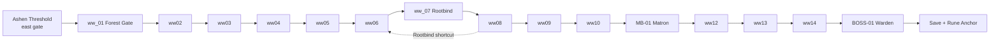

# 10 — Development Roadmap

> *"Ship the forest before you paint every tree. One playable room beats forty design documents."*

This document is the phased build plan for **Arcania** as a **solo developer** working **~15 hours/week** with **AI-assisted coding** (Cursor) and **AI-assisted art/audio** generation. It translates the design lock in [01-gdd.md](01-gdd.md) into weekly, testable deliverables aligned with [08-technical-architecture.md](08-technical-architecture.md).

**Assumptions**

| Parameter | Value |
|-----------|-------|
| Engine | Godot 4.3+ (see [08-technical-architecture.md §1](08-technical-architecture.md#1-engine-setup)) |
| Cadence | ~15 hrs/week (evenings + one weekend block) |
| Team | Solo dev + AI tools |
| Scope target | Vertical slice through Whisperwood / Root Warden before content expansion |

---

## Table of Contents

1. [Overall Timeline](#1-overall-timeline)
2. [Milestone Definitions](#2-milestone-definitions)
3. [Phase 0 — Setup](#phase-0--setup)
4. [Phase 1 — Movement MVP](#phase-1--movement-mvp)
5. [Phase 2 — Combat Core](#phase-2--combat-core)
6. [Phase 3 — Vertical Slice](#phase-3--vertical-slice)
7. [Phase 4 — Systems](#phase-4--systems)
8. [Phase 5 — Content Expansion](#phase-5--content-expansion)
9. [Phase 6 — Polish](#phase-6--polish)
10. [Tooling Recommendations](#10-tooling-recommendations)
11. [Weekly Rhythm (Solo Dev)](#11-weekly-rhythm-solo-dev)
12. [Post-Launch Considerations](#12-post-launch-considerations)
13. [Document Cross-Reference Index](#13-document-cross-reference-index)
14. [Appendix A — Phase 3 Whisperwood Room List](#appendix-a--phase-3-whisperwood-room-list)

---

## 1. Overall Timeline

Gantt-style calendar assuming **Phase 0 complete** and work starting at Phase 1. Dates are illustrative — shift the start column to your actual kickoff.

| Phase | Name | Duration | Hrs (≈) | Calendar* | Depends On | Milestone |
|-------|------|----------|---------|-----------|------------|-----------|
| **0** | Setup | 1 week | 15 | ✅ Done | — | Godot skeleton + autoloads |
| **1** | Movement MVP | 2 weeks | 30 | Wk 1–2 | Phase 0 | **First Playable** (greybox) |
| **2** | Combat Core | 3 weeks | 45 | Wk 3–5 | Phase 1 | Combat loop in test room |
| **3** | **Vertical Slice** | 4 weeks | 60 | ✅ Done | Phase 2 | **Vertical Slice** demo |
| **4** | Systems | 3 weeks | 45 | ✅ Done | Phase 3 | Metroidvania systems online |
| **5** | Content Expansion | Ongoing | — | **In progress** | Phase 4 | Region-by-region alpha |
| **6** | Polish | 2+ weeks | 30+ | Pre-1.0 | Phase 5 critical path | **1.0** candidate |

\* *Example: if Phase 1 starts 2026-06-23, Vertical Slice lands ~2026-08-25; Systems complete ~2026-09-15.*

**Critical path to shippable demo:** Phases 0 → 3 (~10 weeks, ~150 hrs).  
**Critical path to content-complete 1.0:** Phases 0 → 5 + Phase 6 (~6–12+ months depending on region scope).

---

## 2. Milestone Definitions

Use these terms consistently in commits, playtests, and trailer planning.

### First Playable

**When:** End of Phase 1.

A **technical prototype**, not a game loop. The player can move, jump, dash (Veil Step stub OK), and traverse a single test room with tile collision. No combat, no save, placeholder art.

| Criterion | Required |
|-----------|----------|
| 60 FPS in test room | ✅ |
| Coyote time (6f) + jump buffer (8f) | ✅ |
| Camera follows player; no sub-pixel shimmer | ✅ |
| Room transition stub (door → spawn marker) | Optional |

**Not required:** Spells, enemies, narrative, audio, map UI.

---

### Vertical Slice

**When:** End of Phase 3.

A **representative slice of the full game** — one region partial + hub connection + boss — demonstrating core pillars from [01-gdd.md §2](01-gdd.md#2-design-pillars): melee + spell combat, ability gating, boss phase design, save/load, and region identity.

| Criterion | Required |
|-----------|----------|
| Playable path: Ashen Threshold → Whisperwood (partial) → Root Warden | ✅ |
| Spells: Ember Sigil, Veil Step, Rootbind, Arc Step, Rune Anchor (post-boss) | ✅ |
| Mini-boss: Thornweft Matron (2 phases) | ✅ |
| Major boss: Root Warden (3 phases) | ✅ |
| Save/load at Focus Crucible; progress persists | ✅ |
| Manual QA checklist from [08-technical-architecture.md §19](08-technical-architecture.md#19-testing-strategy) passes | ✅ |
| Region-appropriate art/audio (AI batch acceptable) | ✅ |

**Not required:** Full Whisperwood (42 rooms), inventory UI, quest framework, all endings, remaining 9 regions.

Reference pacing: [01-gdd.md §7.5](01-gdd.md#75-progression-pacing-target) targets ~30 min to clear Threshold; slice playtime **45–90 min** for first run.

---

### 1.0 (Release Candidate)

**When:** After Phase 5 critical path + Phase 6 polish.

The **complete intended v1 product** per GDD: 12 regions, 14 spells, faction endings, full relic roster, accessibility options, and balanced Normal difficulty.

| Criterion | Required |
|-----------|----------|
| Critical path completable start → ending choice | ✅ |
| All major bosses (BOSS-01–08) implemented | ✅ |
| Map discovery + fast travel (Waystones + Sigil Recall) | ✅ |
| 3 endings per [07-narrative.md §5](07-narrative.md) | ✅ |
| No P0 bugs; ≤3 first-attempt deaths on Normal main bosses ([01-gdd.md §8.3](01-gdd.md#83-balancing-principles)) | ✅ |
| Steam/desktop build + controller support | ✅ |

**Not required for v1:** NG+, co-op, automated aim assist ([01-gdd.md §11](01-gdd.md#11-accessibility)).

---

## Phase 0 — Setup

**Duration:** 1 week (~15 hrs)  
**Status:** ✅ **COMPLETE** — per [08-technical-architecture.md](08-technical-architecture.md)

### Godot Tasks

- [x] Create Godot 4.3+ project with viewport 960×540, pixel snap, physics layers ([08 §1](08-technical-architecture.md#1-engine-setup))
- [x] Establish folder tree: `autoloads/`, `scenes/`, `scripts/`, `resources/`, `assets/`, `data/` ([08 §2](08-technical-architecture.md#2-folder-structure))
- [x] Register autoload singletons: `EventBus`, `GameManager`, `SaveManager`, `AudioManager`, `SpellManager`, `InventorySystem`, `QuestManager`, `MapManager` ([08 §3](08-technical-architecture.md#3-autoload-singletons))
- [x] Boot scene (`main.tscn`) → title stub → `game_world.tscn` shell
- [x] Input map: move, jump, dash, attack, cast, aim_spell, pause ([08 §15](08-technical-architecture.md#15-input-map))
- [x] Git ignore + README pointing to `docs/`

### AI Art/Audio Batch

Defer heavy generation until Phase 1. Optional Phase 0 batch:

| Asset | Reference | Tool |
|-------|-----------|------|
| Project icon | [03-art-bible.md §2](03-art-bible.md) palette | Midjourney / Flux |
| Placeholder tileset 64×64 | Ashen Threshold charcoal + ember | Tileset generator + manual cleanup |

See [09-asset-production-list.md](09-asset-production-list.md) for full asset IDs when that doc is populated.

### Acceptance Criteria

- [x] Project opens without errors; autoload order matches [08 §3](08-technical-architecture.md#3-autoload-singletons)
- [x] `EventBus` signal smoke test connects/disconnects cleanly
- [x] Debug overlay (F3) shows FPS ≥ 60 in empty scene

### Docs to Reference

| Doc | Sections |
|-----|----------|
| [08-technical-architecture.md](08-technical-architecture.md) | §1–3, §15–16 |
| [01-gdd.md](01-gdd.md) | Appendix A (technical targets) |
| [03-art-bible.md](03-art-bible.md) | §1 (global style rules) |

### Risks & Mitigation

| Risk | Mitigation |
|------|------------|
| Autoload circular dependencies | Follow dependency graph in [08 §3](08-technical-architecture.md#3-autoload-singletons); use EventBus not direct calls |
| Scope creep in folder structure | Freeze structure until Phase 4; add subfolders only when a scene type exceeds ~8 files |

### Milestone Deliverable

**`godot/` project skeleton** — compiles, boots, autoloads registered. ✅ Done.

---

## Phase 1 — Movement MVP

**Duration:** 2 weeks (~30 hrs)  
**Target:** End of week 2 → **First Playable**

### Godot Tasks

#### Week 1 — Player controller

- [x] Implement `player.tscn` + `player.gd` with state machine ([08 §6](08-technical-architecture.md#6-player-controller-architecture))
- [x] States: Idle, Move, Jump, Fall, Dash (Veil Step placeholder — i-frames only, no VFX)
- [x] Movement constants: 180 px/s move, −320 jump, 980 gravity, 400 px/s dash ([08 §6](08-technical-architecture.md#6-player-controller-architecture))
- [x] Coyote frames (6) + jump buffer (8); round positions for pixel snap
- [x] `CharacterBody2D` collision on layer `player`; mask `world`
- [x] Placeholder sprite (colored rect or single-frame Elara stub)

#### Week 2 — World shell

- [x] Build `test_room.tscn` (16×12 tiles minimum) under `scenes/rooms/dev/`
- [x] TileMap with collision — import or greybox 64×64 tiles ([01-gdd.md Appendix A](01-gdd.md#appendix-a-technical-targets-summary))
- [x] `Camera2D` child of player: limits from room bounds, smoothing **off**
- [x] `room_transition.tscn` — Area2D door → `GameManager.change_room()` stub
- [x] Second connected test room to validate spawn markers
- [x] `RoomLoader` instancing pattern ([08 §4](08-technical-architecture.md#4-scene-hierarchy-patterns))

### AI Art/Audio Batch

| Batch | Assets | Doc Reference |
|-------|--------|---------------|
| **Tiles** | Ashen Threshold floor/wall/platform set (16–24 tiles) | [03-art-bible.md §4.1](03-art-bible.md), [09-asset-production-list.md](09-asset-production-list.md) |
| **Player stub** | Elara idle + run cycle (4–6 frames each) | [03-art-bible.md §5](03-art-bible.md) |
| **SFX** | Footstep (2 variants), jump, land | [09-asset-production-list.md](09-asset-production-list.md) |
| **Music** | None required — ambient loop optional | [02-world-design.md §01](02-world-design.md#01--ashen-threshold-hub) music mood |

**Prompt anchor:** Use global suffix from [03-art-bible.md §3](03-art-bible.md): *"hand-drawn 2D game art, dark fantasy metroidvania, hollow knight inspired…"*

### Acceptance Criteria

- [x] Player traverses both test rooms with zero collision bugs (10-min soak test)
- [x] Coyote jump feels forgiving at platform edges (blind playtest)
- [x] Dash grants 14 i-frames; no clipping through 1-tile walls
- [x] Camera never exposes void outside room bounds
- [x] 60 FPS stable; pixel snap — no shimmer on horizontal move ([08 §19 QA](08-technical-architecture.md#19-testing-strategy))

### Docs to Reference

| Doc | Why |
|-----|-----|
| [08-technical-architecture.md](08-technical-architecture.md) | §4–6, §19 |
| [01-gdd.md](01-gdd.md) | §4.1 movement feel, Appendix A |
| [03-art-bible.md](03-art-bible.md) | §4.1 Ashen Threshold palette |
| [02-world-design.md](02-world-design.md) | §01 Ashen Threshold (future art direction) |

### Risks & Mitigation

| Risk | Mitigation |
|------|------------|
| State machine spaghetti | One script per state under `scripts/player/states/`; diagram in [08 §6](08-technical-architecture.md#6-player-controller-architecture) |
| TileMap collision gaps | Snap tiles to grid; test with debug collision draw |
| AI art inconsistent scale | Enforce 64px tile grid; resize in Aseprite before import |

### Milestone Deliverable

**First Playable:** `dev/test_room_01` + `dev/test_room_02` — move, jump, dash, transition. Record 30-sec capture for regression baseline.

---

## Phase 2 — Combat Core

**Duration:** 3 weeks (~45 hrs)  
**Target:** End of week 5 — combat loop validated in test arena

### Godot Tasks

#### Week 3 — Melee + components

- [x] `HealthComponent`, `HitboxComponent`, `HurtboxComponent` scenes ([08 §5](08-technical-architecture.md#5-component-architecture))
- [x] Player Attack state: 3-hit combo chain with cancel windows ([08 §6](08-technical-architecture.md#6-player-controller-architecture))
- [x] Hit flash shader (`assets/shaders/hit_flash.gdshader`)
- [x] `ManaComponent` + overcast logic stub ([06-magic-system.md §0](06-magic-system.md))
- [x] HUD: HP pips + mana bar (`scenes/ui/hud.tscn`)

#### Week 4 — Spells (3 starters)

Implement per [06-magic-system.md](06-magic-system.md) and register in `SpellManager`:

| Spell | ID | Priority |
|-------|-----|----------|
| Ember Sigil | `ember_sigil` | Starter — short-range fire burst |
| Veil Step | `veil_step` | Mobility — dash upgrade from Phase 1 stub |
| Ember Bolt | `ember_bolt` | Ranged — tutorial spell ([02-world-design.md ability table](02-world-design.md#ability-gating-structure)) |

- [x] `SpellData.tres` resources for each spell
- [x] `SpellCaster` node on player; 8-direction aim
- [x] `ProjectilePool` for Ember Bolt ([08 §20](08-technical-architecture.md#20-performance-notes))
- [x] Ability gate prototype: `AbilityGate` burns brazier with Ember Sigil ([08 §14](08-technical-architecture.md#14-ability-gating))

#### Week 5 — One enemy + combat room

- [x] `base_enemy.tscn` + state machine ([08 §7](08-technical-architecture.md#7-enemy-ai-architecture))
- [x] **E-03 Bramble Stalker** — first full enemy ([04-enemy-bible.md](04-enemy-bible.md))
- [x] `EnemyData.tres` with attack patterns + poise
- [x] `combat_test_arena.tscn` — flat floor, 2–3 Stalkers, one brazier gate
- [x] Death → respawn at arena entry (Crucible stub, no save yet)
- [x] `EventBus.enemy_defeated` → XP/Essence counter (display only)

### AI Art/Audio Batch

| Batch | Assets | Doc Reference |
|-------|--------|---------------|
| **Player combat** | Attack frames (3 combos × 4 frames), cast pose, hit react | [03-art-bible.md §5](03-art-bible.md), [09-asset-production-list.md](09-asset-production-list.md) |
| **Ember VFX** | Sigil projectile, bolt trail, burn ground decal | [03-art-bible.md §5.3](03-art-bible.md) Ember Sigil VFX |
| **E-03 Stalker** | Idle, camouflage, lunge, hit, death (per [04-enemy-bible.md](04-enemy-bible.md) frame counts) | [03-art-bible.md §7.2](03-art-bible.md) |
| **SFX** | Sword swish ×3, ember cast, bolt impact, enemy hit/death | [09-asset-production-list.md](09-asset-production-list.md) |
| **UI** | HP pip, mana orb, damage numbers | [03-art-bible.md §10](03-art-bible.md) |

### Acceptance Criteria

- [x] 3-hit melee combo connects on Stalker with readable telegraphs
- [x] Ember Sigil + Ember Bolt both damage Stalker; fire weakness ×1.5 per [04-enemy-bible.md](04-enemy-bible.md)
- [x] Veil Step dodges Stalker lunge with i-frame clarity
- [x] Mana regens in combat; overcast drains HP when mana empty ([06-magic-system.md](06-magic-system.md))
- [x] Player death resets arena; enemy respawns
- [x] Brazier gate opens when hit by Ember Sigil
- [x] No duplicate EventBus connections after 5 respawn cycles

### Docs to Reference

| Doc | Why |
|-----|-----|
| [06-magic-system.md](06-magic-system.md) | Spell stats, mana rules, implementation priority |
| [04-enemy-bible.md](04-enemy-bible.md) | E-03 behavior, telegraphs, stats |
| [08-technical-architecture.md](08-technical-architecture.md) | §5–9, §16 EventBus |
| [01-gdd.md](01-gdd.md) | §5 combat, §8 difficulty philosophy |
| [03-art-bible.md](03-art-bible.md) | Telegraph color `#FF6B35` |

### Risks & Mitigation

| Risk | Mitigation |
|------|------------|
| Spell system over-engineered early | Ship 3 spells hardcoded; generalize after Phase 3 |
| Hitbox feel mushy | Log active frames in debug overlay; match [04-enemy-bible.md](04-enemy-bible.md) T1/T2 telegraph standards |
| AI enemy art unreadable | Prioritize silhouette + warm telegraph accent over detail |

### Milestone Deliverable

**Combat Test Arena** — melee + 3 spells vs Bramble Stalker, HP/mana HUD, brazier gate. Internal playtest checklist signed off.

---

## Phase 3 — Vertical Slice

**Duration:** 4 weeks (~60 hrs)  
**Target:** End of week 9 → **Vertical Slice** demo  
**Status:** ✅ **COMPLETE** (June 2026) — critical path playable; see scope notes below.

### Scope Notes (delivered vs. planned)

| Planned | Delivered |
|---------|-----------|
| 5–7 Ashen Threshold rooms | 2 rooms (`at_01_threshold_hub`, `at_03_east_road`) |
| Whisperwood enemy roster (E-07, E-12, etc.) | E-03 Bramble Stalker placeholder across slice rooms |
| E-04 Ember Moth, E-08 Threshold Shade | Deferred |
| Act I cutscene stub | Quest tracker only; no cutscene scene |
| Region boss music | Title + threshold ambient only |

All 16 slice Whisperwood rooms, both bosses, save/load, and ability gating are implemented.

### Godot Tasks

#### Week 6 — Ashen Threshold hub + save

- [x] Region `ashen_threshold`: hub + east gate (2 rooms; full 5–7 deferred to Phase 5)
- [x] `SaveManager` JSON schema v1 ([08 §10](08-technical-architecture.md#10-save-system))
- [x] `focus_crucible.tscn` — interact → save slot 1
- [x] `MapManager` room discovery on enter ([08 §13](08-technical-architecture.md#13-map--discovery-system))
- [ ] Enemies: E-04 Ember Moth, E-08 Threshold Shade (optional elite) — deferred

#### Week 7 — Whisperwood entry + gating

- [x] Region `whisperwood_hollow`: rooms **ww_01–ww_08** (see [Appendix A](#appendix-a--phase-3-whisperwood-room-list))
- [x] Tileset: Whisperwood palette ([03-art-bible.md §4.2](03-art-bible.md))
- [x] Hazards: thorn floor DoT, falling branch telegraph (geometry stubs)
- [ ] Enemies: E-07 Mothling Swarm, E-12 Bark Wraith — using E-03 Bramble Stalker placeholder
- [x] **Rootbind** spell + `AbilityGate` vine walls ([02-world-design.md](02-world-design.md#ability-gating-structure))
- [x] Rootbind shortcut back up vertical pit

#### Week 8 — Mini-boss + mid-region

- [x] Rooms **ww_09–ww_12**
- [x] **MB-01 Thornweft Matron** — 2 phases ([05-boss-bible.md §4 MB-01](05-boss-bible.md))
- [x] `BossPhaseManager` integration ([08 §8](08-technical-architecture.md#8-boss-architecture))
- [x] Post-Matron: **Arc Step** spell unlock
- [ ] Canopy Nest secret stub (Arc Step gate) — deferred to Phase 5

#### Week 9 — Root Warden + integration

- [x] Rooms **ww_13–ww_16** (Ironroot Depths)
- [x] **BOSS-01 Root Warden** — 3 phases ([05-boss-bible.md §5 BOSS-01](05-boss-bible.md))
- [x] `rune_anchor` spell grant + post-fight tutorial
- [ ] Act I beat stub: Thorn Message effigy cutscene ([07-narrative.md §Act I](07-narrative.md)) — quest tracker only
- [x] Full save/load loop: spells, map, position, boss flags
- [ ] Run [08 §19 Manual QA Checklist](08-technical-architecture.md#19-testing-strategy) end-to-end — manual pass pending

### AI Art/Audio Batch

Batch by week; track IDs in [09-asset-production-list.md](09-asset-production-list.md).

| Week | Batch | Key Assets |
|------|-------|------------|
| 6 | Ashen Threshold | Hub tileset, E-04 Moth, brazier prop, hub ambient loop ([02 §01 music mood](02-world-design.md)) |
| 7 | Whisperwood exterior | Canopy tileset, E-07 swarm, E-12 Wraith, thorn/spore VFX ([03 §7.2](03-art-bible.md)) |
| 8 | Matron fight | MB-01 sprite sheet + arena props, boss music (cello + discordant choir per [05-boss-bible.md](05-boss-bible.md)) |
| 9 | Ironroot + Warden | Mine tileset, anchor ring props, BOSS-01 animations, chain/rhythm boss track (68 BPM) |

**NPCs (minimal):** Magister Corin silhouette for Threshold tutorial ([07-narrative.md](07-narrative.md)).

### Acceptance Criteria

- [x] New game → Threshold tutorial → Whisperwood → Matron → Root Warden completable without cheats
- [x] Save at Crucible → reload preserves room, spells, map fog, boss defeat flags
- [x] Rootbind opens vine wall; Arc Step passes canopy gate; Rune Anchor grapples ring in Warden arena
- [x] Matron Phase II arena shrink works; Warden Phase III mass-pull counterable
- [ ] Slice playtime 45–90 min on first run — needs playtest timing
- [ ] 60 FPS in busiest room (ww_07 + 4 enemies) — needs profiling pass
- [ ] All items on [08 §19 Vertical Slice QA checklist](08-technical-architecture.md#19-testing-strategy) checked

### Docs to Reference

| Doc | Why |
|-----|-----|
| [02-world-design.md](02-world-design.md) | §02 Whisperwood, ability gating, connections |
| [05-boss-bible.md](05-boss-bible.md) | MB-01, BOSS-01 phases |
| [07-narrative.md](07-narrative.md) | Act I beats, Thornspeaker setup |
| [06-magic-system.md](06-magic-system.md) | Rootbind, Arc Step, Rune Anchor |
| [08-technical-architecture.md](08-technical-architecture.md) | §8–10, §13, §19 |
| [04-enemy-bible.md](04-enemy-bible.md) | Whisperwood enemy roster |
| [03-art-bible.md](03-art-bible.md) | §4.2, §7.2, §8.1, §9.2 |

### Risks & Mitigation

| Risk | Mitigation |
|------|------------|
| 4-week scope blowout | Cut to **12 rooms** (Appendix A "Slice Required" column); defer secrets |
| Boss implementation rabbit hole | Phase I only until both bosses move; add phases incrementally |
| Save corruption | Version field in JSON; `SaveManager` validates on load ([08 §10](08-technical-architecture.md#10-save-system)) |
| Narrative scope creep | Text-only dialogue boxes; no branching in slice |

### Milestone Deliverable

**Vertical Slice build** — downloadable/demo branch: Threshold + 16 Whisperwood rooms + Root Warden. Trailer-ready capture.

---

## Phase 4 — Systems

**Duration:** 3 weeks (~45 hrs)  
**Target:** End of week 12 — Metroidvania systems support content scale  
**Status:** ✅ **COMPLETE** (June 2026)

### Godot Tasks

#### Week 10 — Inventory + relics

- [x] `InventorySystem` full implementation ([08 §11](08-technical-architecture.md#11-inventory--relic-system))
- [x] `RelicData.tres` — 6 Tier-I relics from [06-magic-system.md §Relics](06-magic-system.md) (3 placed in-world)
- [x] `ModifierStack` aggregation on player stats
- [x] UI: `inventory_panel.tscn`, relic pickup toast
- [x] Place relics in Whisperwood secret + Ironroot gauntlet ([02-world-design.md secrets](02-world-design.md#02--whisperwood-hollow-early))

#### Week 11 — Quest framework

- [x] `QuestManager` + `QuestData.tres` ([08 §12](08-technical-architecture.md#12-quest-system))
- [x] Objective types: `REACH_LOCATION`, `DEFEAT_ENEMY`, `ACQUIRE_SPELL`, `COLLECT_ITEM`
- [x] Quest log UI (minimal list + active objective)
- [x] Wire Act I quests: *Ashen Awakening*, *Peddler's Price* ([07-narrative.md Act I table](07-narrative.md))

#### Week 12 — Map UI + polish pass

- [x] `map_overlay.tscn` — fog of war grid ([08 §13](08-technical-architecture.md#13-map--discovery-system))
- [x] Region completion % display
- [x] Player markers (3 max)
- [x] Spell wheel UI (`spell_wheel.tscn`) — 8 slots + quick cast
- [x] Pause menu with save/load slots
- [x] Title screen with New Game / Continue / Load
- [ ] Refactor hardcoded Phase 2–3 code into data-driven patterns — partial; room registry remains in `room_loader.gd`

### AI Art/Audio Batch

| Batch | Assets | Doc Reference |
|-------|--------|---------------|
| Relic icons ×6 | Tier-I from [06-magic-system.md](06-magic-system.md) | [03-art-bible.md §10](03-art-bible.md) UI style |
| Map tiles | Fog, visited, secret outline, player dot | [03-art-bible.md §10.3](03-art-bible.md) |
| Quest UI | Journal panel, objective pin | [09-asset-production-list.md](09-asset-production-list.md) |
| SFX | Relic pickup, quest complete, map open | [09-asset-production-list.md](09-asset-production-list.md) |

### Acceptance Criteria

- [x] Equip relic → stat change reflected in combat (e.g., Cinder Heart +20% burn)
- [x] Quest advances on `EventBus.room_entered` and `enemy_defeated`
- [x] Map reveals visited Whisperwood rooms; adjacent rooms show faint outline
- [x] Spell wheel swaps loadout; persists through save/load
- [ ] No regression on Vertical Slice QA checklist — pending formal pass

### Docs to Reference

| Doc | Why |
|-----|-----|
| [08-technical-architecture.md](08-technical-architecture.md) | §11–13 |
| [06-magic-system.md](06-magic-system.md) | Relic table, modifier rules |
| [07-narrative.md](07-narrative.md) | Quest beats, NPC flags |
| [01-gdd.md](01-gdd.md) | §6 relics, §7 progression |

### Risks & Mitigation

| Risk | Mitigation |
|------|------------|
| Relic combo exploits | Cap stacked modifiers; test with [06-magic-system.md](06-magic-system.md) breakpoints |
| Quest system overbuilt | 4 objective types only; defer branching until Act II content |
| UI eats dev time | Reuse palette from [03-art-bible.md §10](03-art-bible.md); AI-generate 9-slice panels |

### Milestone Deliverable

**Systems Complete build** — Vertical Slice + inventory, 6 relics, Act I quests, map overlay.

---

## Phase 5 — Content Expansion

**Duration:** Ongoing (~15 hrs/week)  
**Target:** Region-by-region alpha until critical path complete  
**Status:** **IN PROGRESS** — Whisperwood slice (16 rooms) shipped; remainder + new regions next.

### Godot Tasks (per region sprint)

Use this checklist for **each** of the 12 regions in [02-world-design.md](02-world-design.md):

- [ ] Region root scene + music/ambient triggers
- [ ] Room blockout → gameplay pass → art pass (room count from [02-world-design.md](02-world-design.md))
- [ ] Region enemy roster from [04-enemy-bible.md](04-enemy-bible.md)
- [ ] Mini-boss + major boss from [05-boss-bible.md](05-boss-bible.md)
- [ ] Spell unlock + ability gates from [02-world-design.md ability table](02-world-design.md#ability-gating-structure)
- [ ] Secrets + relic placements from [02-world-design.md](02-world-design.md) + [06-magic-system.md](06-magic-system.md)
- [ ] Narrative beats from [07-narrative.md](07-narrative.md)
- [ ] MapManager region grid + completion tracking
- [ ] Playtest: region completable on Normal without sequence breaks (unless intentional)

### Suggested Region Order

| Sprint | Region | Weeks (est.) | Spell Unlock | Doc |
|--------|--------|--------------|--------------|-----|
| 1 | ✅ Whisperwood Hollow (remainder) | 2 | — | [02 §02](02-world-design.md#02--whisperwood-hollow-early) |
| 2 | Sunken Catacombs | 3 | Crystal Bridge | [02 §03](02-world-design.md) |
| 3 | Archive of Echoes | 3 | Ley Sight | [02 §04](02-world-design.md) |
| 4 | Bleak Marsh | 2 | Spirit Form | [02 §05](02-world-design.md) |
| 5 | Lumineth Caverns | 3 | Frost Bind | [02 §06](02-world-design.md) |
| 6+ | Mid / late regions | 2–4 each | Per ability table | [02-world-design.md](02-world-design.md) |

Full spell order: [01-gdd.md Appendix B](01-gdd.md#appendix-b-spell-acquisition-order-suggested-critical-path).

### AI Art/Audio Batch

**One region per batch cycle** (align with [09-asset-production-list.md](09-asset-production-list.md)):

1. Tileset + props (region palette from [03-art-bible.md §4](03-art-bible.md))
2. Enemy sprites for region roster ([03-art-bible.md §7](03-art-bible.md))
3. Boss + mini-boss ([03-art-bible.md §8](03-art-bible.md))
4. Ambient + combat music layers ([02-world-design.md](02-world-design.md) music mood per region)
5. NPC portraits if region has named characters ([07-narrative.md](07-narrative.md))

### Acceptance Criteria (per region)

- [ ] Region on critical path completable start to exit gate
- [ ] Boss defeat grants spell; ability gate in *next* region requires that spell
- [ ] Map completion % tracks secrets + bosses
- [ ] No P0 bugs open for region

### Docs to Reference

All design docs; primary drivers:

- [02-world-design.md](02-world-design.md) — layout, gating, secrets
- [04-enemy-bible.md](04-enemy-bible.md) — combat specs
- [05-boss-bible.md](05-boss-bible.md) — boss phases
- [07-narrative.md](07-narrative.md) — act structure
- [09-asset-production-list.md](09-asset-production-list.md) — asset tracking

### Risks & Mitigation

| Risk | Mitigation |
|------|------------|
| Content faster than systems | Phase 4 must ship first; use `EnemyData`/`BossData` templates |
| Art inconsistency across regions | Re-run art bible palette check each sprint ([03-art-bible.md §2](03-art-bible.md)) |
| Burnout on room count | Blockout in greybox first; art pass only on critical path rooms |

### Milestone Deliverable

**Region Alpha** tag per release — e.g., `v0.3-catacombs-alpha`. Critical path complete → `v0.9-content-complete`.

---

## Phase 6 — Polish

**Duration:** 2+ weeks (~30+ hrs)  
**Target:** **1.0** release candidate

### Godot Tasks

#### Juice & feel

- [ ] Screen shake, hit-stop (2–4 frames on heavy hits)
- [ ] Particle polish: spore, ember, anchor chain VFX ([03-art-bible.md §9](03-art-bible.md))
- [ ] Spell cast audio layering; boss phase music transitions ([05-boss-bible.md](05-boss-bible.md) music notes)
- [ ] Death/respawn transition polish
- [ ] Title screen + ending cinematics (slideshow acceptable)

#### Audio pass

- [ ] Mix buses: Music, SFX, Ambient, UI ([08 AudioManager](08-technical-architecture.md#3-autoload-singletons))
- [ ] Region ambient loops for all shipped regions
- [ ] Boss tracks stinger-synced to phase changes

#### Balancing

- [ ] Normal difficulty pass per [01-gdd.md §8](01-gdd.md#8-difficulty--balancing-philosophy)
- [ ] Mana-positive puzzle validation per region ([06-magic-system.md](06-magic-system.md))
- [ ] Boss HP tuning: 2–4 spell rotations + melee windows ([01-gdd.md §8.3](01-gdd.md#83-balancing-principles))

#### Endings & accessibility

- [ ] 3 endings implemented ([07-narrative.md §5](07-narrative.md))
- [ ] Accessibility menu: overcast confirm, Ley Sight contrast, spell wheel slow-mo ([06-magic-system.md accessibility](06-magic-system.md))
- [ ] Controller + keyboard remapping

#### Ship prep

- [ ] Export presets: Windows, macOS, Linux
- [ ] Steam page assets / itch.io build
- [ ] Credits roll

### AI Art/Audio Batch

| Batch | Purpose |
|-------|---------|
| Ending illustrations ×3 | [07-narrative.md](07-narrative.md) ending descriptions |
| Title screen key art | [03-art-bible.md](03-art-bible.md) hero shot |
| Final music pass | Suno/Udio stems for main theme + 3 ending variants |
| Trailer SFX pack | Whooshes, impacts for marketing |

### Acceptance Criteria

- [ ] Full critical path playable on Normal in one sitting (~14 hrs per [01-gdd.md §7.5](01-gdd.md#75-progression-pacing-target))
- [ ] All 3 endings reachable with documented requirements
- [ ] Accessibility options functional independently of difficulty
- [ ] Zero P0 / ≤5 P1 bugs in tracker
- [ ] Stable 60 FPS in heaviest late-game room
- [ ] External playtest: 3+ testers complete Normal without softlocks

### Docs to Reference

| Doc | Why |
|-----|-----|
| [01-gdd.md](01-gdd.md) | §8–11 balancing + accessibility |
| [07-narrative.md](07-narrative.md) | Endings, finale |
| [05-boss-bible.md](05-boss-bible.md) | Final boss tuning |
| [03-art-bible.md](03-art-bible.md) | §9 VFX, §11 juice standards |

### Risks & Mitigation

| Risk | Mitigation |
|------|------------|
| Endless polish trap | Time-box juice to 1 week; ship P1 bugs as day-1 patch candidates |
| Balance breaks speedrun strats | Acceptable; patch post-launch if sequence breaks are unintentional |

### Milestone Deliverable

**v1.0.0 release candidate** — tagged build, store page live, day-1 patch branch ready.

---

## 10. Tooling Recommendations

### Development

| Tool | Role | Notes |
|------|------|-------|
| **Cursor** | AI-assisted GDScript, refactoring, doc-aware prompts | Index `docs/` + `godot/`; reference doc filenames in prompts |
| **Godot 4.3+** | Engine | Match [08 §1](08-technical-architecture.md#1-engine-setup) |
| **Git + GitHub** | Version control | Branch per phase; tag milestones (`first-playable`, `vertical-slice`) |
| **GUT / Godot Unit Test** | Automated tests | Room transition, save/load ([08 §19](08-technical-architecture.md#19-testing-strategy)) |

### Art

| Tool | Role | Notes |
|------|------|-------|
| **Midjourney / Flux / Stable Diffusion** | Concept + base sprites | Always append [03-art-bible.md](03-art-bible.md) prompt suffix |
| **Aseprite** | Cleanup, animation, tile assembly | Enforce 64px grid |
| **Tilesetter / Godot TileMap** | Collision + terrain | Nearest filter, no mipmaps |
| **Remove.bg / manual alpha** | Background removal | Batch before import |

### Audio

| Tool | Role | Notes |
|------|------|-------|
| **Suno / Udio** | Music loops | Reference mood strings from [02-world-design.md](02-world-design.md) per region |
| **ElevenLabs / Sfxr / Bfxr** | SFX | Layer with Freesound for ambience |
| **Audacity / REAPER** | Mix + loop points | Seamless loop at 60 BPM multiples for boss fights |

### Project Management

| Tool | Role | Notes |
|------|------|-------|
| **GitHub Issues / Projects** | Task tracking | One issue per checklist item above |
| **Notion / Obsidian** | Design lookup | Mirror `docs/` or symlink |
| **Spreadsheet** | Asset tracker | Mirror [09-asset-production-list.md](09-asset-production-list.md) columns: ID, status, path |

### AI Workflow Tips

1. **Prompt with doc citations:** *"Implement E-03 per 04-enemy-bible.md using BossPhaseManager pattern from 08 §8."*
2. **Batch art by palette** — one region per session for consistency ([03-art-bible.md §4](03-art-bible.md)).
3. **Regression video** — record 30-sec clip at each milestone; compare feel across phases.
4. **Never merge AI art without scale check** — 48–64px character height ([01-gdd.md Appendix A](01-gdd.md#appendix-a-technical-targets-summary)).

---

## 11. Weekly Rhythm (Solo Dev)

Optimized for **~15 hrs/week** (e.g., 2×2hr weeknights + 11hr weekend).

| Block | Hours | Activity |
|-------|-------|----------|
| **Mon planning** | 1 | Pick 3–5 checklist items; read relevant doc section |
| **Tue code** | 2 | Godot implementation (Cursor-assisted) |
| **Wed art/audio** | 2 | AI batch + Aseprite cleanup + import |
| **Thu code** | 2 | Integration + bug fixes |
| **Fri playtest** | 1 | Acceptance criteria check; log issues |
| **Sat build** | 6 | Deep work: boss, room blockout, or system |
| **Sun buffer** | 1 | Docs update, commit, optional spillover |

**Rules**

- **One milestone per week** — if scope slips, cut optional checklist items, not acceptance criteria.
- **Art Wednesday** — keeps code days focused; avoids context-switch mid-implementation.
- **Friday playtest** — even 15 min prevents drift from feel targets in [01-gdd.md](01-gdd.md).
- **End-of-phase retrospective** — update this doc's estimates if consistently off by >25%.

---

## 12. Post-Launch Considerations

| Topic | Plan | Doc Reference |
|-------|------|---------------|
| **Day-1 patch** | P1 bugs, balance hotfixes | [01-gdd.md §8](01-gdd.md#8-difficulty--balancing-philosophy) |
| **NG+ / Walker mode** | Post-v1 if demand | [07-narrative.md](07-narrative.md) ending A epilogue |
| **Accessibility expansion** | Co-pilot, remapping presets | [01-gdd.md §11](01-gdd.md#11-accessibility) |
| **Console ports** | After PC stable 60 FPS | [08 §20](08-technical-architecture.md#20-performance-notes) |
| **DLC / new regions** | Follow Phase 5 sprint template | [02-world-design.md](02-world-design.md) |
| **Community** | Discord, speedrun leaderboards, boss pattern guides | [05-boss-bible.md](05-boss-bible.md) |
| **Mod support** | Not v1 — evaluate `QuestData`/`SpellData` externalization | [08 §11–12](08-technical-architecture.md) |

**Live ops rhythm:** Monthly balance patch for first 3 months; then quarterly unless critical exploit.

---

## 13. Document Cross-Reference Index

| Doc | Title | Used In Phases |
|-----|-------|----------------|
| [01-gdd.md](01-gdd.md) | Game Design Document | All — pillars, pacing, accessibility |
| [02-world-design.md](02-world-design.md) | World Design | 1, 3, 5 — regions, gating, rooms |
| [03-art-bible.md](03-art-bible.md) | Art Bible | 1–6 — palettes, prompts, VFX |
| [04-enemy-bible.md](04-enemy-bible.md) | Enemy Bible | 2, 3, 5 — AI, telegraphs, stats |
| [05-boss-bible.md](05-boss-bible.md) | Boss Bible | 3, 5, 6 — phases, arenas, music |
| [06-magic-system.md](06-magic-system.md) | Magic System | 2–5 — spells, relics, mana |
| [07-narrative.md](07-narrative.md) | Narrative | 3–6 — acts, quests, endings |
| [08-technical-architecture.md](08-technical-architecture.md) | Technical Architecture | 0–6 — Godot patterns, QA |
| [09-asset-production-list.md](09-asset-production-list.md) | Asset Production List | 1–6 — frame counts, audio prompts |
| [10-development-roadmap.md](10-development-roadmap.md) | Development Roadmap | This document |

**Change control:** When [01-gdd.md](01-gdd.md) version bumps, update affected phase checklists in the same commit batch ([01-gdd.md §12](01-gdd.md#12-document-index--cross-links)).

---

## Appendix A — Phase 3 Whisperwood Room List

Partial Whisperwood for the **Vertical Slice** — **16 rooms** on the critical path (full region = 42 rooms per [02-world-design.md §02](02-world-design.md#02--whisperwood-hollow-early)). Scene path pattern: `scenes/rooms/whisperwood_hollow/{room_id}.tscn`.

| # | Room ID | Display Name | Size (tiles) | Purpose | Enemies / Setpiece | Slice Required |
|---|---------|--------------|----------------|---------|-------------------|----------------|
| 1 | `ww_01_forest_gate` | Forest Gate | 20×10 | Entry from Ashen Threshold east road | E-03 ×2 tutorial | ✅ |
| 2 | `ww_02_whisper_path` | Whisper Path | 24×8 | Horizontal intro; whisper audio trigger | E-07 swarm ×1 | ✅ |
| 3 | `ww_03_thorn_hollow` | Thorn Hollow | 16×14 | Thorn floor hazard tutorial | E-03 ×1 | ✅ |
| 4 | `ww_04_branch_crossing` | Branch Crossing | 18×12 | Falling branch telegraph | E-12 Bark Wraith ×1 | ✅ |
| 5 | `ww_05_spore_glen` | Spore Glen | 20×10 | Spore cloud (visual only in slice) | E-07 ×2 | ✅ |
| 6 | `ww_06_root_pit` | Root Pit | 12×20 | One-way vertical drop | None — hazard focus | ✅ |
| 7 | `ww_07_heartwood_chamber` | Heartwood Chamber | 18×16 | **Rootbind** spell acquisition | Scripted vine wall | ✅ |
| 8 | `ww_08_vine_lift` | Vine Lift Base | 14×18 | Rootbind gate → upper canopy | Ability gate | ✅ |
| 9 | `ww_09_canopy_walk` | Canopy Walk | 28×8 | Bark bridge horizontal | E-15 Larva ×2 | ✅ |
| 10 | `ww_10_matron_approach` | Matron Approach | 16×10 | Pre-boss corridor + Crucible save | E-03 ×2 | ✅ |
| 11 | `ww_11_heartwood_grove` | Heartwood Grove | 18×14 | **MB-01 Thornweft Matron** arena | Boss | ✅ |
| 12 | `ww_12_ironroot_gate` | Ironroot Gate | 12×10 | Transition; Matron defeat flag | Cutscene stub | ✅ |
| 13 | `ww_13_cart_tunnel` | Cart Tunnel | 22×10 | Mine cart hazard intro | E-03 ×1 | ✅ |
| 14 | `ww_14_anchor_tutorial` | Anchor Tutorial | 16×12 | Grapple ring teaching (pre-Warden) | Optional E-12 ×1 | ✅ |
| 15 | `ww_15_ironroot_depths` | Ironroot Depths | 20×16 | **BOSS-01 Root Warden** arena | Boss | ✅ |
| 16 | `ww_16_post_warden` | Anchor Sanctum | 14×10 | Rune Anchor tutorial + Crucible save | Scripted | ✅ |

### Deferred to Phase 5 (not slice-required)

| Room ID | Display Name | Purpose |
|---------|--------------|---------|
| `ww_s01_gardener_cache` | Gardener's Cache | Secret relic — destructible bark ([02 §02 secrets](02-world-design.md#02--whisperwood-hollow-early)) |
| `ww_s02_whisper_loop` | Whisper Loop | Three-stone sequence puzzle → map marker |
| `ww_s03_canopy_nest` | Canopy Nest | Arc Step blink entrance; E-18 Canopy Hunter elite |
| `ww_17_upper_canopy` | Upper Canopy | Lumineth elevator connection |
| `ww_18–ww_42` | Various | Remaining exploration rooms for 42-room count |

### Connection Graph (Slice Subset)

### Ability Gate Summary (Slice)

| Room | Gate | Spell | Doc |
|------|------|-------|-----|
| ww_07 | Vine-choked arch | Rootbind | [02 ability #04](02-world-design.md#ability-gating-structure) |
| ww_08 | Vertical bark wall | Rootbind | [06 Rootbind](06-magic-system.md) |
| ww_11 | Thorn pillars (optional) | Veil Step i-frames | [05 MB-01](05-boss-bible.md) |
| ww_s03 | Hollow trunk wall | Arc Step | [02 ability #02](02-world-design.md#ability-gating-structure) |
| ww_15 | Anchor rings / shaft edge | Rune Anchor | [05 BOSS-01](05-boss-bible.md) |

---

*Document version: 1.1 — Phases 0–4 complete (June 2026). Phase 5 (Content Expansion) in progress.*
